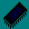
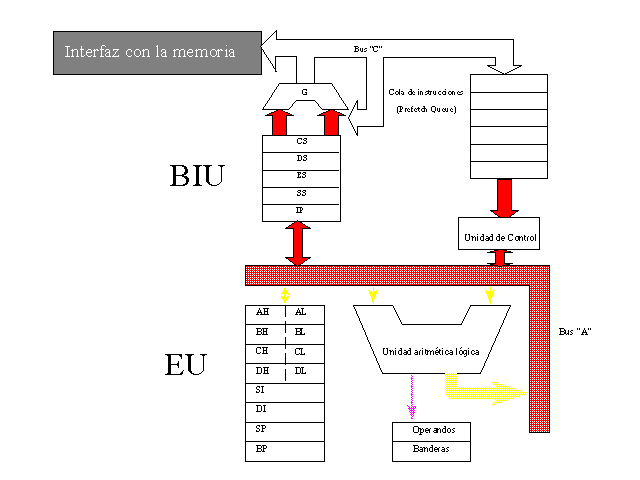

 Arquitectura de la Familia de Procesadores 80x86

=================================

Tema #5
=======

Arquitectura de la Familia de Procesadores 80x86
================================================

[  
Clase Anterior](clase04.md)

[  
Clase Siguiente](../Temas/clase06.md)

[Objetivos específicos](#objetivo)
----------------------------------

[Teoría](#teoria)
-----------------

[Bibliografía](#biblio)
-----------------------

Objetivos Específicos
---------------------

*   Conocer los componentes más importantes de la línea de procesadores Intel 80x86.
*   Entender el funcionamiento general de los mismos.
*   Conocer los elementos que podemos usar del procesador a través de software
*   Conocer el funcionamiento del acceso a memoria y puertos.

Teoría
------

Historia de los Procesadores Intel
----------------------------------

[Arquitectura](#arq)

### Familia "80x86"

*   [8086](#8086)
*   [8088](#8086)
*   [80186](#80186)
*   [80286](#80186)
*   [80386](#80386)
*   [80486](#80486)
*   [Pentium](#Pentium)
*   [Pentium Pro](#PentiumPro)

* * *

8086/8088

#### Nace la industria de PC compatibles

_Tamaño de palabra: 16 bits_

Innovación en un mercado dominado por 8 bits (6502, Z80)  
Posteriormente surge una versión "recortada", con 16 bits en los buses internos, pero solamente 8 en el bus de datos de la memoria, conocida como **8088**.

_20 bits de direccionamiento_

Capacidad de direccionar 1 Mb. de memoria, contra 64 Kb

_Velocidad de reloj: 4.77 Mhz._

Alta velocidad (común 1-2 Mhz.).  
Permite ejecutar más de 1 millón de instrucciones por segundo

_Cola de prefetch_

Disminuye el tráfico en el bus, al permitir separarlo en dos partes: una para uso del Fetch, y otra para uso del Execute..  
Diferencia 8086/8088: el tamaño de la cola (6 vs.4 bytes)

* * *

80186/80286

#### Se requiere más poder de cómputo

_80186 extiende el conjunto de instrucciones del procesador_

Mantienen la compatibilidad hacia atrás

_80186 no tuvo éxito_

Se ve la limitante de 1 Mb. y aparece el 286

_Aumenta el direccionamiento a 24 bits_

16 Mb. de memoria

_Aparece el modo protegido_

Facilita sistemas multitarea, al proporcionar memoria separada por proceso

* * *

80386

_El tamaño de palabra se extiende a 32 bits_

El espacio de direccionamiento llega a 4Gb. (2 a la 32 bytes)

_Nuevas instrucciones_

Manejo de registros extendidos  
Instrucciones de "3 direcciones": dos operandos fuentes y otro destino.  
Mejor aprovechamiento del modo protegido  
Modos diversos de acceso a memoria: compatibilidad hacia atrás (V8086), modo protegido del 286 y modo "flat" exclusivo de 386.

_Se extienden los registros a 32 bits, pero se conserva la versión de 16 bits_

Las versiones extendidas tienen nuevos nombres: EAX, EBX, ...

_Dos versiones_

80386 DX - original

80386 SX - versión reducida

Internamente maneja 32 bits; pero sus conexiones externas son de 16 bits

* * *

80486

#### Aún más poder

_Nueva tecnología en la producción_

Mayor integración del circuito

_Ejecución de instrucciones en "pipelines"_

Permite empezar a hacer instrucciones en paralelo

_Coprocesador matemático como norma_

80486SX: versión reducida, elimina el coprocesador

_Cache de instrucciones_

Agiliza la ejecución

* * *

PENTIUM

#### Intel busca mantener su posición, con nueva tecnología

_Nueva extensión de instrucciones_

Punto flotante más poderoso

_Doble pipeline de ejecución_

Bus interno de 64 bits.

_Doble caché, para datos y código._

Predicción de saltos optimiza los ciclos

_Doble cola de prefetch_

* * *

PENTIUM PRO

#### ¿Cómo competir con Workstations, a menor precio?

_Se rediseña completamente el procesador_

Tres unidades de procesamiento independientes

_Capacidad de ejecutar instrucciones "adelantadas"_

Mientras una instrucción está en espera, por ejemplo de accesos a memoria, las siguientes que están listas se ejecutan.

_Arriba de 200 Mhz._

Arquitectura
------------

El procesador 8086 original introdujo nuevos conceptos en la arquitectura de los procesadores para microcomputadoras:

*   [Arquitectura en Pipeline](#Pipeline)
*   [Bus de datos de 16 bits.](#BusDatos)
*   [Bus de direcciones de 20 bits](#BusDirecciones)

Vamos a explorar sus principales componentes, y cómo se implementaron estos adelantos tecnológicos, a continuación:

En la figura tenemos un mapa de los elementos contenidos en el 8086, descritos más adelante; puedes accesarlos presionando la figura en la sección correspondiente.

### Arquitectura en pipeline

Los procesadores previos al 8086, estaban limitados en su desempeño por la necesidad de realizar los dos pasos principales de ejecución del procesador: _Fetch/Execute_, en forma secuencial. Es decir, no se puede ejecutar una instrucción hasta que se traiga de memoria (_Fetch_); y no podrán traerse instrucciones de memoria mientras ejecutaba una instrucción, pues el procesador estaba ocupado.

Resumiendo, un alto porcentaje del tiempo, el procesador estaba ocupado haciendo _Fetch_, cuando su función debiera ser ejecutar las instrucciones. La capacidad de ejecutar instrucciones sólo se ocupaba en un bajo porcentaje.

Para solucionar esto, Intel desarrolló la arquitectura en _pipeline_ del _Fetch/Execute_, en la cual simplemente se divide la tarea en dos secciones: una encargada del _Fetch_ ([BIU](#BIU), y otra del Execute ([EU](#EU)). De esta manera, existen circuitos separados para cada función, los cuales trabajan en paralelo. Si bien el proceso aún es secuencial, solamente al principio se requiere desperdiciar tiempo en el _Fetch_. A partir de ahí, _Fetch_ va adelante del _Execute_, y trae instrucciones al procesador mientras este ejecuta las anteriores.

### Bus de datos de 16 bits

Los procesadores dominantes antes de la introducción del IBM PC, basado en el 8086, eran todos de 8 bits; con lo que nos refereimos al bus de datos. Esto quiere decir que se podía accesar un byte de memoria en un solo ciclo de reloj, pues existían 8 cables entre la memoria y el procesador, por donde viajaban a la vez 8 bits de información. Que el procesador ahora sea de 16 bits, quiere decir que pueden viajar a la vez 16 bits (2 bytes) entre el procesador y la memoria; por tanto, el procesador puede mover bloques de memoria en la mitad del tiempo, y con la mitad de instrucciones. Esto hace más eficiente el acceso a memoria por parte del procesador.

Al tamaño del bus de datos también suele llamársele _tamaño de palabra._

### Bus de direcciones de 20 bits

También antes del 8086 había una limitante en la memoria de la que el procesador podía disponer. Los procesadores anteriores contaban con un bus de direcciones de 16 bits, con lo que podrán indexar 65536 localidades distintas en memoria; siendo éstas bytes. Por tanto, su memoria máxima era de 64 Kb. Intel reconoció que pronto, esta memoria sería insuficiente, por lo que decidió ampliarla. Sin embargo, no pudieron imaginar usos para una memoria mayor a 1 Mb.; parecía infinita para los estándares de entonces. Por lo que aumentaron las líneas del bus de direcciones a 20, con lo cual se pueden indexar memorias con 1'048,576 elementos (1 Mb.)

### BIU: Bus Interface Unit

El BIU es la parte del 8086 que se encarga de hacer el _Fetch_; es decir, su función es estar continuamente accesando la memoria, trayendo de ella las instrucciones para ser ejecutadas por el procesador.

Contiene los siguientes elementos:

1.  [Los registros de segmentos](#Segmentos)
2.  [La cola de prefetch](#Prefetch)
3.  [El generador de direcciones físicas](#Sumador)
4.  [El Bus C](#BusC)

Su funcionamiento es de la manera siguiente:

#### Registros de segmentos

Estos registros son localidades de 16 bits dedicados a las funciones de acceso a memoria. Se decidió, como se describirá más adelante al analizar el mecanismo de [segmentación](#Segmentacion), dividir el Megabyte de memoria al que puede accesar un 8086, en 65536 partes (segmentos), iniciadas cada 1 Mb / 65536 = 16 bytes. Así, podemos en general decir que los registros de segmentos nos van a indicar qué sección de memoria seleccionamos.

Existen 4 registros de segmentos:

##### DS: Data Segment (Segmento de Datos)

Este registro selecciona una sección de 64 Kb. que se dedica generalmente a colocar en ella nuestras variables, por lo cual toma su nombre: sección de memoria dedicada a datos.

##### CS: Code Segment (Segmento de Código)

Este registro selecciona el área de 64 Kb. que generalmente dedicamos al código. En este caso, el CPU (específicamente, el BIU), siempre toma las instrucciones de esta región de memoria; por lo que cuando requerimos más de 64 Kb. de código (instrucciones), este registro tendrá que moverse, tomando distintos valores según recorremos distintas regiones de memoria.

##### SS: Stack Segment (Segmento de Pila)

Este registro selecciona la región de 64 Kb. que va a contener la pila del sistema. Como su nombre lo indica, tendremos una estructura de datos, con política LIFO (Last In, First Out = El último elemento en entrar, es el primero en salir), con instrucciones básicas PUSH y POP para su manejo. Esta estructura es usada por los programas de aplicación, pero también por el procesador para el control de instrucciones que lo requieren, tales como las llamadas a subrutinas yla atención de interrupciones.

##### ES: Extra Segment (Segmento Extra)

Este registro nos permite seleccionar una sección de 64 Kb., que no está destinada a ningún uso específico; por lo que el programador puede aplicarla como comodín, generalmente como un segundo segmento de datos; o bien, para el acceso a regiones de memoria del sistema, tales como la memoria de video o las variables del BIOS.

#### Cola de prefetch

Ya que el [BIU](#BIU) trabaja en paralelo con el [EU](#EU), requieren de un mecanismo para comunicarse. Esto se logra con una cola, estructura de datos que permite que el EU obtenga instrucciones para ejecutar en el mismo orden en que el BIU las colocó en la misma. Así, el EU puede solicitar instrucciones en cuanto está listo para ejecutar la siguiente, sin importar en qué paso está el BIU en la obtención de instrucciones; y viceversa, el BIU puede continuar su búsqueda de instrucciones, depositando la que acaba de obtener en la cola, sin importar si el EU en este momento está ocupado ejecutando.

#### Generador de direcciones físicas

Como las direcciones son de 20 bits, y los registros que nos permiten accesarlas son de 16, se requiere de 2 registros para que en combinación formen la dirección.

Esta combinación está basada en la [arquitectura segmentada](#Segmentacion) que veremos más adelante. La función del generador de direcciones físicas consiste en realizar esa combinación, para lo cual contiene la circuitería necesaria para calcular la fórmula:

_Dirección Fisica = Segmento \* 0010h + Desplazamiento_

#### Bus C

Este bus interno del procesador permite que la información fluya entre la interfaz con la memoria y los distintos elementos del BIU. Se requiere un bus independiente, para que la información que usa el EU no se interfiera con la que está procesando el BIU.

### EU: Execution Unit

El EU es la parte del 8086 que

Contiene los siguientes elementos:

1.  [Unidad de control](#UnidadControl)
2.  [Registros de propósito general](#PropositoGral)
3.  [Registros de índice](#Indices)
4.  [ALU](#ALU)
5.  [Registro de Banderas](#Banderas)
6.  [Bus A](#BusA)

#### Unidad de Control

Es la sección del procesador que contiene la lógica de funcionamiento del mismo; es decir, esta circuitería gobierna el comportamiento de los distintos elementos en el procesador, coordinando los procesos de _Fetch_ y _Execute_, así como las distintas microoperaciones necesarias para la ejecución. Por tanto, tiene dos funciones principales:

*   Generar la secuencia de estados del procesador, lo que logra gracias a la ejecución del microcódigo.
*   Decodificar las instrucciones, determinando así los pasos para su ejecución.

#### Registros de Propósito general

Son 4 registros de 16 bits, que el programador usará para una diversidad de funciones. Tienen varias característica en común:

*   Pueden ejecutar la mayoría de las operaciones del procesador, incluyendo la generalidad de las instrucciones aritméticas y lógicas, salvo la multiplicación y división.
*   Se dividen lógicamente en 2 registros de 8 bits cada uno, llamados parte alta y parte baja; refiriéndose el registro de parte baja a los bits 0-7 (menos significativos) y la parte alta a los bits 8-15 (más significativos). Se conocen como el registro L (parte baja) y H (parte baja), precedidos por la letra que identifica al registro. Por ejemplo, AX se divide en AH y AL.
*   Pueden conectarse a los registros de segmentos; de hecho, siempre se hará acceso a los registros de segmento a través de un registro de propósito general, o de la pila.

Los 4 registros tienen su nombre propio y ciertas especializaciones:

### AX: Registro de acumulador

Este registro es el más usado, siendo de propósito general; y tiene ciertas especializaciones, de ahí su nombre:

*   Es el único que puede ser usado como multiplicando en la multiplicación
*   Es el único que puede ser usado como dividendo en la división
*   Es el parámetro que selecciona los distintos servicios del Sistema Operativo, usados mediante el mecanismo de Interrupciones.

### BX: Registro de Base

Este registro, además de las característica generales de los registros de propósito general, se especializa

*   en el acceso a memoria en combinación con los registros de índice, especialmente para el manejo de arreglos.

### CX: Registro de Contador

Este registro, como su nombre indica, será ampliamente usado como contador. Puede ser usado como cualquier registro de propósito general, pero tiene capacidades especiales para ser usado en instrucciones:

*   de manejo de ciclos
*   como contador en los corrimientos
*   de manejo de memoria y strings

### DX: Registro de Datos

Este registro de propósito general tiene como especializaciones:

*   Formar con AX números de 32 bits, siendo en este caso la parte más significativa.
*   El acceso a puertos. Las instrucciones IN y OUT, que permiten dicho acceso, requerirán en ciertos casos que el número de puerto está en DX.

#### Registros de índice

Estos registros, de 16 bits, son muy similares a los de propósito general, pero no tienen todas las capacidades de los mismos; en particular:

*   No pueden conectarse directamente con los registros de segmentos.
*   No pueden verse como dos registros de 8 bits (parte alta y parte baja).

Ahora bien, tienen sus propias habilidades. Específicamente, están diseñados para combinarse con los registros de segmento, ser usados como desplazamientos y así intervenir en el acceso a memoria. Se les usa, por ello, para el acceso a arreglos o como apuntadores.

Los 4 registros que se consideran en este grupo son:

### SI: Source Index, o Apuntador a la Fuente

Este registro se especializa en el acceso a bytes o words dentro del segmento de datos; existen instrucciones que lo toman por defecto como el registro que apunta a una localidad de memoria que se va a leer, por lo cual toma su nombre.

### DI: Destination Index, Apuntador al Destino

Este registro se especializa en el acceso a bytes o words dentro del segmento de datos o el extra; existen instrucciones que lo toman por defecto como el registro que en combinación con el ES apunta a una localidad de memoria que se va a escribir, por lo cual toma su nombre.

### BP: Base Pointer, o apuntador a la Base de la Pila.

Este registro es usado para accesar, dentro del segmento de pila, la información. Principalmente nos permite determinar cuando hay un _underflow_, es decir, cuando se quiere sacar más información de la pila que la que se ha colocado en ella; y el acceso a variables locales y parámetros.

### SP: Stack Pointer, o apuntador al tope de la Pila.

Este registro también está siempre asociado al manejo de la pila. Su función especial es marcar el tope de la pila, y por tanto, indica en qué localidad de memoria se localiza la información de la pila; se incrementa cuando se hace un POP, con lo que apunta al siguiente elemento en la pila; y se decrementa al hacer un PUSH, con lo que controla el acceso a la memoria de la pila.

#### ALU: Unidad Aritmética-Lógica

Este componente, como su nombre indica, contiene la circuiteréa necesaria para realizar las diversas operaciones aritméticas y lógicas. Recibe sus operandos por el Bus A, y genera los resultados regresándolos al mismo bus. Una particularidad que es importante recalcar es su conexión al [registro de banderas](#Banderas), por lo cual todas las operaciones aritméticas y lógicas, de acuerdo a su resultado, lo alterarán.

#### Registro de Banderas

Este es un registro de 16 bits, usados como banderas. Esto quiere decir que cada uno de los bits señala un evento dentro del procesador; cuando el bit tiene un valor de 0, el evento no ocurrió (falso); y cuando tiene un valor de 1, el evento ocurrió (verdadero). Entre las banderas más importantes mencionaremos:

##### ZF: Bandera de resultado 0

Se prende cuando el resultado de la última operación realizada en el ALU fue un 0.

##### CF: Bandera de carry

Se prende cuando el resultado de la última operación realizada en el ALU (necesariamente, una suma o resta) generá un _carry_ o un _borrow_.

##### OF: Bandera de overflow

Se prende cuando el resultado de la última operación realizada en el ALU excedió la capacidad del registro donde se almacena (_overflow_).

##### SF: Bandera de signo

Se prende cuando el resultado de la última operación realizada en el ALU fue negativo, según la representación de complemento a 2 que mencionamos en clases anteriores.

##### AF: Bandera de carry auxiliar

Se prende cuando el resultado de la última operación realizada en el ALU generó un carry cuando estaba a la mitad. Por ejemplo, si sumamos dos números de 16 bits, nos indicará si la suma de las partes bajas (primeros 8 bits) había generado carry; si sumamos dos números de 8 bits, indica si el resultado intermedio después de sumar los 4 bits menos significativos, generá carry para sumarse a los bits 5.

##### DF: Bandera de dirección

A diferencia de las anteriores, esta bandera no se prende como resultado del ALU, sino que el programador la usa para controlar la dirección del acceso mediante apuntadores, especialmente en las [instrucciones de strings](../Temas/clase15.htm).

##### IF: Bandera de interrupción

Se prende cuando el procesador es interrumpido, y está ejecutando una rutina de atención de interrupción. Esto evita que el procesador acepte interrupciones mientras está procesando interrupciones previas, de manera que no se pierda el control del procesador.

#### Bus A

Este bus es el camino por el que viajan los datos dentro de la unidad de ejecución, principalmente entre los registros y el ALU.

### Manejo de Memoria: Segmentación

Cuando Intel extendió el bus de direcciones, de 16 a 20 bits, se encontró con el problema de cómo asociar los registros con las direcciones de memoria. Para lograrlo, aplicó un concepto ya usado antes en mainframes, conocido como segmentación; en este modelo, se usan dos registros para seleccionar una localidad de memoria:

*   **Registro de Segmento**: indica en qué segmento (región o sección) de la memoria se encontrará la localidad deseada.
*   **Registro de Desplazamiento**: indica en qué desplazamiento, es decir, dirección relativa respecto al inicio de la sección, se encontrará la localidad deseada.

En el caso del 8086, los registros son de 16 bits, con lo que un registro de segmento puede tomar 65536 valores distintos; además, un registro de desplazamiento puede tomar los mismos valores. De ahí las siguientes propiedades:

*   Un segmento inicia cada 16 bytes de memoria; de esta manera, a cada sección de 16 bytes de la memoria se le llama _"párrafo"_.
*   Dos segmentos de memoria llegan a tener sobreposición; de manera que una misma localidad de memoria puede accesarse en distintas formas. Exactamente, en ¡4096 formas distintas!
*   La ventaja de esta sobreposición, que complica el manejo, es que se desperdicia menos memoria entre código y datos, que están en segmentos distintos; si los segmentos no se sobrepusieran, desperdiciaríamos por ejemplo 63 Kb. si nuestros datos ocuparan 1 Kb, para completar el segmento. En cambio, con el esquema de segmentación con sobreposición, pueden inclusive no desperdiciarse bytes.

Bibliografía
------------

*   Libro de texto, capítulos 3 y 5.

 Página por Bruno Guardia R.

 [ bguardia@itesm.mx](mailto:bguardia@campus.ccm.itesm.mx)

_Creada: Vi 7-Jun-96_  
_Última actualización: Vi 7-Jun-96_