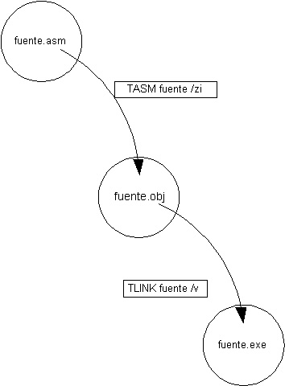

 Uso de las herramientas y estructura general del programa

Tema #9
=======

Uso de las herramientas y estructura general del programa
=========================================================

[  
Clase Anterior](clase08.htm)

[  
Clase Siguiente](../Temas/clase10.htm)

[Objetivos Específicos](#objetivo)
----------------------------------

[Teoría](#teoria)
-----------------

[Bibliografía](#biblio)
-----------------------

Objetivos Específicos
---------------------

*   Conocer el uso de las herramientas básicas para programar en lenguaje Ensamblador en 8086 y familia.
*   Conocer la estructura general de un programa en Ensamblador del 8086 y familia.

Teoría
------

Manejo de las Herramientas

*   [TASM](#TASM)
*   [TLINK](#TLINK)
*   [MAKE](#MAKE)
*   [TD](#TD)
*   [TPROF](#TPROF)

[Estructura general de un programa](#Estructura)

* * *

### Proceso de Ensamblado

* * *

### TASM: Ensamblador

Se le llama ensamblador no sólo al lenguaje; sino también al programa que traduce el código fuente escrito en ensamblador, a código objeto, equivalente a los opcodes en lenguaje de máquina.

En el caso de 8086 y familia, el ensamblador, sea TASM (Borland) o MASM (Microsoft), se encarga de generar los archivos .OBJ que representan el código de máquina asociado al programa fuente en ensamblador.

La sintaxis básica para su uso es:

_TASM <nombre del programa> {opciones}_

En el nombre del programa, podemos omitir la extensión .ASM, que es la que tenemos por defecto.

Por ejemplo, para ensamblar el programa HOLA.ASM, basta la siguiente línea de comandos:

C> **TASM HOLA**

En las opciones se puede controlar el proceso de ensamblado, para que genere información adicional o cambie su forma de operación. Las dos más útiles para este curso serán:

/la

Genera un archivo, adicional al .OBJ, con extensión .LST, que muestra un listado detallado del proceso de ensamblado. Entre otras cosas, muestra la asociasión existente entre el código fuente y los opcodes generados.

/zi

Almacena información de símbolos junto con el programa objeto, útil para que el depurador permita ejecutar el código objeto en sincronía con el código fuente.

Así, se recomienda que durante el desarrollo de un programa se ejecute TASM con una línea de comandos similar a la siguiente:

C> **TASM HOLA** /zi /la

En algunas versiones las opciones deben ponerse previamente, por ejemplo:

C> **TASM** /zi /la **HOLA**

* * *

### TLINK: Linker

Un archivo .OBJ, si bien contiene ya todo el código de máquina, no puede ser ejecutado todavía por el sistema operativo, pues no contiene información necesaria para el mismo, tal como la memoria requerida. Esto se coloca en un encabezado, que es leído por el sistema para determinar cómo ejecutar el programa.

Por otro lado, cuando hacemos un programa en varios módulos, no solamente existe un código objeto sino varios, que debemos combinar o relacionar entre sí.

Estos procesos son llevados a cabo por el TLINK; el cual toma como entrada uno o varios archivos .OBJ y genera los archivos ya ejecutables por el sistema, con extensión .COM o .EXE. Desde el sistema operativo 4.0 se está buscando eliminar a los archivos .COM, por sus limitaciones; por lo cual, en general no se trabaja con ellos en este curso.

Se ejecuta en forma similar al TASM, desde la línea de comandos ("prompt"):

La sintaxis básica para su uso es:

_TLINK <nombre del programa o programas> {opciones}_

En el nombre del programa, podemos omitir la extensión .OBJ, que es la que tenemos por defecto.

Por ejemplo, para ligar el código objeto generado anteriormente HOLA.OBJ, basta la siguiente línea de comandos:

C> **TLINK HOLA**

En las opciones se puede controlar el proceso de ligado. La opción que generalmente se utiliza más es:

/v

Almacena información de símbolos junto con el programa ejecutable, útil para que el depurador permita ejecutar el código objeto en sincronía con el código fuente. **Cuidado: Esta opción debe ponerse en minúsculas, estrictamente.**

Así, se recomienda que durante el desarrollo de un programa se ejecute TLINK con una línea de comandos similar a la siguiente:

C> **TLINK HOLA** /v

También aquí a veces se requiere de poner las opciones antes, como por ejemplo:

C> **TLINK /v HOLA**

* * *

### MAKE: Reglas de construcción

La información sobre esta herramienta se colocará más adelante.

Ejemplo de su uso:

Archivo MAKEFILE

hola.exe: hola.asm  
               tasm hola /zi /la # Hay un caracter tabulador al inicio de línea  
               tlink hola /v

Al ejecutar _MAKE_ con este archivo presente en el directorio actual, si _hola.exe_ no existe o es más viejo que _hola.asm_, se creará _hola.exe_ siguiendo las reglas indicadas, es decir, ejecutando tanto al _TASM_ como al _TLINK_.

* * *

### TD: Depuración

Se pondrá más información sobre esta herramienta posteriormente

Se ejecuta un ambiente amigable de menos; se requiere de ensamblar y ligar con las opciones de depuración (/zi en el TASM y /v en el TLINK)

Las funciones más importantes para su uso serán la ejecución por pasos (F7 y F8), examinar los recursos en la ventana de CPU, y visualizar variables por medio de Watch y Evaluate.

* * *

### TPROF: Pruebas de eficiencia

Se pondrá más información sobre esta herramienta posteriormente.

Se ejecuta un ambiente amigable de menos; al igual que el depurador, requiere de ensamblar y ligar con las opciones de depuración (/zi en el TASM y /v en el TLINK)

* * *

Estructura general de un programa
=================================

Todo programa fuente en ensamblador contará con cuatro secciones básicas:

* * *

Directivas generales:

#### TITLE <titulo>

Esta directiva permite poner un título al programa en ensamblador, es similar a _program_ en Pascal. No se requiere, pero se recomienda por documentación.

* * *

.model <modelo>

Indica el [modelo de memoria](../Temas/clase22.htm) que se va a utilizar. Esto lo veremos con más profundidad al final del curso; por el momento, simplemente pondremos el modelo _small_, que es el más usual y que es apropiado para casi todas las actividades del curso.

* * *

.stack <tamaño>

Indica cuánto espacio se reservará para la pila del sistema. Se requiere este espacio para la operación apropiada del programa, pues diversas instrucciones hacen uso de la pila. Por lo general, basta con un tamaño de 256 bytes (_.stack 100h_). Solamente en programas que hagan fuerte uso de la pila, como aquellos que usen recursión o gráficos VESA, requerirán tamaños mayores.

* * *

Datos y variables:

#### .data

Con esta directiva, indicamos al ensamblador donde iniciaremos las definiciones de variables; de acuerdo a las variables que definamos, se reservará el espacio necesario; lo importante es que la directiva le indica al ensamblador la asociasión para crear el segmento de datos.

* * *

<variable> DB <contenido>

Esta directiva permite definir espacio de variables, en unidades de bytes. Si por ejemplo, se requiere una variable de tipo char Bandera, con valor inicial de 0, se definiría:

`Bandera DB 0`

No siempre se requiere indicar un nombre de variable, especialmente en arreglos:

`Arreglo DB 0`

`DB 1`

`DB 2...`

* * *

<variable> DW <contenido>

Esta directiva, similar a la anterior, permite definir espacio para un Word. (variable que ocupa 2 bytes o 16 bits). Aplican todos los comentarios de la misma.

* * *

#### ?

Cuando se usa el signo de interrogación, se puede definir una variable sin especificar su valor, por ejemplo:

`Variable DB ?`

* * *

#### <numero> DUP <valor>

Esta directiva, combinada con DB o DW, permite llenar un arreglo con un valor repetido. Por ejemplo, si se quiere un arreglo de 100 caracteres, con valor de 0 en cada uno, se define:

`Arreglo DB 100 DUP ( 0`  )

* * *

código:

#### .code

Con esta directiva, se indica al ensamblador que termina la definición de datos, e inicia la definición del código. Después de esta sección, se inicia la secuencia de instrucciones y [procedimientos](../Temas/clase10.htm) que forman el programa.

El código casi siempre tendrá dos elementos importantes:

*   Inicialización de segmentos
*   Regreso a DOS

La inicializaciön de segmentos asegura que el segmento de datos (DS) se ajuste para acceder a las variables del programa, y no a los datos que DOS usá previamente. De manera que acostumbraremos iniciar el código con las instrucciones.

 `MOV AX, @data ; obtener valor del segmento`

 `MOV DS, AX ; Ponerlo en DS`

Para regresar a DOS, tendremos que hacer uso del mecanismo de interrupciones. Por el momento, simplemente enunciaremos cuáles se usan por lo común:

 `MOV AH, 4Ch ; Número del servicio "salir"`

 `INT 21h ; Llamar a DOS`

* * *

Final del programa:

Una vez que terminamos con las instrucciones, el ensamblador requiere saber cuándo dejar de ensamblar. Para ello, requiere de la directiva _END_, que hace dos cosas: indicar al ensamblador que deje de traducir; e indicarle si se desea que el programa inicie su ejecución en un punto distinto al principio del código.

Bibliografía
------------

Capítulo 4, libro de texto.

Manuales de TASM o MASM.

 Página por Bruno Guardia R.

 [ bguardia@itesm.mx](mailto:bguardia@campus.ccm.itesm.mx)

_Creada: Vi 7-Jun-96_  
_Última actualización: Do 16-Feb-97_