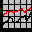

# Planeación del Semestre Agosto-Diciembre 2004

<table cellpadding="2" border="0">

<tbody>

<tr>

<td>

[Verla en formato Syllabus](syllabus.md)

</td>

<td>

[Ver temario analítico](temario.md) (oficial)</td>

</tr>

</tbody>

</table>

<table cellpadding="2" border="0">

<tbody>

<tr>

<td valign="top" align="center">

<table width="442" cellpadding="2" border="2">

<tbody>

<tr>

<td width="58" valign="top" align="center">

[<small>  
9 agosto</small>](Sesiones/sv01.md)<small>  
Inicio de cursos  
[Encuadre  
](Encuadre/sv00.md)</small>[<small>Tarea #1</small>](Actividades/actv01.md)

</td>

<td width="57" valign="top" align="center">

<small>

[  
16 agosto](Sesiones/sv02.md)</small>

<small>

[Entrega Tarea #1](Actividades/actv01.md)</small>

</td>

<td width="52" valign="top" align="center"><small>

[  
23 agosto](Sesiones/sv03.md)</small>  
<small>

[Entrega Tarea #2](Actividades/actv02.md)</small>  
Asueto grupo 02</td>

<td width="64" valign="top" align="center">

<small>

[  
30 agosto](Sesiones/sv04.md)</small>

</td>

<td width="92" valign="top" align="center">

<small>

[  
6 septiembre  
Ex. 1er. P](sesiones/sv05.md)  
</small><small>Entrega [tarea 3](Actividades/tarea3.mdl) </small>

</td>

<td width="65" valign="top" align="center">

<small>[  
13 septiembre](sesiones/sv06.md)</small>  
<small>Revisión</small><small>  
</small>

</td>

</tr>

<tr>

<td width="58" valign="top" align="center"><small>

[  
20 septiembre](Sesiones/sv07.md)</small></td>

<td width="57" valign="top" align="center">

[<small>  
27 septiembre</small>](Sesiones/sv08.md)<small>  
 </small></td>

<td width="52" valign="top" align="center"><small>

[  
4 octubre](sesiones/sv09.md)  

[Proyecto 1](proyectos/proy1Ene03.md)  
Examen 2º Parcial</small></td>

<td width="64" valign="top" align="center">

[<small>  
 11 octubre</small>](Sesiones/sv10.md)<small>  
Revisión</small></td>

<td width="92" valign="top" align="center">

<small>

[  
18 octubre](Sesiones/sv11.md)</small></td>

<td width="65" valign="top" align="center"><small>

  
[25 octubre](Sesiones/sv12.md)</small></td>

</tr>

<tr>

<td width="58" valign="top" align="center"><small>

[  
1 noviembre](Sesiones/sv13.md)</small>  
<small>[Proyecto 2](proyectos/proy2.md)  
Examen 3er. Parcial</small></td>

<td width="57" valign="top" align="center">

[<small>  
8 noviembre</small>](Sesiones/sv14.md)  
<small>Revisión  
examen</small></td>

<td width="52" valign="top" align="center">

[<small>  
15 noviembre</small>](Sesiones/sv15.md)  
 </td>

<td width="92" valign="top" align="center">

[<small>  
22 noviembre</small>](Sesiones/sv15.md)  
<small> Fin de clases  y entrega del  
[Proyecto Final](proyectos/proyfin.md)</small></td>

<td width="65" valign="top" align="center">

<small>

[  
29 noviembre  
Examen Final](Sesiones/sv17.md), 19:00 hrs.</small>

<small><blink><small><small>Se conservan las fechas y horas normales</small></small></blink></small>

 </td>

<td width="65" valign="top" align="center"><small>30 de noviembre, 13:00 hrs..  
Oficinas I 2o. piso  
Revisión Final</small></td>

</tr>

</tbody>

</table>

Leyenda:

<table border="0">

<tbody>

<tr>

<td>

</td>

<td>Principalmente práctica en laboratorio</td>

<td>

</td>

<td>Clase con teoría</td>

</tr>

</tbody>

</table>

</td>

<td valign="top">

#### <small>Lenguaje Ensamblador Grupos 1</small>

<table cellpadding="2" border="1">

<tbody>

<tr>

<th>

<small>Semestre</small>

</th>

<th>

<small>Grupo</small>

</th>

<th>

<small>Horario</small>

</th>

<th>

<small>Salón</small>

</th>

</tr>

<tr>

<td>

<small>200413</small>

</td>

<td>

<small>01</small>

</td>

<td>

Lunes <small>19-22</small>

</td>

<td><small>SC09</small></td>

</tr>

</tbody>

</table>

<small>

Página por [Bruno Guardia Robles](../index.md).</small>

<small>

[ bguardia@itesm.mx](mailto:bguardia@itesm.mx)</small>

<small>

[ bguardia@sinergia-web.com.mx](mailto:bguardia@sinergia-web.com.mx)</small>

* * *

_Creada: Sa/18/ene/97_  
_Última actualización: _

</td>

</tr>

</tbody>

</table>