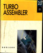

**Instituto Tecnol�gico y de Estudios Superiores de Monterrey.**

**Campus Ciudad de M�xico.**

**Lenguaje Ensamblador (Cb*852)**

**Grupo 01, Semestre 9708 - Presencial**

**Grupo 02, Semestre 9708 - Virtual**

## Pol�ticas del Curso.

## Profesor: [ISC Bruno Guardia Robles](../index.htm) ( [Tec-CEM,](http://www.cem.itesm.mx/) Dic.'93)

<table border="0">

<tbody>

<tr>

<td>[Objetivos](politica.htm#Objetivos)</td>

<td>[Mec�nica](politica.htm#Mec�nica)</td>

<td>[Fechas](politica.htm#Fechas)</td>

<td>[Evaluaci�n](politica.htm#evaluaci�n)</td>

<td>Tareas y proyectos</td>

<td>[Recursos T�cnicos](politica.htm#Recursos)</td>

<td>[Disciplina](politica.htm#Disciplina)</td>

<td>[Asesor�a](politica.htm#Asesor�as)</td>

<td>[Bibliograf�a](politica.htm#Bibliograf�a)</td>

</tr>

</tbody>

</table>

###   
<a name="Objetivos">Objetivos del curso:</a>

*   Desarrollar programas eficientemente usando el lenguaje ensamblador, en ambiente PC.
*   Desarrollar habilidades de trabajo �tiles en la realidad pr�ctica.
*   Consolidar las habilidades de programaci�n.

###   
<a name="Mec�nica">Mec�nica de la clase:</a>

Se deber� leer con anticipaci�n el material indicado en la clase previa y en el calendario del curso, disponible en la red. Salvo el d�a del examen parcial, hay ex�menes r�pidos de tipo "control de lectura", donde se preguntan conceptos b�sicos del tema programado para la fecha correspondiente.

Se buscar� cubrir con rapidez el material te�rico, enfatizando que este es un curso de programaci�n; pero sin descuidar el entendimiento de la teor�a.

Los alumnos de la clase presencial tomar�n clase "tradicional", donde el profesor expondr� con detalle todos los temas, lo cual no los exime de estudiar previamente a la clase. Mientras que en la clase semivirtual, el alumno aprende a su ritmo, utilizando los recursos, y el profesor enfatiza su funci�n de asesor�a m�s que de expositor, concentr�ndose en exponer los temas que le requieren los alumnos, generalmente los m�s dif�ciles; uno de los principales beneficios de este esquema es la oportunidad de mayor pr�ctica en el laboratorio. Sin embargo, el estilo de aprendizaje del alumno hace que para algunos sea mejor el esquema presencial que el virtual, al proporcionarles una organizaci�n l�gica m�s clara y un seguimiento ordenado de los temas.

Con el alumno de una clase virtual se enfatiza la necesidad de aprender por s� mismo, aprendiendo a aprender, como se requiere en la realidad pr�ctica de un ambiente de trabajo. De esta manera, el profesor provee informaci�n a los alumnos, pero en un esquema "virtual", usando los recursos de Internet; y es responsabilidad del alumno leer dicha informaci�n, analizarla y ejercitarla previamente a la clase. El profesor, en contraparte, expondr� los temas m�s relevantes, y contestar� las dudas de los alumnos; adem�s de proponer ejercicios de aplicaci�n donde se refuerce la pr�ctica y el aprendizaje del grupo.

<table border="1">

<tbody>

<tr>

<td>19:05 - 19:10</td>

<td>Toma de lista.</td>

</tr>

<tr>

<td>20:00 - 20:10</td>

<td>Receso.</td>

</tr>

<tr>

<td>21:00 - 21:10</td>

<td>Receso.</td>

</tr>

<tr>

<td>21:45 - 21:55</td>

<td>Dudas y planteamiento de tareas.</td>

</tr>

</tbody>

</table>

En los d�as en que existan ex�menes sorpresa (lo cual puede ser cualquier d�a de clase, excepto el primer d�a de clases y las semanas de ex�menes parciales), estos ser�n a las 19:10.

Se buscar� cubrir con rapidez el material te�rico, enfatizando que este es un curso de programaci�n; pero sin descuidar el entendimiento de la teor�a.

###   
<a name="Fechas">Fechas de ex�menes parciales y finales:</a>

De acuerdo al calendario general del ITESM:

Grupo Presencial

1er. Examen Parcial: Lunes 8 de septiembre de 1997.

2o. Examen Parcial: Lunes 9 de octubre de 1997.

3er. Examen Parcial: Lunes 10 de noviembre de 1997.

Examen Final: Lunes 1� de diciembre de 1997, 19:00 horas.

Grupo Virtual

1er. Examen Parcial: Jueves 11 de septiembre de 1997.

2o. Examen Parcial: Jueves 6 de octubre de 1997.

3er. Examen Parcial: Jueves 13 de noviembre de 1997.

Examen Final: Jueves 4 de diciembre de 1997, 19:00 horas.

###   
<a name="evaluaci�n">Forma de evaluaci�n:</a>

La calificaci�n final del curso ser� integrada de la siguiente manera:

*   Parciales: 3 x 20 % = 60 %
*   Proyecto final (cuarto parcial): 15 %
*   Examen Final: 25 %

La calificaci�n de cada parcial ser� calculada as�:

*   Examen Parcial: 50 %
*   Proyecto o tareas: 30 %
*   Tareas y ex�menes sorpresa: 10%
*   Participaci�n: 10%

Cuando un parcial no tenga proyecto (caso del primer parcial), las tareas y ex�menes r�pidos aportar�n el 40% de la calificaci�n parcial.

Los ex�menes parciales contendr�n ejercicios de programaci�n, y ser�n a libro abierto (incluyendo apuntes, acordeones, etc�tera; lo �nico que no se permite es computadora o asesor); solamente el primer examen parcial, las tareas y los ex�menes sorpresa podr�n incluir teor�a.

Tanto en calificaciones parciales como final, la escala ser� de 1 a 100, y el redondeo se aplicar� solamente cuando concurran tres condiciones:

*   Calificaci�n aprobatoria (C >= 70)
*   Que la parte fraccionaria sea mayor o igual a 0.5
*   <u>En la boleta</u>; para efectos de promedio, todas las calificaciones se guardar�n conservando sus decimales.

Las tareas que incluyan teor�a deber�n realizarse en forma individual, a m�quina o en procesador de palabras, **sin portada**, incluyendo solamente el nombre del alumno y su matr�cula en cada hoja. Deber�n tener el t�tulo en la primera p�gina. En el caso de los ejercicios, estos podr�n realizarse a mano, pero con limpieza y claridad, siendo por lo dem�s similares a las tareas de teor�a.

La participaci�n ser� medida objetivamente, y requerir� al menos de 10 puntos. Un punto se juntar� cada vez que:

*   Se haga un comentario relevante en la lista de discusi�n, en cuanto entre en operaci�n. Puede ser una duda, la respuesta a la duda de otro compa�ero, abrir un tema de inter�s para la materia, o proponer un c�digo de ejemplo �til para los temas que se est�n cubriendo, y que no sea directamente relacionado con un proyecto en curso, es decir, que sea de utilidad general no solamente para una tarea o proyecto planteada. Obviamente, poner la soluci�n a un proyecto o tarea no solamente no ser� participaci�n, sino que ser� sancionado como fraude.
*   Se escriba una duda o asesor�a por correo, que no sea repetida y pueda agregarse al material del curso.
*   Se realice una contribuci�n original, agregando informaci�n a las p�ginas del curso. Esta contribuci�n deber� ser un tema completo.
*   Se se�ale una correcci�n v�lida al material del curso (solamente al primero que la haga).

Si sobran puntos, estos **NO** ser�n acumulables.

Todos los proyectos deber�n contener:

a) Diskette, en formato de PC-compatible (3�", alta o baja densidad), conteniendo a su vez:

*   Programa(s) ejecutable (.COM o .EXE)
*   Programa(s) fuente (.ASM, .C, .PAS, etc.)
*   Archivo "makefile", con la descripci�n completa de programas y opciones de compilaci�n usadas para crear los ejecutables a partir de los fuentes.
*   Archivo de documentaci�n, conteniendo todos los puntos del inciso (b), en formato ASCII (texto simple), Microsoft Word � Microsoft Write.

b) Documentaci�n (a m�quina o preferentemente impresa)

*   Nombres y matr�culas de los integrantes del equipo,
*   Instrucciones para la ejecuci�n, y descripci�n de las principales pruebas realizadas.
*   Marca y modelo de la computadora en que fue desarrollado y probado (si se desarrolla en distintas computadoras, incluirlas todas).
*   Formato del diskette, y descripci�n de cada uno de los archivos existentes en el mismo.

c) Notas de programaci�n (pueden ser a mano o a m�quina, inclusive en sucio)

*   An�lisis y dise�o.
*   Problemas encontrados durante el desarrollo.
*   Principales pruebas realizadas.
*   Dudas e inquietudes surgidas.
*   Errores ("bugs") conocidos en la operaci�n del programa.

Todo lo anterior deber� ser entregado en un sobre manila, tama�o carta, rotulado con el nombre y matr�cula de los miembros del equipo. <u>No se aceptan</u> trabajos despu�s de la fecha de entrega, indicada en las especificaciones, y a las 19:10 horas a m�s tardar.

Los equipos de trabajo, solamente para los proyectos, ser�n de 2 personas, formados por los propios alumnos, entreg�ndose por correo una lista al profesor durante las dos primeras semanas de clase. El profesor podr� modificar los equipos durante el transcurso del curso; los equipos formados por ustedes son para el primer proyecto. Junto con el primer proyecto, se deber� plantear el proyecto final que desear�an atacar, el cual se considerar� "preseleccionado" y de esa manera podr�n empezar a prepararlo, si bien podr�n cambiar de proyecto hasta el d�a del tercer examen parcial.

La calificaci�n de los proyectos empezar� en 100 se le ir�n quitando puntos, seg�n los siguientes par�metros:

a) Documentaci�n incompleta: 10 puntos.

b) Sin ninguna documentaci�n de programaci�n: 10 puntos (adicionales al inciso a).

c) Diskette con virus o da�ado: 10 puntos, si se puede recuperar la informaci�n; 90 puntos, si no es as�.

d) No cumplimiento de los requisitos b�sicos del proyecto (seg�n la especificaci�n): 10 puntos.

e) "Bugs" importantes, no se�alados en la documentaci�n (ej. bloqueo de la m�quina): 10 puntos (adicionales al inciso d)

f) Copia o fraude: 99 puntos, no acumulables.

g) "Bugs" menores o se�alados en la documentaci�n: 1 punto cada uno, hasta un m�ximo de 20 puntos (adicionales, en su caso, al no cumplimiento de la especificaci�n)

<a name="Recursos">**Recursos t�cnicos a usar**:</a>

Podr� usarse cualquier ensamblador disponible para computadoras PC/compatibles, basadas en procesadores 80x86. Sin embargo, se recomienda y prefiere el uso de Turbo Assembler (Borland) y las herramientas asociadas (Turbo Link, Turbo Debugger, Turbo Profiler, etc.). El curso se basar� en dichas herramientas, por lo que quienes prefieran el uso de otro paquete tendr�n que documentarse sobre su uso y caracter�sticas espec�ficas; adem�s, es posible que no puedan usarse otras herramientas para ciertos proyectos, particularmente los de integraci�n con lenguajes de alto nivel. Esto es con el fin de estandarizar las herramientas, y reducir el tiempo para examinarlas, adem�s de poder dominarlas m�s a fondo.

No se permite el uso de herramientas que den alguna ventaja especial, de programaci�n, como el uso de librer�as, salvo los casos en que se especifiquen.

El material del curso (slides, programas ejemplo, especificaciones de proyectos, soluciones a ex�menes) est� disponible en Internet. Durante el curso, se seguir� ampliando este recurso; pero como este curso ya fue impartido con ese material, cuentan con la base del semestre pasado completa. Para visualizar u obtener el material, simplemente usen un "browser" de WWW (por ejemplo Netscape), y con�ctense al URL:

[http://www.siglo.com.mx/bguardia](http://laptop_toshiba/clases/index.htm)

[http://anubis.ccm.itesm.mx/~bguardia](http://laptop_toshiba/clases/index.htm)

[http://yoda.ccm.itesm.mx/~bguardia](http://laptop_toshiba/clases/default.htm)

Les sugiero que marquen esta direcci�n como "_bookmark_", es decir, en su lista de frecuentemente usadas; y que cada vez que la accesen, se aseguren de que se actualize (por ejemplo, usando el bot�n _Reload_), pues voy a estar poniendo material en la misma.

###   
<a name="Disciplina">Disciplina:</a>

La entrada es a las 19:00 hrs., con una tolerancia de 5 minutos; despu�s de las 19:05 hrs., ev�tense la pena de interrumpir la clase. De la misma manera, la salida es a las 22:00 hrs. como m�ximo, tomando las 21:55 como hora base, dejando los �ltimos 5 minutos solamente para resoluci�n de preguntas o dudas pendientes.

Las faltas (incluyendo las debidas a retardos) seguir�n las pol�ticas normales en cuanto a su l�mite: se podr� faltar a la clase un m�ximo de 2 veces durante el semestre, o 3 veces en caso de obtener promedio de 83 o mayor en los parciales, bas�ndose en la calificaci�n de la boleta (no en las guardadas con d�cimas).

La copia en proyectos o ex�menes, incluyendo el final, ser� sancionada con la calificaci�n de 1 en dicho proyecto o examen, y en su caso con memor�ndum a la Direcci�n de Carrera.

Cualquier alumno que cause problemas mayores de disciplina durante la clase, ser� atentamente invitado a salir de ella, con la falta respectiva.

###   
<a name="Bases">Bases del curso:</a>

Se asume que los alumnos del curso de Ensamblador <u>dominan</u> previamente los siguientes temas:

a) Lenguaje Pascal y/o C, incluyendo temas b�sicos, manejo de archivos y apuntadores.

b) �lgebra y matem�ticas b�sicas.

c) Lectura en espa�ol e ingl�s.

d) Principios b�sicos de programaci�n: secuencia, condici�n e iteraci�n; modularidad; algoritmos y estructuras de datos b�sicas.

e) Manejo b�sico de PCs, particularmente del sistema operativo DOS.

Si por cualquier raz�n alg�n alumno no cuenta con dichos conocimientos, es su responsabilidad ponerse al corriente, o arriesgarse a sufrir en su calificaci�n por factores fuera del control del profesor.

###   
<a name="Responsabilidades">Responsabilidades del profesor</a>

De la misma manera, ser� responsabilidad del profesor proporcionar cualquier conocimiento o informaci�n necesaria para el curso, que no est� en los especificados anteriormente, aunque puede apoyarse en trabajos de investigaci�n y exposiciones; pero en estos casos, reafirmar� los puntos clave. Por otro lado, estoy a su disposici�n para apoyarlos en asesor�as sobre los temas anteriores.

Otras responsabilidades del profesor ser�n: entregar las tareas y ex�menes sorpresa corregidos, a m�s tardar 3 clases despu�s de su entrega (es decir, 7 d�as despu�s); los proyectos, corregidos, con comentarios y recomendaciones, adem�s de ejemplos de programas corriendo si es necesario, a lo m�s 3 clases despu�s; y los ex�menes parciales, junto con la calificaci�n integrada del parcial, la clase siguiente a su realizaci�n; y dar <u>asesor�as</u> en las instalaciones de la escuela, en los horarios correspondientes.

Cualquier punto no aclarado en estas pol�ticas, ser� resuelto bajo los criterios del Reglamento Acad�mico; y s�lo en �ltimo caso, bajo el criterio del profesor.

###   
<a name="Asesor�as">Asesor�as</a>

Las asesor�as ser�n **previa cita**; estar� normalmente en el horario de 18:30 a 19:00 horas los lunes, en Ingenier�a (Edificio de Oficinas III, 3er. nivel); sin embargo, si no hay confirmaci�n previa no les garantizo estar ah�. Si el horario no es pr�ctico para alguno de ustedes, por favor ind�quelo y nos ponemos de acuerdo sobre una hora y fecha apropiada. Fuera de la hora "oficial" indicada, los horarios en que m�s f�cilmente podr� dar asesor�a ser�n martes de 18:30 a 19:00 horas, y jueves de 19:00 a 20:00 horas.

El otro medio com�n de asesor�a es a trav�s del correo electr�nico. Este medio tendr� respuesta a m�s tardar de dos d�as despu�s de recibir su e-mail. Mi cuenta para ello es [mailto:bguardia@itesm.mx](mailto:bguardia@campus.ccm.itesm.mx), � [bguardia@itesm.mx](mailto:bguardia@campus.ccm.itesm.mx)

Agradecer� que toda peque�a duda, especialmente si es muy espec�fica, la dirijan por este medio, para ponerla adem�s en el material del curso. Normalmente pongo el nombre de la persona que env�a la duda; pero pueden pedirme que deje an�nima la pregunta. Recuerden que cuenta para participaci�n.

### 

### <a name="Bibliograf�a">Bibliograf�a</a>

<table border="0" cellspacing="0">

<tbody>

<tr>

<td>[**Texto**](politica.htm#texto)</td>

<td>[**Referencia**](politica.htm#ref)</td>

<td>[**Electr�nica**](politica.htm#www)</td>

</tr>

</tbody>

</table>

* * *

### <a name="texto">Texto del Curso:</a>

<table border="0" cellspacing="0" width="791">

<tbody>

<tr>

<td rowspan="3" width="1%"></td>

<td width="99%">**Yu, Ytha y Marut, Charles: _Assembly Language Programming and Organization of the IBM PC._**</td>

</tr>

<tr>

<td width="99%">**1992, Mc. Graw Hill.**</td>

</tr>

<tr>

<td width="99%">**ISBN 0-07-112896-4**</td>

</tr>

</tbody>

</table>

* * *

### <a name="ref">Referencia:</a>

<table border="1" cellspacing="1" bordercolor="#000000">

<tbody>

<tr>

<td></td>

<td>**Manuales de Turbo Assembler y Turbo Debugger _(recomendados los de la versi�n 2.0)_**</td>

<td>[**Informaci�n de Borland**](http://www.borland.com/)</td>

</tr>

<tr>

<td> </td>

<td>**Tischer, Michael:  
_PC Interno 2.0_**</td>

<td>**1995, Data Becker. 1995, Marcombo (edici�n en espa�ol).  
Distribuido en M�xico por Alfa Omega Editores.  
QA76.5 T5718**</td>

</tr>

<tr>

<td> </td>

<td>**Hall, Douglas V.:  
_Microprocessors and Interfacing: Programming and Hardware_**</td>

<td>**MacMillan/McGraw Hill.  
QA76.6 H34 1992\.**</td>

</tr>

<tr>

<td> </td>

<td>[**Brown, Ralph** ](http://www.cs.cmu.edu/afs/cs/user/ralf/pub/WWW/ralf-home.html)**y Kyle, Jim:  
****[_PC Interrupts_](http://www.ctyme.com/rbrown.htm)**</td>

<td>**Addison-Wesley.  
QA76.6 B76\.**</td>

</tr>

<tr>

<td> </td>

<td>**Norton, Peter; Aitken, Peter; Wilton, Richard:  
_Peter Norton PC Programmer's Bible_**</td>

<td>**Microsoft Press.  
QA76.6 N67 1993\.**</td>

</tr>

<tr>

<td> </td>

<td>**Wyatt, Allen:  
_Using Assembly Language_**</td>

<td>**Serie Que, Addison-Wesley.  
QA76.73.A8W93 1992**</td>

</tr>

<tr>

<td> </td>

<td>**Swan, Tom.  
_Mastering Turbo Assembler_**</td>

<td>**QA76.73.A8S92  
Hayden Books**</td>

</tr>

<tr>

<td> </td>

<td>**Mischel, Jim.  
_Macro Magic with Turbo Assembler_**</td>

<td>**QA76.73.A8M57  
John Wiley & Sons, 1992\.**</td>

</tr>

<tr>

<td> </td>

<td>**Holzner, Steven  
_Advanced Assembly Language_**</td>

<td>**QA76.73.H64  
Brady**</td>

</tr>

<tr>

<td> </td>

<td>**Barkakati y Hyde  
_The Waite's Group MASM Bible._**</td>

<td>**QA76.76.A87 B37 1992  
SAMS**</td>

</tr>

<tr>

<td> </td>

<td>**Brey  
_The Advanced Intel Microprocessors: 80286, 80386, 80486_**</td>

<td>**QA76.8.I2927 B73**</td>

</tr>

<tr>

<td> </td>

<td>**Bertelsons & Raseh  
_PC al L�mite_**</td>

<td>**QA76.5 B47218**</td>

</tr>

<tr>

<td> </td>

<td>**Schulman, Andrew**, [**Brown, Ralph** ](http://www.cs.cmu.edu/afs/cs/user/ralf/pub/WWW/ralf-home.html)**y Kyle, Jim:  
_Undocumented DOS_**</td>

<td> </td>

</tr>

</tbody>

</table>

* * *

### En forma electr�nica:

<dir>*   ### <a name="www">Revista</a> [Dr. Dobb's Journal](http://www.ddj.com/)

    ### [Un tutorial de ensamblador (Gracias a la U de G)](http://udgftp.cencar.udg.mx/TutorialEnsamblador/Tutorial.html)

    ### [Diversos tips y trucos de ensamblador (en Holanda)](http://www.fys.ruu.nl/~faber/Amain.html)

    ### [Amplia lista de las Interrupciones](http://www.ctyme.com/rbrown.htm)

    ### [Informaci�n (no documentada) sobre procesadores Intel](http://www.x86.org/)

    </dir>