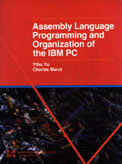

## Referencias

###   
Material del curso

> A veces es un poco difícil o incómodo bajar el material del curso clase por clase; [esta liga](download/ClasesASM.zip) te permitirá bajar el conjunto con todo el material del curso, en formato comprimido.
> 
> Puedes descomprimirlo usando [Winzip](http://www.winzip.com).

###   
Lista de discusión

[Newsgroup mundial sobre lenguaje Ensamblador](news:alt.comp.lang.asm)

> Requiere estar conectado a un servidor apropiado de noticias, se recomienda [news:news.mty.itesm.mx](news:news.mty.itesm.mx), si bien sólo se puede accesar dentro del dominio del ITESM.

  

### [Cuadro de Honor](honor.md)

> Los mejores programas entregados durante las 9 veces que llevamos impartiendo el curso.

###   
Bibliografía

<table border="0">

<tbody>

<tr>

<td>

[Texto](#texto-del-curso)</td>

<td>

[Referencia](#referencia)</td>

<td>

[Electrónica](#www)</td>

<td>

[Programas](#progs)</td>

<td>

[Exámenes](#examenes)</td>

</tr>

</tbody>

</table>

**[Referencias avanzadas (en construcción)](referavanz.md)**

* * *

### Texto del Curso

<table border="0">

<tbody>

<tr>

<td>

</td>

<td>

<table border="0">

<tbody>

<tr>

<td>Yu, Ytha y Marut, Charles: _Assembly Language Programming and Organization of the IBM PC._</td>

</tr>

<tr>

<td>1992, Mc. Graw Hill.</td>

</tr>

<tr>

<td>ISBN 0-07-112896-4</td>

</tr>

<tr>

<td>Costo aproximado: $130.00 pesos (librería interna, por confirmar)</td>

</tr>

</tbody>

</table>

</td>

</tr>

</tbody>

</table>

* * *

### Referencia:

<table border="1">

<tbody>

<tr>

<td>

</td>

<td>Manuales de Turbo Assembler y Turbo Debugger _(recomendados los de la versión 2.0, más didácticos que los siguientes)_</td>

<td>

[Información de Borland](http://www.borland.com)</td>

</tr>

<tr>

<td> </td>

<td>Tischer, Michael:  
_PC Interno 2.0_</td>

<td>1995, Data Becker. 1995, Marcombo (edición en español).  
Distribuido en México por Alfa Omega Editores.  
QA76.5 T5718  
</td>

</tr>

<tr>

<td> </td>

<td>Hall, Douglas V.:  
_Microprocessors and Interfacing: Programming and Hardware_</td>

<td>MacMillan/McGraw Hill.  
QA76.6 H34 1992.  
</td>

</tr>

<tr>

<td> </td>

<td>

[Brown, Ralph](http://www.cs.cmu.edu/afs/cs/user/ralf/pub/WWW/ralf-home.mdl) y Kyle, Jim:  
[_PC Interrupts_](http://www.ctyme.com/rbrown.md)</td>

<td>Addison-Wesley.  
QA76.6 B76\.</td>

</tr>

<tr>

<td> </td>

<td>

Schulman, Andrew, [Brown, Ralph](http://www.cs.cmu.edu/afs/cs/user/ralf/pub/WWW/ralf-home.mdl) y Kyle, Jim:  
El DOS No Documentado</td>

<td>Addison-Wesley</td>

</tr>

<tr>

<td> </td>

<td>Norton, Peter; Aitken, Peter; Wilton, Richard:  
_Peter Norton PC Programmer's Bible_</td>

<td>Microsoft Press.  
QA76.6 N67 1993\.</td>

</tr>

<tr>

<td> </td>

<td>Wyatt, Allen:  
_Using Assembly Language_</td>

<td>Serie Que, Addison-Wesley.

QA76.73.A8W93

1992

</td>

</tr>

<tr>

<td> </td>

<td>Swan, Tom.

_Mastering Turbo Assembler_

</td>

<td>QA76.73.A8S92

Hayden Books

</td>

</tr>

<tr>

<td> </td>

<td>Mischel, Jim.

_Macro Magic with Turbo Assembler_

</td>

<td>QA76.73.A8M57

John Wiley & Sons, 1992\.

</td>

</tr>

<tr>

<td> </td>

<td>Holzner, Steven.

_Advanced Assembly Language_

</td>

<td>QA76.73.H64

Brady

</td>

</tr>

<tr>

<td> </td>

<td>Barkakati y Hyde

_The Waite's Group MASM Bible._

</td>

<td>QA76.76.A87 B37 1992

SAMS

</td>

</tr>

<tr>

<td> </td>

<td>Brey  
_The Advanced Intel Microprocessors: 80286, 80386, 80486_</td>

<td>QA76.8.I2927 B73</td>

</tr>

<tr>

<td> </td>

<td>Bertelsons & Raseh  
_PC al Límite_</td>

<td>QA76.5 B47218</td>

</tr>

</tbody>

</table>

* * *

### En forma electrónica

*   <a name="www">

    Revista</a> [Dr. Dobb's Journal](http://www.ddj.com)

     [Un tutorial de ensamblador (Gracias a la U de G)](http://udgftp.cencar.udg.mx/tutoriales/TutorialEnsamblador/ensam.mdl) **Cambió recientemente**

     [Diversos tips y trucos de ensamblador (en Holanda)](http://www.fys.ruu.nl/~faber/Amain.mdl)

     [Amplia lista de las Interrupciones](http://www.ctyme.com/rbrown.md)

     [Información (no documentada) sobre procesadores Intel](http://www.x86.org)

## <a name="progs">Programas de ejemplo</a>

1.  [Hola Mundo](programa/hello.asm)

    ### Primer parcial

2.  [Clave César](programa/cesar.asm)
    *   Ejemplo de [Makefile](programa/cesar.mak) , para este programa.
3.  [Serie de Fibonacci](programa/fibo.asm)
4.  [Proyecto #1, resuelto](programa/proy1.asm)

    ### [Segundo Parcial](#examenes)

5.  [Ejemplos para cálculo de la raíz cuadrada](programa/read-sqr.md)
6.  [Conversión e Impresión de números](programa/convert.asm)
7.  [Dibujo de un marco usando INT 10h](programa/marco.asm)
8.  [Limpiar pantalla](programa/clear.asm)
    *   [Primera optimización](programa/clear2.asm)
    *   [Segunda optimización](programa/clear3.asm)
9.  [Manejo de arreglos](programa/find_ij.asm)

    ### [Tercer Parcial](#Examen3)

10.  Ejemplos de manejo de archivos:
     
[Type o Cat](programa/mitype.asm) (mostrar un archivo en pantalla)
[Copy](programa/micopy.asm) (crear un archivo destino y colocarle la información leída de un archivo fuente)
[Numera](programa/numera.asm) (Lee un archivo de texto y lo despliega en la salida estándar, con las líneas numeradas).

11.  [Manejo de parámetros de línea de comandos](programa/param2.asm)
12.  [Comparador de archivos](programa/compare.asm)

     ### Cuarto parcial

13.  [Dibujo de un círculo en modo 13h](programa/circulo.asm)
14.  [Muestra del código generado por un compilador de C](programa/param.asm) - En distintos modelos de memoria
15.  Ejemplos de combinar C con Ensamblador
       Programa que usa el Speaker
        *   [SPEAKER.ASM: Librería para Manejo del Speaker](programa/speaker.asm)
        *   [SPEAKER.H: Encabezados para usarla desde C](programa/speaker.h)
        *   [PRUSPEAK.C: Programa para probar el uso desde C](programa/pruspeak.c)
        *   [MAKEFILE para el conjunto](programa/makespk)

       Programa que muestra gráficos en modo 13h
        *   [LIGA.ASM: Funciones en Ensamblador para gráficos en modo 13h](programa/liga.asm)
        *   [LIGA.H: Encabezados para usarla desde C](programa/liga.h)
        *   [LIGA-C.C: Programa para probar el uso desde C](programa/liga-c.c)

### Extras para el Proyecto Final

16.  Ejemplos de programas residentes
       [RESIDE.ASM: Un residente casi mínimo](/Asm/programa/reside.asm)
       [RELOJRES.ASM: Reloj residente](/Asm/programa/relojres.asm)
17.  [Ejemplo de Animación, Compresión y Acceso Directo a Memoria de Video.](/Asm/programa/eclipses/readme.md)

## Soluciones a exámenes

### Semestre 9606

1.  Examen del 2º parcial
    *   [Makefile para los fuentes del Examen 2º parcial](examenes/makefile)
    *   [Pregunta 1: lÍneas diagonales](examenes/uno.asm)
    *   [Pregunta 2 y 3: imprimir cadena con atributos](examenes/dos.asm)
2.  Exámen del 3er. parcial
    *   [Makefile](examenes/make.3)
    *   [Pregunta 1: Línea horizontal con acceso directo a memoria](examenes/ex3-1.asm)
    *   [Pregunta 2: Comparar archivos](examenes/ex3-2.asm)
    *   [Pregunta 3 (rescate): Macro para contar palabras](examenes/ex3-3.asm)