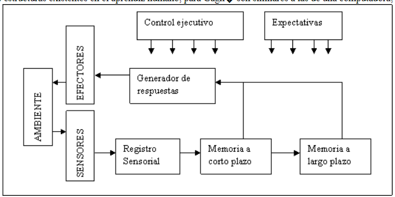
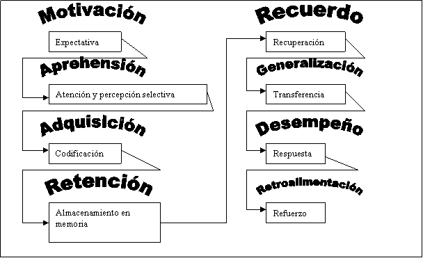
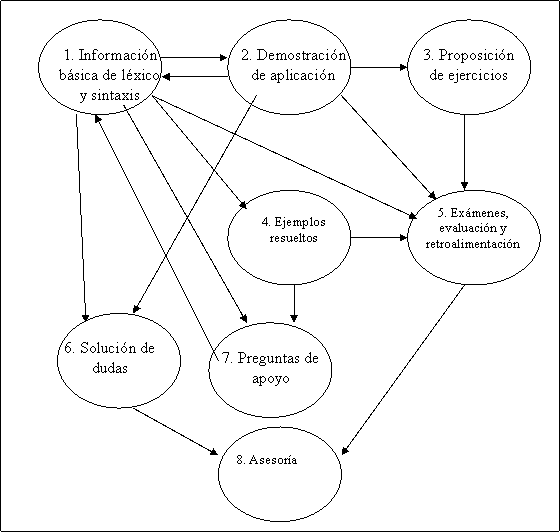
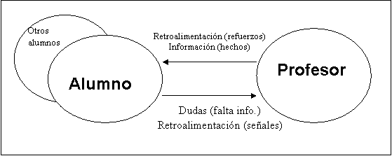
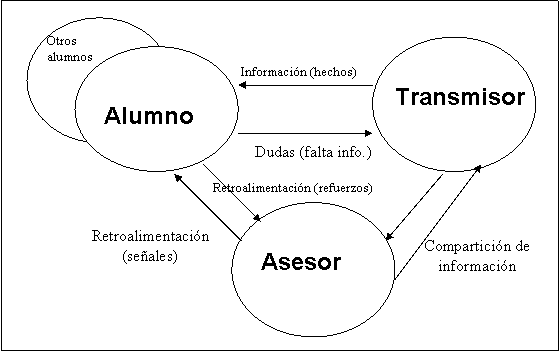
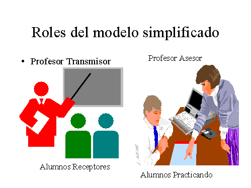

## II - El proceso de enseñanza - aprendizaje de un lenguaje en las materias de programación

## Panorama del capítulo

Una vez que se ha explicado el objetivo general de este trabajo, se requiere analizar cómo ocurre el proceso de asesoría; y fundamentarlo en investigaciones del área de la Pedagogía.

Para construir el asesor inteligente automatizado ANGEL, es necesario realizar un diseño de su operación; esto incluye, además de los aspectos propios de las técnicas de Inteligencia Artificial y Sistemas Tutores Inteligentes, que se tratarán en el capítulo 3, las estrategias de asesoría que se usarán. La ciencia que se ha dedicado a investigar el proceso de enseñanza - aprendizaje y las técnicas para hacerlo más eficiente o mejorar su calidad, es la Pedagogía; ya que el objetivo final de ANGEL es contribuir para mejorar dicho proceso, es conveniente apoyarse en las teorías propuestas dentro de la Pedagogía. Sin embargo, aún no se conoce de estudios pedagógicos que hayan sido realizados en un contexto específico similar al existente en las asignaturas de aprendizaje de lenguajes de programación; por ello, se requiere la observación de dicho contexto, que permita distinguir sus características. Esta será usada para seleccionar un solo modelo pedagógico de referencia sobre el cual se realice la implementación y experimentación de ANGEL.

En este capítulo, se revisan algunos de los más conocidos modelos de instrucción propuestos por la Pedagogía; se explica el contexto en el que deseamos aplicarlos; de acuerdo a ello, se propone un modelo del proceso de enseñanza - aprendizaje de asignaturas de programación y los roles que existen dentro de dicho proceso; y se elige la estrategia instruccional, basada en un modelo teórico aceptado en el ámbito de la Pedagogía, que se considera más apropiada para ser usada dentro del proceso de enseñanza y aprendizaje en el contexto de asignaturas de programación.

El objetivo de este capítulo es por lo tanto, establecer el universo o entorno dentro del cual el agente ANGEL realizará su trabajo; así como la estrategia instruccional que seguirá.

## Modelos de enseñanza-aprendizaje

### Introducción

No se pretende realizar una revisión exhaustiva de los modelos de enseñanza - aprendizaje; sin embargo, sí se considera conveniente revisar las características principales de algunos de ellos, que faciliten situar el contexto dentro del cual se da el proceso de enseñanza y aprendizaje.

Para entender el subproceso de asesoría y sus limitantes, que es el problema al que se busca solución, se requiere examinar los procesos y modelos generales de enseñanza - aprendizaje.

Entre las diversas teorías formadas por diversos pedagogos para explicar cómo se da el aprendizaje, hay básicamente dos tendencias [23]: la instruccional, donde se considera al profesor como el diseñador del contenido que el alumno debe "aprender"; y la del aprendizaje por descubrimiento, donde el profesor es un facilitador para que el alumno descubra el conocimiento que le convenga. Esté fuera del alcance de este trabajo analizar la controversia entre ambos enfoques, sin embargo, se mencionarán algunas características de teorías en las dos tendencias, con el objetivo de tomar una posición apropiada para el objetivo de este trabajo.

### 2.2.2 Teorías instruccionales

Araújo y Chadwick [13] resumen un conjunto de las teorías de instrucción más influyentes, de una forma que permite comparar los puntos de vista, fortalezas y debilidades de distintos autores. Las teorías que cubren incluyen las de Ausubel, Bandura, Bruner, Gagné, Piaget y Skinner, de las que se hace un muy breve resumen a continuación.

Es importante comentar que en esta sección se hablará de aprendizaje desde el enfoque pedagógico, mientras que en el resto del trabajo suele tomarse el enfoque de la Inteligencia Artificial. En el glosario se analiza la diferencia entre ambos sentidos semánticos de aprendizaje.

Siempre que se haga referencia a estos modelos, el enfoque es netamente pedagógico.

Teoría de Ausubel

Se especializa en la adquisición de aprendizaje _significativo_, y por ello no considera el aprendizaje mecánico o de memoria.

Para considerar a un aprendizaje como significativo, requiere de tener un sentido para ser incorporado al conjunto de conocimientos que el sujeto posee; es decir, el concepto aprendido deberá relacionarse con conocimientos previamente existentes en la estructura mental del sujeto. De acuerdo a esto, existen dos tipos de sentido: lógico, en el cual el contenido en sí mismo esté relacionado; y psicológico, que es el sentido propio del sujeto, es decir, la forma en la que encaja el sentido lógico en la estructura mental particular del alumno.

También considera al aprendizaje como _receptivo_, en cuanto a que el profesor establece los contenidos y estructura del material, lo cual facilita su aprendizaje al ahorrar tiempo al alumno y facilitar la organización del nuevo conocimiento dentro de su estructura mental.

Un tema interesante dentro de la teoría de Ausubel, es el reconocimiento de cinco procesos mentales dentro del aprendizaje: reconciliación integrativa, subsunción (derivativa y correlativa), asimilación, diferenciación progresiva, y consolidación. Estos procesos se describen a continuación:

En la reconciliación integrativa se obtiene una generalización, un nuevo concepto que abstrae a otros anteriormente conocidos.

La subsunción es la forma básica en la que entra nuevo contenido al cuerpo de conocimiento del alumno; existen dos formas de la misma: _derivativa_, en la que el concepto aprendido se integra como un nuevo ejemplo de aplicación de un concepto existente, reforzando por tanto al anterior; y _correlativa_, en la cual el contenido del aprendizaje es una extensión, modificación o cualificación de conceptos previamente aprendidos.

La asimilación ocurre cuando aparece un nuevo sentido del concepto, al tiempo que permanece en relación con el concepto original que permitió hacer la subsunción de dicho concepto.

La diferenciación progresiva, que es contraria a la reconciliación integrativa, permite relacionar nuevo conocimiento, por sus diferencias o particularidades. Se orienta a dirigir el aprendizaje de lo general a lo particular, y Ausubel la considera como "más sencilla" para el alumno que la reconciliación integrativa.

La consolidación, es el proceso donde el contenido se refuerza hasta dominarse; debe darse antes de introducir nuevos contenidos.

Además de estos procesos, Ausubel sugiere que el contenido deberá presentarse en una forma organizada, de manera que sea fácil para el alumno incluirlos en su estructura mental; se sugiere el uso de "organizadores avanzados", que son contenidos de inducción que presentan la relación que tendrá el material que se aprenderá, con los conocimientos anteriores del alumno, estableciendo un puente entre ambos conocimientos; y enfatiza la importancia de resaltar la organización y la diferenciación junto con los conceptos.

Mediante el uso de organizadores avancados, se facilita la ocurrencia de los procesos de aprendizaje. Por ello, Ausubel se opone a la tendencia de que en la organización de un libro o material didáctico se olvide de hacer énfasis en las relaciones entre capítulos y secciones.

Teoría de Bandura

Esta teoría toma un enfoque social, donde el aprendizaje es resultado de un proceso de interacción con otras personas. Se define claramente un proceso de aprendizaje, que engloba:

Como entradas, un suceso modelado, que es el comportamiento o técnica que se desea aprender; determinantes antecedentes, que se refieren a expectativas y experiencia previa, así como el estatus del modelo; y los determinantes consecuentes, que incluyen los refuerzos y castigos correspondientes a la imitación o no correcta.

Como procesos internos del aprendiz: atención, que incluye diversas variables sensoriales y psicológicas, donde el aprendiz observa el suceso modelado; retención, donde el aprendiz codifica simbólicamente el suceso, y lo organiza dentro de su estructura cognitiva; reproducción motriz, donde el aprendiz es capaz de repetir el comportamiento, es decir, de aplicar el conocimiento aprendido; y el proceso motivacional, que incluye la ejecución de subprocesos que mantengan trabajando al proceso del aprendizaje, tales como los reforzadores y la autorregulación.

Como salidas esperadas, la repetición del comportamiento aprendido y la autorregulación del alumno.

Los procesos que gobiernan el aprendizaje, según Bandura, se esquematizan en la tabla 3; a su teoría se le conoce como "aprendizaje por observación en un contexto social".

Tabla 3: Procesos que gobiernan el aprendizaje por observación. Tomada de Araujo [13].

<table class="MsoNormalTable" border="1" cellspacing="0" cellpadding="0" style="border-collapse:collapse;border:none;mso-border-alt:solid windowtext .5pt;
 mso-padding-alt:0in 3.5pt 0in 3.5pt;mso-border-insideh:.5pt solid windowtext;
 mso-border-insidev:.5pt solid windowtext">

<tbody>

<tr style="mso-yfti-irow:0">

<td width="159" valign="top" style="width:119.3pt;border:solid windowtext 1.0pt;
  mso-border-alt:solid windowtext .5pt;padding:0in 3.5pt 0in 3.5pt">

Procesos de Atención

</td>

<td width="159" valign="top" style="width:119.3pt;border:solid windowtext 1.0pt;
  border-left:none;mso-border-left-alt:solid windowtext .5pt;mso-border-alt:
  solid windowtext .5pt;padding:0in 3.5pt 0in 3.5pt">

Procesos de retención

</td>

<td width="159" valign="top" style="width:119.3pt;border:solid windowtext 1.0pt;
  border-left:none;mso-border-left-alt:solid windowtext .5pt;mso-border-alt:
  solid windowtext .5pt;padding:0in 3.5pt 0in 3.5pt">

Procesos de reproducción motriz

</td>

<td width="159" valign="top" style="width:119.3pt;border:solid windowtext 1.0pt;
  border-left:none;mso-border-left-alt:solid windowtext .5pt;mso-border-alt:
  solid windowtext .5pt;padding:0in 3.5pt 0in 3.5pt">

Procesos motivacionales

</td>

</tr>

<tr style="mso-yfti-irow:0;mso-yfti-lastrow:yes">

<td width="159" valign="top" style="width:119.3pt;border:solid windowtext 1.0pt;
  border-top:none;mso-border-top-alt:solid windowtext .5pt;mso-border-alt:solid windowtext .5pt;
  padding:0in 3.5pt 0in 3.5pt">

Estímulos modeladores

Nitidez

Valor afectivo

Complejidad

Prominencia

Valor funcional

Características del observador

Capacidades sensoriales

Nivel de estimulación

Campo perceptual

Historia de refuerzo

</td>

<td width="159" valign="top" style="width:119.3pt;border-top:none;border-left:
  none;border-bottom:solid windowtext 1.0pt;border-right:solid windowtext 1.0pt;
  mso-border-top-alt:solid windowtext .5pt;mso-border-left-alt:solid windowtext .5pt;
  mso-border-alt:solid windowtext .5pt;padding:0in 3.5pt 0in 3.5pt">

Codificación simbólica.

Organización cognitiva.

Entrenamiento simbólico.

Entrenamiento motor.

</td>

<td width="159" valign="top" style="width:119.3pt;border-top:none;border-left:
  none;border-bottom:solid windowtext 1.0pt;border-right:solid windowtext 1.0pt;
  mso-border-top-alt:solid windowtext .5pt;mso-border-left-alt:solid windowtext .5pt;
  mso-border-alt:solid windowtext .5pt;padding:0in 3.5pt 0in 3.5pt">

Aptitudes físicas.

Disponibilidad de respuestas.

Autoobservación de los comportamientos reproducidos.

Precisión de la retroalimentación.

</td>

<td width="159" valign="top" style="width:119.3pt;border-top:none;border-left:
  none;border-bottom:solid windowtext 1.0pt;border-right:solid windowtext 1.0pt;
  mso-border-top-alt:solid windowtext .5pt;mso-border-left-alt:solid windowtext .5pt;
  mso-border-alt:solid windowtext .5pt;padding:0in 3.5pt 0in 3.5pt">

Refuerzo externo.

Refuerzo vicario.

Autorrefuerzo.

</td>

</tr>

</tbody>

</table>

#### Teoría de Piaget

Esta teoría, que representa la corriente de la psicología evolutiva, suele no considerarse como una teoría de aprendizaje sino más bien una teoría del desarrollo psicológico [24], y en esto hay cierta controversia. Efectivamente el mismo Piaget no desarrolla una estrategia de instrucción, dejando ese trabajo a pedagogos que usando la psicología evolutiva proponen aquella. Una diferenciación que algunos teóricos hacen y parece ser pertinente, es que una teoría del aprendizaje habla del proceso que ocurre para que el aprendiz adquiera el conocimiento, mientras que una teoría de instrucción ofrece un modelo para optimizar la ocurrencia del proceso de aprendizaje. Con este enfoque, se comenta la teoría de Piaget sin tomarla como teoría instruccional, sino más bien teoría del aprendizaje.

Se consideran varias etapas del desarrollo psicológico del niño, llamadas "estadios": el sensomotor, que abarca del nacimiento hasta los primeros 18 a 24 meses de vida; el de "operaciones concretas", de los 2 a los 11 a 12 años de edad; y el de "operaciones formales", que inicia entre los 11 y 12 años.

En el primer estadio, se desarrollan los esquemas sensorio-motores, pero existe una ausencia operacional de símbolos, y al final del mismo se inicia el establecimiento de esquemas.

En el segundo estadio, que a su vez se divide en dos etapas (pensamiento preoperacional y pensamiento operacional concreto), se desarrollan las funciones simbólicas, tales como el lenguaje, los juegos y la imaginación; y más adelante, la inclusión lógica, se inicia el agrupamiento de estructuras cognitivas, se adquieren nociones tales como la conservación de sustancia, peso, volumen y distancia.

Finalmente, el tercer estadio representa el raciocionio hipotético-deductivo, el uso de proposiciones lógicas y otras estructuras cognitivas de alto nivel como el álgebra.

#### Teoría de Bruner

Esta teoría, relacionada con la de Piaget, enfatiza el aprendizaje por descubrimiento. Indica que el alumno es quien tiene que descubrir el contenido del aprendizaje, pues esto le causa mayor satisfacción y permite una mayor retención; pero desarrolla más específicamente que Piaget una técnica o proceso de instrucción donde el profesor cree el ambiente que favorezca lograr dicho objetivo.

Para ello, propone que los contenidos a enseñar se presenten como un conjunto de problemas y relaciones que el alumno debe resolver, así como lagunas que debe llenar, a fin de que se interese y le resulte significativo el aprendizaje.

De esta manera, se presenta el material de enseñanza como hipótesis a comprobar por el alumno. Se señalan cuatro ventajas, respaldadas por pruebas experimentales:

Potencia intelectual: el alumno, como resultado de esta técnica, forma la habilidad de aplicar el aprendizaje a resolver problemas en la vida real.

Existe motivación, tanto intrínseca (la satisfacción del alumno al resolver el problema) como extrínseca (la retroalimentació  y competencia que se genera con sus compañeros y profesor).

El aprendizaje del descubrimiento en sí mismo; es decir, por la ejercitación de resolver problemas de aprendizaje, el alumno aprende a aprender.

Maximiza la retención en la memoria.

#### Teoría de Gagné.

En esta teoría, el aprendizaje se define como un proceso que permite a un organismo vivo modificar sus comportamientos en forma rápida y permanente; por tanto, el aprendizaje se verifica cuando existe un cambio de comportamiento, relativamente estable. Esto supone cuatro elementos:

Un aprendiz.

Una situación o entorno que permite el aprendizaje.

Un comportamiento explícito del aprendiz.

Un cambio interno.

El proceso del aprendizaje se ve afectado por una serie de factores, internos y externos al aprendiz; los internos incluyen:

La información en forma de hechos, sea que se le presenta al aprendiz o que éste la recuerda de un aprendizaje anterior.

Las habilidades intelectuales previamente desarrolladas.

Las estrategias de aprendizaje previamente desarrolladas.

Mientras que los externos incluyen principalmente:

Contigüidad en las experiencias en el tiempo.

Repetición de la experiencia.

Refuerzo.

Una vez que plantea estos factores que afectan al aprendizaje, Gagné puede plantear al proceso de aprendizaje como un sistema, donde dichas entradas afectan la salida; y por lo tanto, _el profesor puede mejorar la salida controlando las entradas_.

¿Cómo sugiere Gagné que se haga esto? En primer lugar, agrega un concepto, el de jerarquía, importante como base para su descripción del funcionamiento del sistema; este concepto indica que los distintos tipos de aprendizaje (conceptos clasificados) están organizados en forma jerárquica, requiriendose para el aprendizaje de un concepto, el aprendizaje de aquellos subordinados. Sus experimentos demostraron en forma estadísticamente significativa que:

Sólo se verificá el aprendizaje en un nivel jerárquico superior cuando los niveles superiores habían sido aprendidos.

La correlación entre el nivel de aprendizaje en un nivel superior y sus niveles jerárquicamente inferiores fue muy alta.

Las estructuras existentes en el aprendiz humano, para Gagné son similares a las de una computadora; de hecho, su modelo del aprendiz se conoce como "modelo de procesamiento de informaciones". En la figura 2 se muestra el modelo, que incluye:

Figura 2: Modelo básico de aprendizaje y memoria en un enfoque de procesamiento de la información (tomado de Chadwick [13])

Sensores, por los cuales el aprendiz recibe los estímulos del ambiente.

Registro sensorial, que traduce los estímulos en unidades significativas para el aprendiz; por ejemplo, reconocimiento de formas y palabras.

Memoria a corto plazo, donde se procesa durante un tiempo limitado un conjunto de impresiones sensoriales.

Memoria a largo plazo, donde se almacena prácticamente de por vida una sítesis obtenida de la memoria a corto plazo.

Generador de respuestas, el cual ocupa información en cualquiera de las memorias para decidir la acción con la que el aprendiz reaccionará.

Efectores, que son los órganos con los que el aprendiz modifica al ambiente como respuesta.

Control ejecutivo y expectativas, que son variables que controlan cómo se ejecuta el proceso.

Gagné propone un conjunto de fases por las que pasa el aprendizaje, que son motivación, aprehensión, adquisición, retención, recuerdo, generalización, desempeño y retroalimentación.

En la primera fase, que es la _motivación_, el aprendiz establece las expectativas del aprendizaje. El rol del profesor en esta fase es activar la motivación, e informar de los objetivos a alumno.

La segunda fase, conocida como _aprehensión_, es donde ocurre la atención y una percepción selectiva. El rol del profesor consiste en dirigir la atención del alumno.

En la fase de _adquisición_, se codifica y almacena el conocimiento en la memoria de corto plazo. El rol del profesor en este caso es estimular la memoria y proporcionar los hechos en una forma fácil de codificar, así como guiar el aprendizaje.

Posteriormente, en la fase de _retención_, se transfiere el conocimiento a la memoria de largo plazo. Mientras, el profesor continúa desempeñando los mismos roles que en la fase de adquisición.

Una vez retenido el conocimiento, se recuerda; en esta fase de _recuerdo_, el proceso central es la recuperación de la información. Se sugiere que aquí el profesor realice actividades que promuevan la retención.

La fase de _generalización_ permite transferir el conocimiento de un dominio a otro. El profesor puede intervenir promoviendo la transferencia, por ejemplo demostrando la aplicación del conocimiento.

El cambio en el comportamiento se puede medir en la fase de _desempeño_, donde el aprendiz ejecuta una nueva respuesta a la situación original. El profesor aquí solamente interviene como observador.

Finalmente, se cierra un ciclo de aprendizaje en la fase de _retroalimentación_, donde se hace un refuerzo al proceso. En esta fase es donde el profesor interviene fuertemente, dando retroalimentació , sea positiva (premiando y elogiando el buen desempeño) o crítica (seáalando las fallas en el aprendizaje).

Figura 3: Fases y sucesos del aprendizaje según Gagné. Adaptada de Araujo [13].

Teoría de Skinner

La teoría conductista, que representa Skinner [24], indica que el aprendizaje viene del refuerzo; el individuo recibe un estímulo, es decir, experimenta un suceso que percibe sensorialmente; e inmediatamente después, ocurre un refuerzo, es decir, un suceso, controlable por el individuo, que favorece o dificulta la conducta del mismo. El aprendizaje se da cuando el individuo reconoce la conexión entre ambos sucesos, y por ello cambia su comportamiento para conseguir que el suceso ocurra o no ocurra.

Algunos ejemplos son el aprendizaje de abrir un paraguas para protegernos de la lluvia: se tienen el suceso "lluvia" y el suceso "abrir el paraguas", siendo el segundo controlable; el aprendiz reconoce la relación entre ellos: ¿Cuándo abro el paraguas, me protege de la lluvia?, y por ello, desarrolla un cambio en su comportamiento: una vez aprendido, cada vez que el aprendiz se encuentre con el suceso "lluvia", accionará "abrir el paraguas". El enfoque es perfectamente aplicable a eventos de conocimiento: hablando en general, cuando se tiene el suceso "problema" y el suceso "técnica que lo soluciona", el alumno aprende a reconocer esa clase de problemas diferenciándolo de otras clases de problemas, y accionar para dichos problemas la técnica correspondiente. El refuerzo se da cuando el aprendiz obtiene una solución exitosa, la que puede representar desde satisfacción personal, hasta una mejor calificación o la capacidad de ejecutar una acción deseable.

Con estas bases para explicar los cambios de conducta, el método de Skinner para la instrucción consiste en la aplicación de refuerzos; se prefieren los refuerzos positivos, sean los premios o el "castigo" consistente en la falta del premio, si bien se reconoce que también pueden funcionar (y desafortunadamente se usan más de la cuenta) los refuerzos negativos, sea la aplicación de un castigo directo, o "salvarse del castigo" por una buena conducta. De acuerdo a ello se reconoce como la principal función del profesor la de encargarse que ocurra el refuerzo dentro del ambiente de aprendizaje, siempre que el alumno consigue la respuesta apropiada, similar a la que se desea obtener. Para ello, se definen como principales variables el usar muchos pasos pequeños en el aprendizaje, y buscar como objetivo minimizar el número de errores, y una secuencia correcta en los conceptos que asegure una progresión estrictamente creciente.

Aplicación de los modelos instruccionales en el contexto estudiado

La mayoría de los autores anteriores han realizado su investigación en otros contextos, tales como la educación primaria y secundaria. Se requiere un análisis del contexto para establecer cómo se pueden adaptar estos modelos para contribuir en la mejora del proceso de enseñanza y aprendizaje de un lenguaje de programación.

En la siguiente sección, se examina ese contexto, hacia el que se deberá dirigir la aplicación de un modelo instruccional.

### 2.3 Observación de los procesos que intervienen en la enseñanza y aprendizaje de un lenguaje de programación.

La experiencia del autor ha permitido observar algunos patrones comunes en la forma en que se enseña a los alumnos a programar, utilizando un lenguaje de programación específico. Estos patrones se presentan a continuación, y se resumen en la figura 4; a través de la observación de este proceso, se podrá justificar a continuación la selección de un modelo de enseñanza y aprendizaje que pueda ser adaptado a este proceso.

En la gran mayoría de los casos, el profesor (o en su defecto, el libro o artículo), inicia por la introducción del léxico y sintaxis del lenguaje, es decir, qué comandos lo forman, qué otras categorías de palabras (_tokens_) existen, y cómo deben estructurarse para formar unidades lógicas coherentes.

Posteriormente, se suele demostrar cómo escribir un programa completo, o exponer el funcionamiento de uno ya escrito; mostrando de pasada la gramática del lenguaje, es decir, cómo se estructura un texto más amplio en el lenguaje.

Los dos procesos anteriores por lo general no son lineales; ocurren cíclicamente; varias veces a lo largo del curso, se expone un grupo de instrucciones del lenguaje, y después se demuestra su uso. De la misma forma que ocurre en un lenguaje natural, donde se empieza con un léxico limitado, y poco a poco se va ampliando al tiempo que se pueden expresar ideas más complejas. En cada "unidad" del curso (que puede ser una sesión de clase, un capítulo del libro, una semana, mes u otro período conveniente de tiempo), se sugieren o solicitan ejercicios para que el alumno los resuelva, aplicando así el conocimiento recién adquirido.

En la mayoría de las ocasiones, si bien éste es un patrón un poco menos común, se proporcionan ejemplos resueltos de ejercicios más o menos similares a los que el alumno se enfrentará.

También en general, se retroalimenta y evalúa al alumno por medio de exámenes o pruebas; los cuales pueden incluir dos tipos principales de preguntas: las "teóricas", que validan el conocimiento del léxico, o de las reglas sintácticas y gramaticales; y las "prácticas", que consisten en ejercicios de programación.

Cuando los recursos computacionales (principalmente en cuanto a infraestructura de hardware y software) así lo permiten, se realizan prácticas de programación, donde uno o dos alumnos utilizan una computadora para escribir programas en el lenguaje en cuestión, y el profesor tiene la oportunidad de observarlos mientras aplican ese conocimiento, pudiendo así detectar por ejemplo: qué conocimiento requiere el alumno para conseguir sus objetivos, qué conceptos erróneos se han formado por parte del alumno; en general, diagnosticar los problemas en el aprendizaje del alumno; y usando su experiencia, retroalimentarlo de tal forma que pueda resolver dichos problemas.

El profesor contesta las dudas que el alumno le plantea, con lo cual se produce retroalimentació  que dirige al alumno, y adapta la exposición del contenido a las necesidades específicas del alumno.

Otros recursos [8] con los que comúnmente el profesor refuerza el proceso del aprendizaje, incluyen la utilización de distintos medios de exposición (apoyos) y la realización de preguntas.

En algunas ocasiones, especialmente en grupos grandes, el profesor "titular" cuenta con un profesor auxiliar; este auxiliar facilita la labor del profesor titular, en actividades tales como: control del grupo, resolución de dudas, asesoría, evaluación, y en ocasiones también en la "impartición" de la clase. Cabe hacer notar que el tamaño del grupo es un factor que afecta el comportamiento del grupo [24], y el número de dudas o requerimientos de asesoría que recibe el profesor, así como el número de exámenes o tareas a evaluar; pero tareas como explicar, demostrar, y en general, transmitir la información y "hechos" referentes a la asignatura, están limitadas por otros factores tales como el tamaño del aula, del pizarrón, y los medios audiovisuales con los que se cuenta, así como la calidad del material; pero son independientes del número de alumnos.

Figura 4: Proceso de la enseñanza de lenguajes de programación

### 2.4. Roles dentro del proceso de enseñanza - aprendizaje

La generalidad de los modelos instruccionales, como hemos verificado, asumen que en el proceso de enseñanza - aprendizaje hay dos "roles" que juegan los participantes:

-El de profesor, quien ya cuenta con el conocimiento, y se encarga de transmitirlo, exponerlo, o facilitar su adquisición.

-El de alumno, el cual no cuenta con el conocimiento o comportamiento deseado; y cuya tarea consiste en adquirirlo.

Se habla de "roles" y no "participantes", ya que puede haber múltiples individuos desempeñando cada uno de dichos roles; lo único que se puede decir del número de individuos, es que generalmente hay más alumnos que profesores; los arreglos más comunes dentro de un aula son "un profesor que imparte la asignatura a n alumnos", donde n suele estar en el rango de 5 a 300 alumnos, dependiendo del nivel escolar y la asignatura; y "dos profesores para n alumnos", donde dos profesores comparten el rol de profesor, generalmente por que el número de alumnos es alto.

Según sea el modelo instruccional, es la forma en que se supone que interactúan Alumno y Profesor; por ejemplo, algunos modelos indican que el Profesor inicia la interacción, y el Alumno reacciona al Profesor; mientras que en otros, el rol iniciador es el Alumno y el Profesor actúa "reactivamente" [24][23]. Sin embargo, en general se considera que el Profesor transmite información y responde dudas del alumno, además de retroalimentar en forma de refuerzos; mientras que el alumno es un receptor activo (tiene un comportamiento observable) de la información, y plantea dudas o requiere asesoría. Todo esto se ejemplifica en la figura 5.

  
Figura 5: Modelo de dos roles (alumno - profesor).

Tomando el proceso observado durante la experiencia del autor en la enseñanza de lenguajes de programación, en la propuesta de tesis [E2] se propuso la existencia de tres roles: el transmisor, el receptor, y el asesor.

- El transmisor (del conocimiento), generalmente llevado a cabo por el profesor titular, quien se encarga de dirigir el proceso de enseñanza - aprendizaje hacia la consecución de un objetivo definido para el curso o asignatura de la que se trate; en el modelo tradicional [1], toma el papel de exponer la clase y centrar el proceso en él, siguiendo un estilo de conferencia más que de diálogo.

- El receptor (del conocimiento), que es generalmente ejecutado por muchos alumnos, los cuales deberán tener como resultado un aprendizaje, el cual se puede definir como un cambio en el comportamiento (en el caso de aprendizaje de un lenguaje de programación, el cambio implicará que el alumno cuente con la capacidad de resolver problemas utilizando la herramienta "lenguaje de programación" de que se trate).

- Un asesor, quien suele ser el profesor mismo, pero también puede estar a cargo de un profesor auxiliar o de un alumno avanzado; el cual observa al alumno (receptor) al momento de aplicar el conocimiento recibido, y de acuerdo al ajuste del comportamiento del alumno, valida si se ha dado o no el aprendizaje; en el caso de que no se haya dado, es decir, que diagnostique fallas en la ejecución por parte del alumno, le proporciona retroalimentación  que facilite la reconstrucción o complementación del conocimiento del alumno, permitiendo así que se oriente hacia el comportamiento deseado. Este papel puede identificarse con el facilitador que aparece en el nuevo modelo de enseñanza propuesto en el ITESM [1], o en el modelo postmodernista [E1].

Estos roles se resumen en la tabla 4, y en las figuras 6 y 7:

Tabla 4: Algunos agentes que se proponen para el modelado del proceso enseñanza - aprendizaje.

<table class="MsoNormalTable" border="0" cellspacing="0" cellpadding="0" style="border-collapse:collapse;mso-padding-alt:0in 3.5pt 0in 3.5pt">

<tbody>

<tr style="mso-yfti-irow:0">

<td width="477" valign="top" style="width:357.9pt;border-top:solid windowtext 1.0pt;
  border-left:solid windowtext 1.0pt;border-bottom:none;border-right:none;
  mso-border-top-alt:solid windowtext .75pt;mso-border-left-alt:solid windowtext .75pt;
  padding:0in 3.5pt 0in 3.5pt">

**Meta principal**

</td>

<td width="121" valign="top" style="width:91.1pt;border-top:solid windowtext 1.0pt;
  border-left:none;border-bottom:none;border-right:solid windowtext 1.0pt;
  mso-border-top-alt:solid windowtext .75pt;mso-border-right-alt:solid windowtext .75pt;
  padding:0in 3.5pt 0in 3.5pt">

**Nombre del agente**

</td>

</tr>

<tr style="mso-yfti-irow:0">

<td width="477" valign="top" style="width:357.9pt;border:solid windowtext 1.0pt;
  mso-border-alt:solid windowtext .75pt;padding:0in 3.5pt 0in 3.5pt">

Transmitir el conocimiento del lenguaje de programación

</td>

<td width="121" valign="top" style="width:91.1pt;border:solid windowtext 1.0pt;
  border-left:none;mso-border-left-alt:solid windowtext .75pt;mso-border-alt:
  solid windowtext .75pt;padding:0in 3.5pt 0in 3.5pt">

**_Transmisor_**

</td>

</tr>

<tr style="mso-yfti-irow:0">

<td width="477" valign="top" style="width:357.9pt;border:solid windowtext 1.0pt;
  border-top:none;mso-border-top-alt:solid windowtext .75pt;mso-border-alt:
  solid windowtext .75pt;padding:0in 3.5pt 0in 3.5pt">

Adquirir el conocimiento del lenguaje de programación

</td>

<td width="121" valign="top" style="width:91.1pt;border-top:none;border-left:
  none;border-bottom:solid windowtext 1.0pt;border-right:solid windowtext 1.0pt;
  mso-border-top-alt:solid windowtext .75pt;mso-border-left-alt:solid windowtext .75pt;
  mso-border-alt:solid windowtext .75pt;padding:0in 3.5pt 0in 3.5pt">

**_Alumno_**

</td>

</tr>

<tr style="mso-yfti-irow:0;mso-yfti-lastrow:yes">

<td width="477" valign="top" style="width:357.9pt;border:solid windowtext 1.0pt;
  border-top:none;mso-border-top-alt:solid windowtext .75pt;mso-border-alt:
  solid windowtext .75pt;padding:0in 3.5pt 0in 3.5pt">

Reconocer y corregir los errores del Alumno al realizar prácticas de programación

</td>

<td width="121" valign="top" style="width:91.1pt;border-top:none;border-left:
  none;border-bottom:solid windowtext 1.0pt;border-right:solid windowtext 1.0pt;
  mso-border-top-alt:solid windowtext .75pt;mso-border-left-alt:solid windowtext .75pt;
  mso-border-alt:solid windowtext .75pt;padding:0in 3.5pt 0in 3.5pt">

**_Asesor_**

</td>

</tr>

</tbody>

</table>

¿Para qué sirven estos roles? ¿Por qué no simplemente basarse en el modelo de dos roles usado tradicionalmente?

Figura 6: Modelo de tres roles (alumno - profesor - asesor).

El modelo de dos roles esté basado en la observación de los participantes humanos que intervienen en el proceso; es claro que se les puede clasificar en "profesores" y "alumnos" según si su objetivo general es adquirir o transmitir el conocimiento. Sin embargo, se admite que existen diversos procesos ocurriendo dentro de cada una de las entidades; por ejemplo, un alumno humano ejecuta a veces el proceso "memorizar", en otras "analizar", en otras "sintetizar". Del mismo modo, el profesor en ocasiones ejecuta procesos como "ejemplificar", "definir", "preguntar", "responder dudas", "premiar" y "castigar". Desde un enfoque de Sistemas, sería posible dividir a cualquiera de ambos roles, "alumno" o "profesor", en múltiples subsistemas.

Sin embargo, esto aún no explica por qué usar un modelo de tres roles, y no uno de cinco, siete o veinticinco. De hecho, sigue siendo conveniente usar el modelo de dos roles, pues la generalidad de los autores de teorías instruccionales, lo utilizan directamente.

La explicación esté en la necesidad que se busca resolver con un asesor inteligente automatizado:

_El profesor humano (quien evidentemente, funge en el rol de profesor de los modelos instruccionales), se ve limitado en tiempo y espacio, para asesorar oportunamente a los alumnos._

Explicándolo de otro modo:

-El problema detectado consiste en que el profesor no esté disponible en algún momento o lugar, en el que su participación sería benéfica para el proceso de enseñanza - aprendizaje.

-Es deseable, por lo tanto, encontrar una forma de sustituir, parcial o totalmente, el rol del profesor en dichos casos.

-Para muchos de los procesos que realiza el profesor, tales como la transmisión de información, ya se cuenta con sustitutos apropiados; por ejemplo, los libros de texto.

-Sin embargo, existen procesos, como la retroalimentació , resolución de dudas, diagnóstico de la situación de aprendizaje del alumno, y proposición de alternativas para que el alumno supere dicha situación, que no están satisfactoriamente cubiertas.

-Por tanto, se divide el rol del profesor, según el modelo de dos roles, en el rol "transmisor de información" y el rol "asesor". Se supone que estos dos roles forman una partición propia del profesor, es decir, se asume que toda característica del rol profesor será incluida en uno u otro de los nuevos roles propuestos.

-Se supone que el profesor humano, es capaz de cubrir ambos roles, por lo que generalmente no se observa distinción entre ellos.

-Sin embargo, se propone automatizar el rol del asesor, ya que es el que no esté apropiadamente cubierto cuando el profesor humano no esté disponible; y se analiza como campo de estudio de la Inteligencia Artificial, puesto que su comportamiento es inteligente, lo que también explica el por qué no se cuenta con alternativas satisfactorias para sustituir dicho rol, mediante la aplicación de otras disciplinas, salvo la introducción de un asesor humano.

-No es el objetivo sustituir totalmente el rol del profesor; de ahí la división; puesto que las limitaciones existentes no afectan a otras de las actividades del mismo.

_
Figura 7: Participantes que juegan en el modelo de tres roles.

Al construir el asesor inteligente automatizado ANGEL, objeto de este trabajo, éste apoyará a un profesor humano en su enseñanza a alumnos humanos; de manera que los distintos roles serán ejecutados de la forma siguiente (Figura 7):

-El rol de Transmisor será ejecutado por un profesor humano, apoyado por medios tales como libros y páginas WWW

-El rol de Receptor, totalmente por alumnos humanos

-El rol del Asesor será ejecutado en primera instancia por ANGEL, respaldado por el profesor humano.

Aún no contamos con los elementos tecnológicos suficientes para automatizar totalmente el papel del Asesor, pues el recabar el conocimiento necesario para este agente, y su construcción completa, requiere como todo Sistema Tutor Inteligente, de varios años de desarrollo [15]; además de que el problema de dotar al software de sentido común, es aún un problema abierto [5] [18] [19]; de aquí que el profesor humano continúe respaldando el rol.

Sin embargo, ANGEL permitirá aumentar la disponibilidad de la asesoría, al menos hasta cierto nivel de inteligencia, ya que el asesor automatizado podrá apoyar al alumno en momentos y lugares donde el asesor humano no esté disponible, además de recabar información sobre el comportamiento del alumno que ayude a hacer más efectiva la asesoría por parte del humano.

### 2.5 Comparación de modelos instruccionales con la situación actual

En esta sección, se busca encontrar la estrategia pedagógica que mejor se ajuste al entorno observado, de manera que sea usada por ANGEL para guiar su comportamiento como asesor del alumno.

Para ello, se presenta la tabla 5, en la cual se reconocen elementos de la teoría que son aplicados en la asignatura estudiada, así como aquellos que no corresponden con la impartición real de la misma, de manera que se determine qué teoría instruccional corresponde más con el estilo del profesor humano, y de esta manera se pueda usar el modelo seleccionado para modelar al estudiante y las estrategias de asesoría.

Tabla 5: Similitud y diferencia entre las teorías instruccionales y el proceso observado en la enseñanza de la programación.

<table class="MsoNormalTable" border="1" cellspacing="0" cellpadding="0" style="border-collapse:collapse;border:none;mso-border-alt:solid windowtext .5pt;
 mso-padding-alt:0in 3.5pt 0in 3.5pt;mso-border-insideh:.5pt solid windowtext;
 mso-border-insidev:.5pt solid windowtext">

<tbody>

<tr style="mso-yfti-irow:0">

<td width="80" valign="top" style="width:60.2pt;border:solid windowtext 1.0pt;
  mso-border-alt:solid windowtext .5pt;padding:0in 3.5pt 0in 3.5pt">

**_Modelo_**

</td>

<td width="274" valign="top" style="width:205.55pt;border:solid windowtext 1.0pt;
  border-left:none;mso-border-left-alt:solid windowtext .5pt;mso-border-alt:
  solid windowtext .5pt;padding:0in 3.5pt 0in 3.5pt">

**_Corresponde en que..._**

</td>

<td width="274" valign="top" style="width:205.55pt;border:solid windowtext 1.0pt;
  border-left:none;mso-border-left-alt:solid windowtext .5pt;mso-border-alt:
  solid windowtext .5pt;padding:0in 3.5pt 0in 3.5pt">

**_Es diferente en que..._**

</td>

</tr>

<tr style="mso-yfti-irow:0">

<td width="80" valign="top" style="width:60.2pt;border:solid windowtext 1.0pt;
  border-top:none;mso-border-top-alt:solid windowtext .5pt;mso-border-alt:solid windowtext .5pt;
  padding:0in 3.5pt 0in 3.5pt">

Ausubel

</td>

<td width="274" valign="top" style="width:205.55pt;border-top:none;border-left:
  none;border-bottom:solid windowtext 1.0pt;border-right:solid windowtext 1.0pt;
  mso-border-top-alt:solid windowtext .5pt;mso-border-left-alt:solid windowtext .5pt;
  mso-border-alt:solid windowtext .5pt;padding:0in 3.5pt 0in 3.5pt">

- El aprendizaje de la programación es significativo, no puede ser de memoria.

- Los contenidos y estructura del material están establecidos por el profesor.

</td>

<td width="274" valign="top" style="width:205.55pt;border-top:none;border-left:
  none;border-bottom:solid windowtext 1.0pt;border-right:solid windowtext 1.0pt;
  mso-border-top-alt:solid windowtext .5pt;mso-border-left-alt:solid windowtext .5pt;
  mso-border-alt:solid windowtext .5pt;padding:0in 3.5pt 0in 3.5pt">

- El contenido no esté organizado de lo general a lo particular.

- No se usan organizadores avanzados que relacionen el material a exponer con otros conocimientos.

</td>

</tr>

<tr style="mso-yfti-irow:0">

<td width="80" valign="top" style="width:60.2pt;border:solid windowtext 1.0pt;
  border-top:none;mso-border-top-alt:solid windowtext .5pt;mso-border-alt:solid windowtext .5pt;
  padding:0in 3.5pt 0in 3.5pt">

Bandura

</td>

<td width="274" valign="top" style="width:205.55pt;border-top:none;border-left:
  none;border-bottom:solid windowtext 1.0pt;border-right:solid windowtext 1.0pt;
  mso-border-top-alt:solid windowtext .5pt;mso-border-left-alt:solid windowtext .5pt;
  mso-border-alt:solid windowtext .5pt;padding:0in 3.5pt 0in 3.5pt">

- Suele modelarse el suceso "programación", pues el profesor demuestra cómo resuelve un problema aplicando los conocimientos expuestos; y se espera que el alumno repita un comportamiento similar.

</td>

<td width="274" valign="top" style="width:205.55pt;border-top:none;border-left:
  none;border-bottom:solid windowtext 1.0pt;border-right:solid windowtext 1.0pt;
  mso-border-top-alt:solid windowtext .5pt;mso-border-left-alt:solid windowtext .5pt;
  mso-border-alt:solid windowtext .5pt;padding:0in 3.5pt 0in 3.5pt">

- En el proceso observado, se asume que el aprendizaje puede ocurrir sin interacción con otras personas; basta un libro y una computadora. De hecho, de esa forma aprendió (exitosamente) el profesor a programar.

</td>

</tr>

<tr style="mso-yfti-irow:0">

<td width="80" valign="top" style="width:60.2pt;border:solid windowtext 1.0pt;
  border-top:none;mso-border-top-alt:solid windowtext .5pt;mso-border-alt:solid windowtext .5pt;
  padding:0in 3.5pt 0in 3.5pt">

Bruner

</td>

<td width="274" valign="top" style="width:205.55pt;border-top:none;border-left:
  none;border-bottom:solid windowtext 1.0pt;border-right:solid windowtext 1.0pt;
  mso-border-top-alt:solid windowtext .5pt;mso-border-left-alt:solid windowtext .5pt;
  mso-border-alt:solid windowtext .5pt;padding:0in 3.5pt 0in 3.5pt">

- El alumno suele descubrir su propio estilo de programación.

- Se presentan problemas a resolver y el alumno busca sus soluciones.

- Se aprende "haciendo", a través de la práctica.

</td>

<td width="274" valign="top" style="width:205.55pt;border-top:none;border-left:
  none;border-bottom:solid windowtext 1.0pt;border-right:solid windowtext 1.0pt;
  mso-border-top-alt:solid windowtext .5pt;mso-border-left-alt:solid windowtext .5pt;
  mso-border-alt:solid windowtext .5pt;padding:0in 3.5pt 0in 3.5pt">

- No se presenta el material como hipótesis a comprobar, sino como axiomas a aplicar.

</td>

</tr>

<tr style="mso-yfti-irow:0">

<td width="80" valign="top" style="width:60.2pt;border:solid windowtext 1.0pt;
  border-top:none;mso-border-top-alt:solid windowtext .5pt;mso-border-alt:solid windowtext .5pt;
  padding:0in 3.5pt 0in 3.5pt">

Gagné

</td>

<td width="274" valign="top" style="width:205.55pt;border-top:none;border-left:
  none;border-bottom:solid windowtext 1.0pt;border-right:solid windowtext 1.0pt;
  mso-border-top-alt:solid windowtext .5pt;mso-border-left-alt:solid windowtext .5pt;
  mso-border-alt:solid windowtext .5pt;padding:0in 3.5pt 0in 3.5pt">

- Sugiere que la información presentada al aprendiz es factor que promueve el proceso de aprendizaje.

- Hay una fuerte correlación entre el aprendizaje de una nueva habilidad, y las habilidades previamente desarrolladas (se supone como prerrequisito que el alumno sabe programar)

- Ambos modelos reconocen roles similares, y Gagné explica el comportamiento del agente Alumno, siguiendo prácticamente el mismo paradigma.

</td>

<td width="274" valign="top" style="width:205.55pt;border-top:none;border-left:
  none;border-bottom:solid windowtext 1.0pt;border-right:solid windowtext 1.0pt;
  mso-border-top-alt:solid windowtext .5pt;mso-border-left-alt:solid windowtext .5pt;
  mso-border-alt:solid windowtext .5pt;padding:0in 3.5pt 0in 3.5pt">

- No se sigue una estrategia estratificada en fases.

- No se cuenta con un modelo preciso del alumno; es un modelo "difuso", adquirido por el profesor pero no formalizado.

</td>

</tr>

<tr style="mso-yfti-irow:0;mso-yfti-lastrow:yes">

<td width="80" valign="top" style="width:60.2pt;border:solid windowtext 1.0pt;
  border-top:none;mso-border-top-alt:solid windowtext .5pt;mso-border-alt:solid windowtext .5pt;
  padding:0in 3.5pt 0in 3.5pt">

Skinner

</td>

<td width="274" valign="top" style="width:205.55pt;border-top:none;border-left:
  none;border-bottom:solid windowtext 1.0pt;border-right:solid windowtext 1.0pt;
  mso-border-top-alt:solid windowtext .5pt;mso-border-left-alt:solid windowtext .5pt;
  mso-border-alt:solid windowtext .5pt;padding:0in 3.5pt 0in 3.5pt">

- El reconocimiento de las acciones exitosas y erróneas al programar parece seguir claramente el patrón propuesto por Skinner.

- Hay una progresión estrictamente creciente en la complejidad de los contenidos, cada tema requiere los anteriores.

- Se busca minimizar el número de errores.

</td>

<td width="274" valign="top" style="width:205.55pt;border-top:none;border-left:
  none;border-bottom:solid windowtext 1.0pt;border-right:solid windowtext 1.0pt;
  mso-border-top-alt:solid windowtext .5pt;mso-border-left-alt:solid windowtext .5pt;
  mso-border-alt:solid windowtext .5pt;padding:0in 3.5pt 0in 3.5pt">

- El aprendizaje de la programación se da por "saltos cuánticos" y mesetas, no en pasos pequeños.

</td>

</tr>

</tbody>

</table>

De la tabla se deduce que no hay una clara relación entre una teoría particular de instrucción, y el proceso observado; hay gran cantidad de similitudes con todas las teorías instruccionales, y pocas diferencias.

Algunas de las diferencias encontradas pueden aprovecharse como estrategias de enseñanza; como ejemplo, se mencionarán las siguientes:

La teoría de Ausubel sugiere enfatizar la organización lógica como parte del contenido a aprender, lo cual puede agregarse y enriquecer al curso actual

La teoría de Bandura puede aplicarse para modelar de un ambiente como el aula, donde hay muchos aprendices, y aprovechar las interacciones entre ellos para reforzar el aprendizaje

La teoría de Bruner aporta sugerencias especialmente en la parte de práctica de la programación, en el laboratorio

La de Gagné cuenta con un claro modelo del aprendiz, de las fases del aprendizaje y hasta cierto punto de las estrategias que debe seguir el profesor

La de Skinner puede ayudar a diseñar un contenido que permita a los alumnos reconocer los errores comunes y estrategias exitosas (exponiéndolos a los mismos)

### 2.6 Selección de un modelo de referencia.</a>

Se mostró que cualquiera de las teorías instruccionales observadas puede resultar útil en la mejora del proceso de enseñanza - aprendizaje observado para lenguajes de programación. La decisión para utilizar uno u otro modelo, en el desarrollo de un asesor inteligente, puede justificarse por razones pedagógicas y técnicas. Se exponen a continuación cada uno de los modelos, junto con las justificaciones (de ambos tipos) por las que se prefiría utilizar o no dicho modelo.

El modelo de Ausubel es apropiado, desde el punto de vista pedagógico; coincide con la estructura actual de un curso sobre lenguajes de programación, y sus diferencias se reconocen como posibles mejoras en el curso actual. Pero desde el punto de vista técnico, Ausubel no propone un modelo formal del estudiante, es decir, no describe las variables y atributos internos del alumno, que son afectadas por el proceso de enseñanza - aprendizaje. Como se verá en el capítulo 3, se requerirá implementar dicho modelo del estudiante; por lo que se prefiría un modelo instruccional que esté complementado con una representación del estudiante.

El modelo de Bandura es apropiado para el ambiente tradicional (el aula) de aprendizaje, especialmente cuando es un laboratorio. Sin embargo, su teoría del aprendizaje social no explica los eventos de aprendizaje fuera del contexto del aula; como puede ser el desarrollo de proyectos y ejercicios de programación, por cuenta del alumno; y no presenta estrategias instruccionales apropiadas para este caso. Ya que el problema que se desea atacar en este trabajo, es la mejora específicamente en el proceso de asesoría, cuando el profesor no esté disponible o es un recurso limitado, el modelo de Bandura resulta incompleto para utilizarse en dicho problema.

Al igual que en el modelo de Ausubel, en el de Bruner no se tiene ninguna crítica desde el punto de vista pedagógico; al contrario, sus sugerencias pueden ser aplicadas hacia la mejora del curso. Pero adolece del mismo problema: la falta de una definición de los atributos internos del alumno y cómo son afectados por el proceso de aprendizaje.

El modelo de Skinner es apropiado pedagógicamente, para representar muchos de los subprocesos reconocidos en el proceso observado; de hecho, es excelente para explicar algunos puntos, por ejemplo cómo el alumno cambia su comportamiento al reconocer un error en su programa, como un estímulo negativo, y asociarlo con la estrategia apropiada para corregirlo (y eliminar el estímulo indeseado). Resulta por ello una opción interesante para su implementación. Pero representa al alumno en una forma reactiva, donde el aprendizaje viene totalmente como consecuencia de estímulos externos, explícitamente no intenta explicar el proceso que ocurre dentro del individuo para que el aprendizaje ocurra; y asume que los sucesos internos son colaterales al comportamiento que les da origen. Estas consideraciones, si bien son controvertidas [13], dificultarían la implementación y hacen que el autor prefiera tomar la posición de Gagné.

El modelo de Gagné y su enfoque sistémico describe con precisión el proceso de enseñanza - aprendizaje y cómo los estímulos externos e internos afectan al sistema; describe los procesos y componentes internos del alumno; y pedagógicamente es tan apropiado como el de Ausubel y Bruner. Por ello, se selecciona el modelo de Gagné, para su adaptación e integración al asesor inteligente objeto de este trabajo. Por contar con el planteamiento detallado de las variables indicadas, resulta el más sencillo de adaptar; mientras que con otros modelos tendría que realizarse un trabajo de investigación pedagógica, que permitiera complementar al modelo con una descripción detallada de los efectos de la instrucción en el alumno, y por tanto, modelara al alumno como entidad afectada por el proceso. Dicha investigación pedagógica va más allá del objetivo de este trabajo, por lo cual, se decidió no seguir esa línea.

### Conclusiones

Para modelar los roles explicados en la sección 1.4, además de la propuesta que viene de la observación y experiencia en las aulas, conviene respaldarla con modelos teóricos de la Pedagogía, que tratan de explicar cómo el alumno forma los conceptos al ir aprendiendo, y por lo tanto, qué efecto tiene el asesor sobre las variables del aprendizaje.

Después de construir y observar la tabla 5, se concluye que cualquiera de las teorías, o una combinación de ellas, podría ser usada en el contexto para mejorar el proceso de enseñanza - aprendizaje. Por lo que se utilizan criterios pedagógicos y técnicos para discriminar la teoría que se adaptará en la construcción del asesor inteligente ANGEL.

Se considera que el modelo de Gagné es el más apropiado para su adaptación; por ello, ANGEL, el asesor inteligente automatizado que se construye en este trabajo, lo usa para representar su estrategia instruccional. Sin embargo, se observa que otros modelos podrían aplicarse al problema; por lo que debe considerarse la selección del modelo de Gagné como una opción para experimentarse en este trabajo, quedando como posibilidad de trabajo futuro cambiar la estrategia instruccional. Por ello, ANGEL toma un enfoque modular, que aísla dicha estrategia instruccional del resto del sistema.

Una vez que se ha establecido la dirección a seguir respecto al modelo instruccional y cómo encaja dentro del contexto, en este trabajo se hace un repaso de las investigaciones anteriores en el área de la Inteligencia Artificial, aplicada a la enseñanza. Esta rama de investigación es conocida como Sistemas Tutores Inteligentes, y se expondrá en el capítulo 3.
