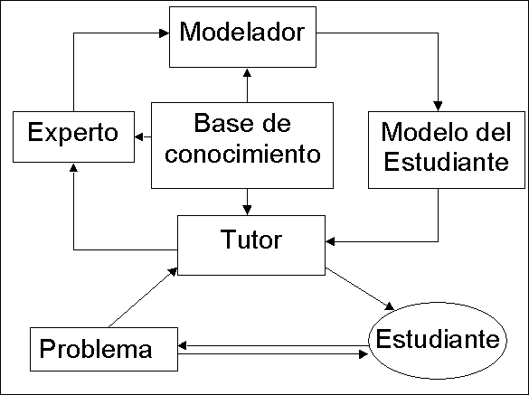

# 3. Sistemas Tutores Inteligentes

## 3.1 Panorama del capítulo

Ya se ha establecido la estrategia y metodología que se seguirá desde el punto de vista de la Pedagogía; si bien aún no se describe profundamente el contexto del curso, se desea ahora enfocar el problema desde el punto de vista con el que se ha atacado previamente por las Ciencias Computacionales y específicamente la Inteligencia Artificial; como se mencionó en los Antecedentes, este problema ha sido el área de estudio de los Sistemas Tutores Inteligentes.

Por ello, en este capítulo se examina el trabajo anterior en el área de Sistemas Tutores Inteligentes, enfatizando la tecnología y arquitectura generales que han utilizado distintos investigadores. En particular, se revisan esfuerzos similares al actual para implementar asesores inteligentes para la enseñanza de lenguajes de programación; y se hace una comparación entre ellos, que permite mostrar su evolución.

Finalmente, se explica la relación entre los Sistemas Tutores Inteligentes y las Interfaces Inteligentes, y se propone clasificar a los Asesores Inteligentes Automatizados como aquellos Sistemas Tutores Inteligentes que además son Interfaces Inteligentes.

Con esta base, el objetivo a cubrir en este capítulo será contar con el fundamento teórico del diseño y construccióñ de Sistemas Tutores Inteligentes, y las características propias de un asesor inteligente, todo lo cual será un punto de partida para el diseño de ANGEL.

## 3.2 Revisión histórica

Clancey [15] hace una exposición de la historia de los sistemas tutores inteligentes, del porqué se les llama de esta forma, las características relevantes, y sus componentes. En primer término, se describen unos cuantos de ellos, los suficientes para introducir el tema y más adelante establecer una clasificación y arquitectura de los mismos.

#### 3.2.1 SCHOLAR

El primer programa dedicado a la enseñanza que usa una representación de conocimiento, basada en el trabajo en Inteligencia Artificial, se le debe a Carbonell, en 1970, y se conoce como SCHOLAR [15][3][11][22]. Este programa reconoce la posibilidad de separar el conocimiento sobre ¿Cómo enseñará?, del conocimiento sobre la materia a estudiar. En este caso, usa una red semántica para representar el dominio, específicamente la geografía de Sudamérica; y la estrategia de interacción con el estudiante es codificada en el programa que hace uso de dicho conocimiento.

Usa una interface de línea de comandos, tradicional en la época en que se desarrolló, donde SCHOLAR le plantea preguntas al alumno sobre el tema; el alumno puede contestarlas, en cuyo caso el programa las evalúa y retroalimenta al alumno; pero además cuenta con un reloj, que usa para decidir avisar al estudiante que esté tardando demasiado. Sin embargo, lo que permite una retroalimentación inteligente es su capacidad de permitir que el estudiante tome iniciativa y haga preguntas; en ese caso, el programa es capaz de contestarlas, demostrando su razonamiento si es que no contaba con el hecho en su memoria; y de pedir al alumno que regrese a la pregunta anterior. Una de las fortalezas de SCHOLAR esté en su reconocimiento del lenguaje natural.

#### 3.2.2 West

Un primer ejemplo de la técnica de Asesor Inteligente en un Sistema Tutor Inteligente, es el trabajo WEST. [15][22]

Para enseñar matemáticas a niños, se desarrolló el sistema PLATO. Este sistema incluye diversos módulos, la mayoría de ellos de tipo CAI, donde se generan problemas y se presentan "apuntes" al alumno; se le puede considerar un "ambiente de aprendizaje". Uno de estos módulos implementa el juego ¿How the West was won?, que consiste en usar operaciones matemáticas correctamente, de lo cual se desprende el avance del jugador que controla el niño; el juego incluye a WEST, el asesor inteligente que apoya al niño en el proceso de jugar, y por consiguiente, de aprender los conceptos matemáticos asociados al juego.

El paradigma que sigue es conocido como "Pendientes y Ejemplos"(_Issues_  _and_ _Examples_). En él, se enumeraron todos los tipos de combinaciones de operadores, a los que se llaman "pendientes"; por ejemplo, el que un estudiante conozca la forma de utilizar los paréntesis para agrupar una operación. Para realizar la crítica y retroalimentación, se requiere reconocer un pendiente del alumno, tal como observar que en una larga sesión no ha usado paréntesis, contando con oportunidades donde sería óptimo hacerlo. Pero simplemente indicárselo al alumno en cualquier momento no sería efectivo; debe ocurrir en un momento que sea oportuno para mostrarle un buen ejemplo de cómo aplicarlos, por ejemplo, la próxima vez que no los use y le representen un claro beneficio.

Este paradigma es sumamente aplicable, pues con él pueden construirse Sistemas Tutores en forma general: proveer las reglas o conceptos que se quieren enseñar (los "pendientes" de aprender para el estudiante); y reconocedores de patrones que identifiquen si el estudiante ya los conoce o no.

#### 3.2.3 MENO

Este es un Sistema Tutor Inteligente orientado a la enseñanza de la programación, específicamente de Pascal. Cuenta con un conjunto de plantillas de programas, que son soluciones plausibles a problemas que plantea; por ejemplo "realizar un programa que calcule el promedio de una lista de nÚmeros"; así como con una base de datos de los errores comunes de los estudiantes que resuelven el problema; es capaz de reconocer estos errores a través de un análisis del programa que proporciona el estudiante, y su comparación con la plantilla. De acuerdo a ello, presenta sugerencias para corregir el programa, además de indicarle al estudiante cuáles pueden ser las causas de su error (qué conceptos aplicó en forma incorrecta, o tal vez no conozca).

Más tarde se continuó el trabajo en este sistema, conocido ahora como PROUST [11]; con el agregado de que es capaz de analizar completamente el código, sin usar una plantilla, haciéndolo más general.

#### 3.2.4 Coach

Otro ejemplo de asesor inteligente, orientado a la enseñanza de lenguajes de programación, es COACH [7]. En este caso, se ofrece un ambiente de ayuda interactiva, donde el usuario proporciona una entrada (que se espera sea un programa en LISP); y en un panel separado, el asesor ofrece información relevante.

Posiblemente la innovación más relevante que presenta Selker, es que el modelo del estudiante es adaptativo, incluyendo variables tales como la tasa de cambio en el alumno; de esta forma, el sistema va evolucionando cuando el estudiante aprende, y de esta manera el alumno recibe un distinto tipo de asesoría según su nivel de conocimientos. Por otro lado, en este estudio se demostró claramente la capacidad del sistema para ser adaptado a otro dominio de conocimiento (en este caso, la enseñanza de los comandos del sistema operativo UNIX).

## 3.3 Características que distinguen un sistema tutor inteligente

Podemos resumir un conjunto de características que debe cumplir todo sistema tutor inteligente (ITS). [15][3]

-En primer lugar, se les da el calificativo de "Inteligentes" para contrastarlo con los sistemas tradicionales de instrucción por computadora (CAI), siendo la diferencia el uso de técnicas de la Inteligencia Artificial.

-Una razón para atribuir "inteligencia" a estos sistemas, esté en su capacidad de resolver los problemas que presenta a los estudiantes, y explicar cómo lo hizo.

-Al igual que los sistemas de CAI tradicionales, permiten un mayor grado de individualización en la instrucción [E5]; en particular, un ITS relaciona la instrucción con el entendimiento de las metas y creencias del estudiante. [41][10][28]

-En un sistema de CAI no inteligente, el orden y plan de interacción están más bien predefinidos; mientras que en un ITS, se usan técnicas de Inteligencia Artificial tales como la planeación, optimización y búsquedas, dejando que el sistema decida "inteligentemente" el orden de presentación del contenido al alumno. [15][27][29]

-La interacción puede ser muy variada en un ITS; desde los pasivos o reactivos, que dependen completamente de esperar a que el alumno realice una acción bien determinada; hasta los que constantemente presentan nueva información (tutor oportunista), pasando por los asesores, caracterizados por observar al alumno mientras que realiza una tarea, sin interferir constantemente, pero explicando o enseñando un concepto en un momento importante o cuando el alumno lo pide.

-Recientemente, se ha ampliado el uso de interaces más sofisticadas, que refuerzan la disponibilidad y facilidad de uso de los tutores inteligentes. Dos tendencias importantes en este sentido, son la utilización de multimedia y del WWW. [26][43][35][38]

No basta con indicarle a un estudiante su error y luego cuál es la solución correcta; debe hacer hipótesis basadas en su historial de errores, y de acuerdo a eso detectar la fuente del problema. [22]

De esta manera, una definición amplia sería la siguiente:

_Un Sistema Tutor Inteligente es un sistema de enseñanza asistida por computadora, que utiliza técnicas de Inteligencia Artificial, principalmente para representar el conocimiento y dirigir una estrategia de enseñanza; y es capaz de comportarse como un experto, tanto en el dominio de conocimiento que enseña (mostrando al alumno cómo aplicar dicho conocimiento), como en el dominio pedagógico, donde es capaz de diagnosticar la situación en la que se encuentra el estudiante y de acuerdo a ello ofrecer una acción o solución que le permita progresar en el aprendizaje._

## 3.4 Componentes generales

Kaplan [11] propone una arquitectura para un Sistema Tutor Inteligente, mostrada en la figura 8, que ya se había analizado en la Propuesta de Tesis [E2]

_
Figura 8: Arquitectura de Sistemas Tutores Inteligentes, según Kaplan.

Los componentes que Kaplan reconoce son:

-La interface, que permite a los usuarios interactuar con el sistema. Se distinguen tres tipos específicos de usuarios: el Estudiante, el Instructor, y el Desarrollador del sistema.

-El modelo instruccional o pedagógico, el que se encarga de definir la estrategia para transmitir el conocimiento a los usuarios.

-El modelo experto o del dominio, el cual versa sobre la materia o curso que se impartirá.

-El modelo del estudiante, que refleja cuánto conoce el estudiante sobre el dominio, así como las experiencias cognitivas y de aprendizaje que ha llevado, del cual puede obtenerse un diagnóstico. [E5]

Se encuentra otra propuesta de arquitectura general en Clancey [15], que a su vez la toma del trabajo de Goldstein; como se puede ver en la figura 9, resulta similar a la de Kaplan.

_

Figura 9: Arquitectura de Sistemas Tutores Inteligentes, según Clancey.

Al igual que el paradigma planteado en WEST, un punto que se puede resaltar de esta propuesta de arquitectura, es la separación de funciones de los módulos: por un lado, el modelo del estudiante se construye y actualiza a través de un diagnóstico, realizado por el módulo 'modelador', que puede considerarse un primer 'experto'; y por el otro, el tutor propiamente dicho, que recaba la información sobre el estudiante, pero también lo retroalimenta, para lo cual requiere una estrategia y tomar decisiones, lo cual también es un comportamiento más o menos 'inteligente'. De manera que, por decir lo menos, un Sistema Tutor Inteligente es un sistema experto y 'algo más' [3][4].

Desde el punto de vista de la Inteligencia Artificial, hay diversas formas de implementar dicho modelo; conviene mencionar al menos dos alternativas que surgen naturalmente de observar la figura 9:

- Dos sistemas expertos: uno encargado de diagnosticar el estado actual del alumno (el experto del dominio); y uno encargado de decidir la mejor forma de retroalimentarlo en el momento actual (el experto asesor). [15][7]
- Un sistema experto de diagnóstico (el experto del dominio) [2], y un algoritmo programático de decisión sobre la estrategia de retroalimentación, basado en una representación especialmente concebida del conocimiento sobre el estado del alumno.

## 3.5 Clasificación de Sistemas Tutores Inteligentes, de acuerdo a su rol en un modelo de enseñanza-aprendizaje. 

De la estrategia de instrucción de los Sistemas Tutores Inteligentes, podemos reconocer al menos dos tendencias, que nos llevan a clasificarlos por su 'rol'; estos roles corresponden con los definidos en el capítulo 2, "El proceso de enseñanza-aprendizaje de lenguajes de programación":

- Sistemas instruccionales, orientados a transmitir el conocimiento y guiar al estudiante; en estos sistemas, el estudiante ejecuta la tarea 'estudiar el lenguaje', de modo que el sistema se comporta como un profesor transmisor. En general, el sistema controla el flujo del trabajo, y dirige la interacción con el alumno. Evidentemente, el rol del sistema se identifica con el de Profesor Transmisor. [3][15][10][14][22][31][37][41][43]

- Sistemas asesores, orientados a apoyar al estudiante en su aprendizaje, el cual ocurre a través de la ejecución de una tarea de aplicación por parte del estudiante. En estos sistemas, el estudiante se enfoca a la tarea 'programar', y el sistema se comporta como un asesor, es decir, como un auxiliar que realiza sugerencias al alumno de acuerdo a su criterio, con el objetivo de que el estudiante mejore su desempeño. En este caso, el estudiante dirige la tarea, y la realiza en el orden que considere conveniente; inclusive, puede controlar la interacción con el sistema. A este rol se le definió, precisamente, como el rol de Profesor Asesor. [7][2][3][15][22]

El concepto de asesores no es exclusivo de la enseñanza; es aplicable en otros ámbitos; sin embargo, en este trabajo, se usa el término 'asesores inteligentes' exclusivamente en referencia a este contexto. Cuando un sistema asesora al usuario sobre la forma de interactuar con una computadora, se dice que contamos con una_interace inteligente_. Por ello, se examinan a continuación algunos de los trabajos en el área de investigación sobre interaces inteligentes [6][16][17][20][31][32][33][39][40], así como las características de las mismas.

## 3.6 Interfaces inteligentes

### 3.6.1 Problemática en el diseño de interface

Schneiderman [6] resume los siguientes beneficios del estudio del diseño de Interface Hombre- Máquina.

- Conseguir el desempeño requerido por un sistema; si el diseño no es correcto, se reduce la productividad del usuario que opera el sistema:

- Minimizar el personal, su capacidad o entrenamiento requeridos, y por lo tanto, los costos del sistema:

- Conseguir la confiabilidad requerida; en muchos sistemas, un objetivo es la reducción de los errores que se presentan en los procesos. Un buen diseño reduce la tasa de error humano.

- Promover la estandarización, lo que facilite la transferencia del conocimiento de los operadores a otros sistemas.

Existen diversas limitantes para conseguir estos beneficios; pero hay investigadores que han observado la oportunidad de mejorar una interface, utilizando técnicas de Inteligencia Artificial. De acuerdo a los criterios de Schneiderman, esto se puede conseguir [6]:

- Aumentando el desempeño del sistema (por ejemplo, si se deducen las acciones que el usuario requiere y se realizan automáticamente) [36].

- Usando el Reconocimiento de Patrones para detectar acciones comunes y crear 'Macros' que le permitan al usuario ejecutar dichas acciones más eficientemente. [16][17][39][36]

- Facilitando al personal el entrenamiento (por ejemplo, por medio de una ayuda en línea que use lenguaje natural, o un sistema tutor inteligente incluido) [6][41][27].

Existen distintos intentos y técnicas dentro del área de Inteligencia Artificial que tratan sobre el desarrollo de sistemas que permiten una amplia adaptabilidad a distintos usuarios. Uno de los nombres genéricos que se ha dado a estos sistemas es el de _Sistemas Adaptativos_ [20]. Dado que ANGEL deberá adaptarse automáticamente al perfil de cada alumno, se puede considerar como un sistema adaptativo; por lo que conviene hacer referencia al estado del arte en dicho campo.

### 3.6.2 Sistemas adaptativos: una clasificación

Benyon y Murray [20] introducen el campo de estudio de los sistemas adaptativos, y hacen una clasificación de los mismos, proveyendo un modelo de referencia para comparar a dichos sistemas. Este modelo se resume en la tabla 6.
_Tabla 6: Clasificación de Sistemas Adaptativos según Benyon - Murray [20]_

<table class="MsoNormalTable" border="1" cellspacing="0" cellpadding="0" style="border-collapse:collapse;border:none;mso-border-alt:solid windowtext .75pt;
 mso-padding-alt:0in 3.5pt 0in 3.5pt">

<tbody>

<tr>

<td width="150" valign="top" style="width:112.25pt;border:solid windowtext 1.0pt;
  border-right:none;mso-border-top-alt:solid windowtext .5pt;mso-border-left-alt:
  solid windowtext .5pt;mso-border-bottom-alt:solid windowtext .5pt;padding:
  0in 3.5pt 0in 3.5pt">

**Categoría**

</td>

<td width="214" valign="top" style="width:160.6pt;border-top:solid windowtext 1.0pt;
  border-left:none;border-bottom:solid windowtext 1.0pt;border-right:none;
  mso-border-top-alt:solid windowtext .5pt;mso-border-bottom-alt:solid windowtext .5pt;
  padding:0in 3.5pt 0in 3.5pt">

**Característica**

</td>

<td width="217" valign="top" style="width:163.0pt;border:solid windowtext 1.0pt;
  border-left:none;mso-border-top-alt:solid windowtext .5pt;mso-border-bottom-alt:
  solid windowtext .5pt;mso-border-right-alt:solid windowtext .5pt;padding:
  0in 3.5pt 0in 3.5pt">

**Metas principales**

</td>

</tr>

<tr>

<td width="150" valign="top" style="width:112.25pt;border:none;border-left:solid windowtext 1.0pt;
  mso-border-left-alt:solid windowtext .75pt;padding:0in 3.5pt 0in 3.5pt">

Interfaces inteligentes

</td>

<td width="214" valign="top" style="width:160.6pt;border:none;padding:0in 3.5pt 0in 3.5pt">

Representación del usuario individual y del dominio

</td>

<td width="217" valign="top" style="width:163.0pt;border:none;border-right:solid windowtext 1.0pt;
  mso-border-right-alt:solid windowtext .75pt;padding:0in 3.5pt 0in 3.5pt">

Facilitar el uso del software para una amplia variedad de usuarios

</td>

</tr>

<tr>

<td width="150" valign="top" style="width:112.25pt;border:none;border-left:solid windowtext 1.0pt;
  mso-border-left-alt:solid windowtext .75pt;padding:0in 3.5pt 0in 3.5pt">

Sistemas Adaptativos de Lenguaje Natural (NL)

</td>

<td width="214" valign="top" style="width:160.6pt;border:none;padding:0in 3.5pt 0in 3.5pt">

Inferencia de necesidades y metas del usuario

</td>

<td width="217" valign="top" style="width:163.0pt;border:none;border-right:solid windowtext 1.0pt;
  mso-border-right-alt:solid windowtext .75pt;padding:0in 3.5pt 0in 3.5pt">

Facilitar la comprensión y generación del lenguaje natural, al ajustar el dominio al usuario particular.

</td>

</tr>

<tr style="mso-yfti-lastrow:yes">

<td width="150" valign="top" style="width:112.25pt;border-top:none;border-left:
  solid windowtext 1.0pt;border-bottom:solid windowtext 1.0pt;border-right:
  none;mso-border-left-alt:solid windowtext .75pt;mso-border-bottom-alt:solid windowtext .75pt;
  padding:0in 3.5pt 0in 3.5pt">

Tutores Inteligentes (ITS)

</td>

<td width="214" valign="top" style="width:160.6pt;border:none;border-bottom:solid windowtext 1.0pt;
  mso-border-bottom-alt:solid windowtext .75pt;padding:0in 3.5pt 0in 3.5pt">

Capaces de reconocer errores y conceptos erróneos, de observar el comportamiento del usuario e intervenir de ser necesario.

</td>

<td width="217" valign="top" style="width:163.0pt;border-top:none;border-left:
  none;border-bottom:solid windowtext 1.0pt;border-right:solid windowtext 1.0pt;
  mso-border-bottom-alt:solid windowtext .75pt;mso-border-right-alt:solid windowtext .75pt;
  padding:0in 3.5pt 0in 3.5pt">

Enseñar conceptos al usuario estudiante (se asume la meta del usuario)

</td>

</tr>

</tbody>

</table>

  

_Tabla 6: Clasificación de Sistemas Adaptativos según Benyon - Murray [20] (continúa)_

<table class="MsoNormalTable" border="1" cellspacing="0" cellpadding="0" style="border-collapse:collapse;border:none;mso-border-alt:solid windowtext .75pt;
 mso-padding-alt:0in 3.5pt 0in 3.5pt">

<tbody>

<tr>

<td width="150" valign="top" style="width:112.25pt;border-top:solid windowtext 1.0pt;
  border-left:solid windowtext 1.0pt;border-bottom:none;border-right:none;
  mso-border-top-alt:solid windowtext .75pt;mso-border-left-alt:solid windowtext .75pt;
  padding:0in 3.5pt 0in 3.5pt">

Soporte Inteligente

</td>

<td width="214" valign="top" style="width:160.6pt;border:none;border-top:solid windowtext 1.0pt;
  mso-border-top-alt:solid windowtext .75pt;padding:0in 3.5pt 0in 3.5pt">

Incluyen las características de ITS; uso de lenguaje natural; orientados a la solución de problemas.

</td>

<td width="217" valign="top" style="width:163.0pt;border-top:solid windowtext 1.0pt;
  border-left:none;border-bottom:none;border-right:solid windowtext 1.0pt;
  mso-border-top-alt:solid windowtext .75pt;mso-border-right-alt:solid windowtext .75pt;
  padding:0in 3.5pt 0in 3.5pt">

Ayuda activa, apoya al usuario en la ejecución de la tarea, no en su aprendizaje.

</td>

</tr>

<tr>

<td width="150" valign="top" style="width:112.25pt;border:none;border-left:solid windowtext 1.0pt;
  mso-border-left-alt:solid windowtext .75pt;padding:0in 3.5pt 0in 3.5pt">

Sistemas de Explicación

</td>

<td width="214" valign="top" style="width:160.6pt;border:none;padding:0in 3.5pt 0in 3.5pt">

Agregan a lo anterior, la capacidad de explicar el comportamiento del sistema

</td>

<td width="217" valign="top" style="width:163.0pt;border:none;border-right:solid windowtext 1.0pt;
  mso-border-right-alt:solid windowtext .75pt;padding:0in 3.5pt 0in 3.5pt">

Mostrar al usuario el porqué del comportamiento

</td>

</tr>

<tr style="mso-yfti-lastrow:yes">

<td width="150" valign="top" style="width:112.25pt;border-top:none;border-left:
  solid windowtext 1.0pt;border-bottom:solid windowtext 1.0pt;border-right:
  none;mso-border-left-alt:solid windowtext .75pt;mso-border-bottom-alt:solid windowtext .75pt;
  padding:0in 3.5pt 0in 3.5pt">

Agentes cooperativos inteligentes [9][31][40]

</td>

<td width="214" valign="top" style="width:160.6pt;border:none;border-bottom:solid windowtext 1.0pt;
  mso-border-bottom-alt:solid windowtext .75pt;padding:0in 3.5pt 0in 3.5pt">

Sistemas independientes, que pudieran entrar en las Categorías anteriores; agregan elementos de trabajo en equipo y negociación. [12]

</td>

<td width="217" valign="top" style="width:163.0pt;border-top:none;border-left:
  none;border-bottom:solid windowtext 1.0pt;border-right:solid windowtext 1.0pt;
  mso-border-bottom-alt:solid windowtext .75pt;mso-border-right-alt:solid windowtext .75pt;
  padding:0in 3.5pt 0in 3.5pt">

Mayor poder de resolución de problemas, en grupos. Conseguir la adaptación tanto respecto al exterior (humano) como interior (otro agente)

</td>

</tr>

</tbody>

</table>

En otras referencias, las interaces inteligentes se clasifican, de acuerdo a su estilo de ayuda, en: ayudas en línea inteligentes, interaces de comandos basadas en lenguaje natural; asistentes inteligentes; y asesores inteligentes:

- Ayudas en línea inteligentes [6]: pueden ser bases de conocimiento o libros en línea, pero que hacen uso de tecnologías tales como sistemas expertos y lenguaje natural para conseguir que el usuario encuentre eficientemente en las mismas, las respuestas a su duda o cómo ejecutar un proceso, utilizando el sistema.

- Interfaces de comandos basadas en lenguaje natural [6][20]. Estas han sido ampliamente usadas, en especial como lenguaje de consulta de bases de datos, ya que uno de los problemas del lenguaje natural es el amplio dominio de contextos que implica; por ello, los investigadores en esta área han realizado aplicaciones con dominios restringidos, y los sistemas de cómputo son apropiados para ello, pues cuentan con un dominio limitado y no ambigüo, de capacidades.

- Asistentes inteligentes: son sistemas a los que el usuario puede delegarle tareas relativamente tediosas, las que pueden ser llevadas a cabo con un cierto grado de conocimiento del contexto y del usuario; ejemplos de estas son el Asistente de Agenda CAP [17] y otros similares [40], el Softbot para automatizar la búsqueda en Internet [39] y el asistente Maxims para organizar el correo electrónico [16].

- Asesores inteligentes: se definen de esta forma aquellos sistemas inteligentes, similares a los asistentes, cuyo objetivo no es realizar la tarea en lugar del usuario, sino enseñar al usuario a ejecutar la tarea; ejemplos de ellos incluyen a COACH [7] y WEST [15].

De acuerdo a la clasificación de Benyon y Murray, las ayudas inteligentes serían el único tipo de interaces inteligentes 'puras'; las interaces de comandos con lenguaje natural pueden ser interaces inteligentes, sin entrar dentro de la clasificación de 'sistemas adaptativos de NL', dependiendo de si la 'adaptabilidad' se refiere al lenguaje o al reconocimiento de las acciones del usuario sobre el sistema. Los asistentes inteligentes están entre las interaces inteligentes, y los sistemas de soporte inteligente. Finalmente, los asesores inteligentes, tienen todas las características de una interface inteligente, pero al mismo tiempo son Sistemas Tutores Inteligentes.

## 3.7. Asesores inteligentes
Z">Contando con las características principales que distinguen a los Sistemas Tutores Inteligentes, así como a las Interfaces Inteligentes, se sugiere el nombre de "**Asesores Inteligentes**" para designar a los sistemas que cumplen con las características de ambas clases; de forma que, como se puede ver en la figura 10, a los Sistemas Tutores Inteligentes que siguen el paradigma de asesor, se les puede denotar como 'Asesores Inteligentes', y en el caso de que el dominio que el estudiante busca aprender sea el de la programación, hablaremos de 'Asesores Inteligentes aplicados a la enseñanza de la programación'.

_Figura 10: Relación entre las áreas de Investigación sobre Sistemas Tutores Inteligentes, Agentes Inteligentes e interace Hombre-Máquina_

Algunas de las características de los Asesores Inteligentes (aplicados a la Enseñanza) incluyen:

- La asesoría es más efectiva en tareas donde el desempeño del estudiante tiende a estabilizarse, y la curva de aprendizaje tiene mesetas, ya que la exposición oportuna de nuevo conocimiento abre una nueva área de exploración para el estudiante. [3][13]

- Están disponibles no solamente durante las actividades formales de instrucción, sino también para ayudar al estudiante durante actividades normales de "trabajo", es decir, de aplicación de los conocimientos aprendidos, aún después del período formal de "aprendizaje". [36]

- En general, asisten al alumno en una forma no intrusiva, es decir, le permiten ejecutar la tarea sin interrumpirlo tanto que hagan ineficiente su desempeño; pero aprovechan determinados momentos que se reconocen como 'apropiados', para ofrecer su asesoría al alumno. Esto es importante, pues existen estudios [6] que demuestran que el comportamiento 'intrusivo' de una interface reduce el desempeño en relación con una interface no intrusiva.

## 3.8 CONCLUSIONES

Durante casi 30 años, se ha realizado investigación en el campo de los sistemas tutores inteligentes. Dicho campo esté relacionado con el estudio las interaces inteligentes, puesto que ambos tipos de sistemas entran dentro de la Categoría de Sistemas Adaptativos. De manera que se cuenta con una amplia base de experiencias previas para respaldar esta investigación.

Sin embargo, la mayoría de estos Sistemas Tutores Inteligentes han sido de aplicación restringida y no generalizada [15][25]. La educación asistida por computadora (CAI), en cambio, ha sido aplicada en forma amplia y comercial. Entre las razones que se pueden atribuir a ello, hay que mencionar:

-El largo tiempo requerido (años) para desarrollar un sistema tutor inteligente. [15]

-La falta de un modelo instruccional claramente planteado dentro del sistema.

-La falta de integración entre el ambiente de enseñanza - aprendizaje y el sistema tutor inteligente.

-El diseño instruccional de la asignatura, que no considera la aplicación del sistema tutor inteligente como parte integral de la misma.

-El intento de cubrir completamente todos los roles del profesor, que requiere un esfuerzo mayor.

Pero de este esfuerzo se han obtenido avances más o menos estables, como es la arquitectura general, aplicable a distintos dominios y tipos de sistemas y la apertura a modificar o integrar cualquiera de sus componentes con otros sistemas, mediante la independencia de los modelos.

Se considera que en el momento actual se cuenta con las herramientas apropiadas para conseguir mejores resultados en esta investigación [25], ya que se cuenta con:

-Computadoras personales ampliamente difundidas en el salón de clases, y con un poder de cómputo y memoria apropiados para ejecutar aplicaciones inteligentes, tales como un sistema experto con gran cantidad de reglas.

-Ambientes productivos de programación, que reducen el tiempo de implementación ocupado en el pasado; dichos ambientes incluyen tanto a los lenguajes de programación, como a los 'shells' y plataformas para la construccióñ de sistemas especializados, incluyendo en particular los sistemas expertos.

-Una evolución en el paradigma de enseñanza - aprendizaje, que esté llevándonos a un cambio en los modelos instruccionales, que puede acomodar mejor las nuevas tecnologías.

-La capacidad de reutilizar el trabajo anterior [25], tanto en cuanto a los conceptos y modelos ya desarrollados, como respecto a 'reglas' planteadas en sistemas anteriores.

Si bien aún se requiere un largo tiempo para su desarrollo [25], es objetivo de este trabajo demostrar la factibilidad de utilizar sistemas tutores inteligentes en forma efectiva, en el contexto de las asignaturas de programación. Una ventaja de dichas asignaturas es su integración natural y necesaria con las herramientas, tales como las computadoras personales, requeridas para obtener el resultado deseado.

En particular, ANGEL seguirá el enfoque de un Asesor Inteligente, puesto que es la alternativa que nos permite complementar a un profesor humano y reducir las limitantes debidas al tiempo y ubicación del profesor.

En este capítulo, se introdujeron los conceptos generales del campo de los Sistemas Tutores Inteligentes. Sería demasiado extenso e iría más allá del alcance de este trabajo, el analizar con mayor profundidad sus características e implementación; sin embargo, existen diversas referencias sobre el campo, si bien casi todas ellas mencionan a unos cuantos trabajos. Por otro lado, durante el resto del trabajo se aplican estos conceptos, y se detalla el diseño y construccióñ de uno de ellos, y dentro de estos procesos, naturalmente se profundiza en muchos de los conceptos tratados.

Se han planteado ya las bases necesarias para el diseño de ANGEL, por lo cual, en el capítulo 4, se detallará este proceso; en el cual se seleccionarán las técnicas necesarias para implementar computacionalmente y en forma apropiada, los modelos planteados; es decir, la arquitectura de un sistema tutor inteligente, con el modelo de Asesor Inteligente; adaptado a su entorno, descrito en el capítulo 2, que es el proceso de enseñanza - aprendizaje de lenguajes de programación. También se explicó el modelo instruccional, que en el caso de ANGEL será adaptado del modelo de Gagné.

