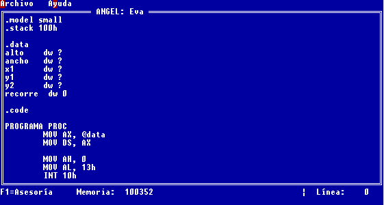
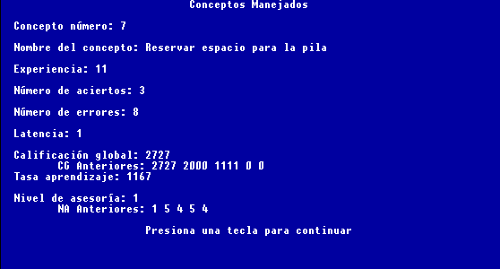

# Programación de Angel

## 5.1 Panorama del capítulo

En los capítulos previos, se ha seguido la teoría que soporta el diseño del asesor inteligente ANGEL. En este capítulo, se describe la implementación concreta de las ideas, en un sistema computacional que cubra las características requeridas.

El desarrollo completo de un asesor inteligente requiere varios años [15]; por ello, este trabajo solamente aspira a implementar el sistema computacional a un nivel de "prototipo", que permita evaluar los resultados de aplicar las técnicas y herramientas seleccionadas en los capítulos anteriores, pero requerirá de un desarrollo incremental y continuo para considerarse "terminado". Se espera que el prototipo de ANGEL cuente con una base de conocimiento suficiente para empezar a ser usado como parte integral del curso, durante el semestre 9801; sin embargo, en este trabajo se expone la implementación de toda la arquitectura base, que era el objetivo específico planteado que permitirá continuar la investigación durante una larga fase experimental.

En la sección 5.2 se presenta un detalle de la arquitectura de ANGEL, que presenta en forma global los módulos que se fueron implementando a lo largo de su desarrollo.

Las herramientas usadas para la programación de ANGEL, se tuvieron que seleccionar de entre distintas herramientas disponibles; en la sección 5.3 se justifica la selección de dichas herramientas, de acuerdo a las características requeridas por la implementación. Esto incluye al lenguaje de programación, a las herramientas para el análisis léxico y sintáctico, y a la plataforma ("_shell_") de sistemas expertos.

A partir de la sección 5.4, se explica la implementación específicas de los componentes de ANGEL. En primer lugar, la sección 5.4 describe cómo se implementaron las interfases, tanto con el alumno como con el profesor humano y el desarrollador de la base de conocimiento.

En la sección 5.5 se describe con detalle la implementación del modelo del dominio; este incluye el analiador léxico y sintáctico, que procesan respectivamente el léxico y la gramática (estéticos) que describen al lenguaje; y el sistema experto que utiliza reglas para diagnosticar si el uso del lenguaje es correcto y si ocurre alguno de los errores de concepto comunes en el uso del lenguaje.

En la sección 5.6, se analiza la implementación del modelo del estudiante, cómo se registran los datos del estudiante y de los conceptos que va dominando, así como la estrategia que se sigue para que el modelo se adapte según va aprendiendo el estudiante.

Se describe en la sección 5.7 la implementación del modelo pedagógico. Se muestra que el sistema experto resulta una herramienta con la que se pueden expresar en forma sencilla las estrategias instruccionales, contando con funciones que permitan obtener la información del modelo del estudiante.

Finalmente, en la sección 5.8 se integran los resultados de la construcción de ANGEL, que se usarán para delinear las pruebas y el trabajo futuro.

## 5.2 Arquitectura Física General

Dentro de la arquitectura "lógica", presentada en la figura 10 del capítulo 4, es necesario reconocer algunos módulos independientes que se requerirán durante la implementación.

Siguiendo el principio del refinamiento sucesivo, en la figura 11 (siguiente página) se presenta una subdivisión de los componentes generales, en módulos físico específicos.

Los módulos presentados en la figura 11 se describen a continuación, a grandes rasgos; y posteriormente en este capítulo se analizarán con mayor detalle.

#### Figura 12: Arquitectura física de ANGEL

Dentro de la interface, se cuenta con tres elementos:

>
>- El profesor humano cuenta con la posibilidad de observar el comportamiento del estudiante, a través del módulo de reportes, que le permite una observación de la información contenida dentro del modelo del estudiante.
>
>- El editor de conceptos es la única interface a implementar con el desarrollador, ya que las reglas, que se encuentran tanto en el modelo del dominio como en el instruccional, se editan utilizando un editor de texto convencional.
>
>- El editor de programa es la interface con el alumno; de hecho, es el sistema ANGEL en su percepción, que observa su comportamiento y lo retroalimenta.

En el modelo del dominio, se reconocen también tres elementos:

>- El análisis léxico y sintáctico es la implementación eficiente del conocimiento sobre las reglas gramaticales del lenguaje.
>
>- Las unidades de aprendizaje o conceptos, que se almacenan en un archivo con su información general.
>
>- Las reglas del dominio, que describen el uso correcto y errores comunes al usar el lenguaje, y relacionan la sintaxis con los conceptos.

Se observan dos elementos en el modelo del estudiante:

>- Los datos generales sobre el estudiante.
>
>- La información sobre los conceptos que ha manejado, que incluye por ejemplo la experiencia que tiene en ellos así como su tasa de aprendizaje.

El modelo instruccional cuenta con tres elementos:

>- Las reglas instruccionales, que deciden cuándo asesorar al estudiante sobre un concepto específico, y qué técnica instruccional utilizar.

>- La implementación de la interface necesaria para cada estrategia instruccional, la cuál está conectada con la interface con el alumno.

El registro histórico sobre la aseosría realizada, que permite seguir el comportamiento del asesor.

Finalmente, existe un componente adicional, que es el motor de inferencia, que procesa las reglas existentes tanto en el modelo del dominio como en el instruccional; se usa el mismo motor de inferencia para ambas, ya que están relacionadas. Sin embargo, lógicamente se pueden considerar dos sistemas expertos independientes.

Contando con la información sobre los módulos, conviene revisar qué herramientas existen en la actualidad que faciliten el desarrollo de dichos módulos y aprovechen la experiencia anterior en el campo de sistemas tutores inteligentes.

En la siguiente sección, se explica el proceso que se siguió para determinar las herramientas con las que se hizo la implementación de la primera versión de ANGEL.

## 5.3 Selección de herramientas

### Selección del lenguaje de programación

Tradicionalmente, muchas de las aplicaciones desarrolladas en el área de la Inteligencia Artificial, incluyendo algunos de los asesores inteligentes [3][7][15][16][17] mencionados en el capítulo 3, se han desarrollado utilizando el lenguaje LISP. Entre las razones que han motivado esto se puede considerar que es un lenguaje que permite manejar estructuras de datos complejas en un nivel alto, en forma mucho más sencilla y menos propensa a errores que, por ejemplo, C.

Otro de los lenguajes utilizados, especialmente en el área de sistemas expertos, es PROLOG; esto ya que contiene en sí mismo un motor de inferencia, de manera que su programación es específicamente en forma de reglas.

El lenguaje de uso más extendido para aplicaciones que requieren un buen desempeño, es C; además, es uno de los lenguajes más portables, gracias a la definición estándar de una amplia librería de funciones. C++ cuenta con muchas de las ventajas de C, adicionándole la capacidad de trabajar con las características de un lenguaje orientado a objetos, especialmente la herencia y el polimorfismo; desafortunadamente, estas ventajas son acompañadas por una pérdida, menor pero perceptible, en el desempeño; y por una falta de estandarización, en las librerías estándares orientadas a objetos.

Finalmente, un último lenguaje que se va a considerar es Java, el cuál también ha sido diseñado para ser sumamente portable; y si bien su desempeño es mucho menor que el de C, es muy superior al de los lenguajes interpretados, como suelen ser LISP y Prolog. Además, cuenta con una rica librería de clases, orientadas a objetos y más o menos estandarizada; y con la ventaja única de poder integrarse perfectamente en un ambiente instruccional a través de Internet, dentro de páginas Web. Por ello, ha sido el lenguaje de elección para diversos trabajos desarrollados recientemente. [38]

Desafortunadamente, al ser un lenguaje relativamente nuevo, se cuenta con menos recursos en forma de código reutilizable, motores de inferencia y otras aplicaciones de la Inteligencia Artificial. Esto implica que se requerirá un mayor esfuerzo para desarrollar el sistema en Java, al no contar con una plataforma o herramientas de base, para módulos tales como el análisis léxico y sintáctico o el motor de inferencia.

La otra gran desventaja de Java es su elevado consumo de recursos; simplemente, no está disponible en computadoras que no cuenten con 8 Mb. de memoria. Si bien en el ambiente del laboratorio escolar es posible que contemos con los recursos apropiados para Java, muchos de los alumnos cuentan con máquinas relativamente limitadas, lo que limitaría su disponibilidad; sin contar con que en otras instituciones o laboratorios, no siempre se cuenta con el equipo apropiado.

Se presenta la tabla 7, en la que se ordenan los lenguajes, de acuerdo a cada una de las características mencionadas. Se considera "1" al lenguaje que cuenta con la mejor situación respecto a dicha características; y "5" al que cubre en menor medida la características deseada. La columna "librerías" se refiere a la riqueza y estandarización de sus librerías de funciones; la columna "Internet" a su facilidad de integrarse con aplicaciones en Internet; la columna "Recursos", al uso de recursos, donde el óptimo es el que usa menos recursos; y la columna "Uso en IA", se refiere a la cantidad de trabajos y código de referencia que existe en el área de investigación de la Inteligencia Artificial.

#### Tabla 7: Comparación de los lenguajes que podrían usarse en el desarrollo de ANGEL

  <table class="MsoNormalTable" border="1" cellspacing="0" cellpadding="0" style="border-collapse:collapse;border:none;mso-border-alt:solid windowtext .5pt;
  mso-padding-alt:0in 3.5pt 0in 3.5pt;mso-border-insideh:.5pt solid windowtext;
  mso-border-insidev:.5pt solid windowtext">

  <tbody>

  <tr style="page-break-inside:avoid">

  <td width="80" valign="top" style="width:60.2pt;border:solid windowtext 1.0pt;
    mso-border-alt:solid windowtext .5pt;padding:0in 3.5pt 0in 3.5pt">

  **Lenguaje**

  </td>

  <td width="104" valign="top" style="width:78.0pt;border:solid windowtext 1.0pt;
    border-left:none;mso-border-left-alt:solid windowtext .5pt;mso-border-alt:
    solid windowtext .5pt;padding:0in 3.5pt 0in 3.5pt">

  **Portabilidad**

  </td>

  <td width="94" valign="top" style="width:70.85pt;border:solid windowtext 1.0pt;
    border-left:none;mso-border-left-alt:solid windowtext .5pt;mso-border-alt:
    solid windowtext .5pt;padding:0in 3.5pt 0in 3.5pt">

  **Desempeño**

  </td>

  <td width="76" valign="top" style="width:56.7pt;border:solid windowtext 1.0pt;
    border-left:none;mso-border-left-alt:solid windowtext .5pt;mso-border-alt:
    solid windowtext .5pt;padding:0in 3.5pt 0in 3.5pt">

  **Librerías**

  </td>

  <td width="66" valign="top" style="width:49.6pt;border:solid windowtext 1.0pt;
    border-left:none;mso-border-left-alt:solid windowtext .5pt;mso-border-alt:
    solid windowtext .5pt;padding:0in 3.5pt 0in 3.5pt">

  **Internet**

  </td>

  <td width="76" valign="top" style="width:56.7pt;border:solid windowtext 1.0pt;
    border-left:none;mso-border-left-alt:solid windowtext .5pt;mso-border-alt:
    solid windowtext .5pt;padding:0in 3.5pt 0in 3.5pt">

  **Recursos**

  </td>

  <td width="85" valign="top" style="width:63.8pt;border:solid windowtext 1.0pt;
    border-left:none;mso-border-left-alt:solid windowtext .5pt;mso-border-alt:
    solid windowtext .5pt;padding:0in 3.5pt 0in 3.5pt">

  **Uso en IA**

  </td>

  <td width="57" valign="top" style="width:42.55pt;border:solid windowtext 1.0pt;
    border-left:none;mso-border-left-alt:solid windowtext .5pt;mso-border-alt:
    solid windowtext .5pt;padding:0in 3.5pt 0in 3.5pt">

  **Total**

  </td>

  </tr>

  <tr style="page-break-inside:avoid">

  <td width="80" valign="top" style="width:60.2pt;border:solid windowtext 1.0pt;
    border-top:none;mso-border-top-alt:solid windowtext .5pt;mso-border-alt:solid windowtext .5pt;
    padding:0in 3.5pt 0in 3.5pt">

  LISP

  </td>

  <td width="104" valign="top" style="width:78.0pt;border-top:none;border-left:
    none;border-bottom:solid windowtext 1.0pt;border-right:solid windowtext 1.0pt;
    mso-border-top-alt:solid windowtext .5pt;mso-border-left-alt:solid windowtext .5pt;
    mso-border-alt:solid windowtext .5pt;padding:0in 3.5pt 0in 3.5pt">

  4

  </td>

  <td width="94" valign="top" style="width:70.85pt;border-top:none;border-left:
    none;border-bottom:solid windowtext 1.0pt;border-right:solid windowtext 1.0pt;
    mso-border-top-alt:solid windowtext .5pt;mso-border-left-alt:solid windowtext .5pt;
    mso-border-alt:solid windowtext .5pt;padding:0in 3.5pt 0in 3.5pt">

  4

  </td>

  <td width="76" valign="top" style="width:56.7pt;border-top:none;border-left:none;
    border-bottom:solid windowtext 1.0pt;border-right:solid windowtext 1.0pt;
    mso-border-top-alt:solid windowtext .5pt;mso-border-left-alt:solid windowtext .5pt;
    mso-border-alt:solid windowtext .5pt;padding:0in 3.5pt 0in 3.5pt">

  4

  </td>

  <td width="66" valign="top" style="width:49.6pt;border-top:none;border-left:none;
    border-bottom:solid windowtext 1.0pt;border-right:solid windowtext 1.0pt;
    mso-border-top-alt:solid windowtext .5pt;mso-border-left-alt:solid windowtext .5pt;
    mso-border-alt:solid windowtext .5pt;padding:0in 3.5pt 0in 3.5pt">

  5

  </td>

  <td width="76" valign="top" style="width:56.7pt;border-top:none;border-left:none;
    border-bottom:solid windowtext 1.0pt;border-right:solid windowtext 1.0pt;
    mso-border-top-alt:solid windowtext .5pt;mso-border-left-alt:solid windowtext .5pt;
    mso-border-alt:solid windowtext .5pt;padding:0in 3.5pt 0in 3.5pt">

  2

  </td>

  <td width="85" valign="top" style="width:63.8pt;border-top:none;border-left:none;
    border-bottom:solid windowtext 1.0pt;border-right:solid windowtext 1.0pt;
    mso-border-top-alt:solid windowtext .5pt;mso-border-left-alt:solid windowtext .5pt;
    mso-border-alt:solid windowtext .5pt;padding:0in 3.5pt 0in 3.5pt">

  1

  </td>

  <td width="57" valign="top" style="width:42.55pt;border-top:none;border-left:
    none;border-bottom:solid windowtext 1.0pt;border-right:solid windowtext 1.0pt;
    mso-border-top-alt:solid windowtext .5pt;mso-border-left-alt:solid windowtext .5pt;
    mso-border-alt:solid windowtext .5pt;padding:0in 3.5pt 0in 3.5pt">

  20

  </td>

  </tr>

  <tr style="page-break-inside:avoid">

  <td width="80" valign="top" style="width:60.2pt;border:solid windowtext 1.0pt;
    border-top:none;mso-border-top-alt:solid windowtext .5pt;mso-border-alt:solid windowtext .5pt;
    padding:0in 3.5pt 0in 3.5pt">

  PROLOG

  </td>

  <td width="104" valign="top" style="width:78.0pt;border-top:none;border-left:
    none;border-bottom:solid windowtext 1.0pt;border-right:solid windowtext 1.0pt;
    mso-border-top-alt:solid windowtext .5pt;mso-border-left-alt:solid windowtext .5pt;
    mso-border-alt:solid windowtext .5pt;padding:0in 3.5pt 0in 3.5pt">

  5

  </td>

  <td width="94" valign="top" style="width:70.85pt;border-top:none;border-left:
    none;border-bottom:solid windowtext 1.0pt;border-right:solid windowtext 1.0pt;
    mso-border-top-alt:solid windowtext .5pt;mso-border-left-alt:solid windowtext .5pt;
    mso-border-alt:solid windowtext .5pt;padding:0in 3.5pt 0in 3.5pt">

  4

  </td>

  <td width="76" valign="top" style="width:56.7pt;border-top:none;border-left:none;
    border-bottom:solid windowtext 1.0pt;border-right:solid windowtext 1.0pt;
    mso-border-top-alt:solid windowtext .5pt;mso-border-left-alt:solid windowtext .5pt;
    mso-border-alt:solid windowtext .5pt;padding:0in 3.5pt 0in 3.5pt">

  5

  </td>

  <td width="66" valign="top" style="width:49.6pt;border-top:none;border-left:none;
    border-bottom:solid windowtext 1.0pt;border-right:solid windowtext 1.0pt;
    mso-border-top-alt:solid windowtext .5pt;mso-border-left-alt:solid windowtext .5pt;
    mso-border-alt:solid windowtext .5pt;padding:0in 3.5pt 0in 3.5pt">

  4

  </td>

  <td width="76" valign="top" style="width:56.7pt;border-top:none;border-left:none;
    border-bottom:solid windowtext 1.0pt;border-right:solid windowtext 1.0pt;
    mso-border-top-alt:solid windowtext .5pt;mso-border-left-alt:solid windowtext .5pt;
    mso-border-alt:solid windowtext .5pt;padding:0in 3.5pt 0in 3.5pt">

  4

  </td>

  <td width="85" valign="top" style="width:63.8pt;border-top:none;border-left:none;
    border-bottom:solid windowtext 1.0pt;border-right:solid windowtext 1.0pt;
    mso-border-top-alt:solid windowtext .5pt;mso-border-left-alt:solid windowtext .5pt;
    mso-border-alt:solid windowtext .5pt;padding:0in 3.5pt 0in 3.5pt">

  2

  </td>

  <td width="57" valign="top" style="width:42.55pt;border-top:none;border-left:
    none;border-bottom:solid windowtext 1.0pt;border-right:solid windowtext 1.0pt;
    mso-border-top-alt:solid windowtext .5pt;mso-border-left-alt:solid windowtext .5pt;
    mso-border-alt:solid windowtext .5pt;padding:0in 3.5pt 0in 3.5pt">

  24

  </td>

  </tr>

  <tr style="page-break-inside:avoid">

  <td width="80" valign="top" style="width:60.2pt;border:solid windowtext 1.0pt;
    border-top:none;mso-border-top-alt:solid windowtext .5pt;mso-border-alt:solid windowtext .5pt;
    padding:0in 3.5pt 0in 3.5pt">

  C

  </td>

  <td width="104" valign="top" style="width:78.0pt;border-top:none;border-left:
    none;border-bottom:solid windowtext 1.0pt;border-right:solid windowtext 1.0pt;
    mso-border-top-alt:solid windowtext .5pt;mso-border-left-alt:solid windowtext .5pt;
    mso-border-alt:solid windowtext .5pt;padding:0in 3.5pt 0in 3.5pt">

  2

  </td>

  <td width="94" valign="top" style="width:70.85pt;border-top:none;border-left:
    none;border-bottom:solid windowtext 1.0pt;border-right:solid windowtext 1.0pt;
    mso-border-top-alt:solid windowtext .5pt;mso-border-left-alt:solid windowtext .5pt;
    mso-border-alt:solid windowtext .5pt;padding:0in 3.5pt 0in 3.5pt">

  1

  </td>

  <td width="76" valign="top" style="width:56.7pt;border-top:none;border-left:none;
    border-bottom:solid windowtext 1.0pt;border-right:solid windowtext 1.0pt;
    mso-border-top-alt:solid windowtext .5pt;mso-border-left-alt:solid windowtext .5pt;
    mso-border-alt:solid windowtext .5pt;padding:0in 3.5pt 0in 3.5pt">

  2

  </td>

  <td width="66" valign="top" style="width:49.6pt;border-top:none;border-left:none;
    border-bottom:solid windowtext 1.0pt;border-right:solid windowtext 1.0pt;
    mso-border-top-alt:solid windowtext .5pt;mso-border-left-alt:solid windowtext .5pt;
    mso-border-alt:solid windowtext .5pt;padding:0in 3.5pt 0in 3.5pt">

  3

  </td>

  <td width="76" valign="top" style="width:56.7pt;border-top:none;border-left:none;
    border-bottom:solid windowtext 1.0pt;border-right:solid windowtext 1.0pt;
    mso-border-top-alt:solid windowtext .5pt;mso-border-left-alt:solid windowtext .5pt;
    mso-border-alt:solid windowtext .5pt;padding:0in 3.5pt 0in 3.5pt">

  1

  </td>

  <td width="85" valign="top" style="width:63.8pt;border-top:none;border-left:none;
    border-bottom:solid windowtext 1.0pt;border-right:solid windowtext 1.0pt;
    mso-border-top-alt:solid windowtext .5pt;mso-border-left-alt:solid windowtext .5pt;
    mso-border-alt:solid windowtext .5pt;padding:0in 3.5pt 0in 3.5pt">

  3

  </td>

  <td width="57" valign="top" style="width:42.55pt;border-top:none;border-left:
    none;border-bottom:solid windowtext 1.0pt;border-right:solid windowtext 1.0pt;
    mso-border-top-alt:solid windowtext .5pt;mso-border-left-alt:solid windowtext .5pt;
    mso-border-alt:solid windowtext .5pt;padding:0in 3.5pt 0in 3.5pt">

  12

  </td>

  </tr>

  <tr style="page-break-inside:avoid">

  <td width="80" valign="top" style="width:60.2pt;border:solid windowtext 1.0pt;
    border-top:none;mso-border-top-alt:solid windowtext .5pt;mso-border-alt:solid windowtext .5pt;
    padding:0in 3.5pt 0in 3.5pt">

  C++

  </td>

  <td width="104" valign="top" style="width:78.0pt;border-top:none;border-left:
    none;border-bottom:solid windowtext 1.0pt;border-right:solid windowtext 1.0pt;
    mso-border-top-alt:solid windowtext .5pt;mso-border-left-alt:solid windowtext .5pt;
    mso-border-alt:solid windowtext .5pt;padding:0in 3.5pt 0in 3.5pt">

  3

  </td>

  <td width="94" valign="top" style="width:70.85pt;border-top:none;border-left:
    none;border-bottom:solid windowtext 1.0pt;border-right:solid windowtext 1.0pt;
    mso-border-top-alt:solid windowtext .5pt;mso-border-left-alt:solid windowtext .5pt;
    mso-border-alt:solid windowtext .5pt;padding:0in 3.5pt 0in 3.5pt">

  2

  </td>

  <td width="76" valign="top" style="width:56.7pt;border-top:none;border-left:none;
    border-bottom:solid windowtext 1.0pt;border-right:solid windowtext 1.0pt;
    mso-border-top-alt:solid windowtext .5pt;mso-border-left-alt:solid windowtext .5pt;
    mso-border-alt:solid windowtext .5pt;padding:0in 3.5pt 0in 3.5pt">

  3

  </td>

  <td width="66" valign="top" style="width:49.6pt;border-top:none;border-left:none;
    border-bottom:solid windowtext 1.0pt;border-right:solid windowtext 1.0pt;
    mso-border-top-alt:solid windowtext .5pt;mso-border-left-alt:solid windowtext .5pt;
    mso-border-alt:solid windowtext .5pt;padding:0in 3.5pt 0in 3.5pt">

  2

  </td>

  <td width="76" valign="top" style="width:56.7pt;border-top:none;border-left:none;
    border-bottom:solid windowtext 1.0pt;border-right:solid windowtext 1.0pt;
    mso-border-top-alt:solid windowtext .5pt;mso-border-left-alt:solid windowtext .5pt;
    mso-border-alt:solid windowtext .5pt;padding:0in 3.5pt 0in 3.5pt">

  3

  </td>

  <td width="85" valign="top" style="width:63.8pt;border-top:none;border-left:none;
    border-bottom:solid windowtext 1.0pt;border-right:solid windowtext 1.0pt;
    mso-border-top-alt:solid windowtext .5pt;mso-border-left-alt:solid windowtext .5pt;
    mso-border-alt:solid windowtext .5pt;padding:0in 3.5pt 0in 3.5pt">

  4

  </td>

  <td width="57" valign="top" style="width:42.55pt;border-top:none;border-left:
    none;border-bottom:solid windowtext 1.0pt;border-right:solid windowtext 1.0pt;
    mso-border-top-alt:solid windowtext .5pt;mso-border-left-alt:solid windowtext .5pt;
    mso-border-alt:solid windowtext .5pt;padding:0in 3.5pt 0in 3.5pt">

  17

  </td>

  </tr>

  <tr style="mso-yfti-lastrow:yes;page-break-inside:avoid">

  <td width="80" valign="top" style="width:60.2pt;border:solid windowtext 1.0pt;
    border-top:none;mso-border-top-alt:solid windowtext .5pt;mso-border-alt:solid windowtext .5pt;
    padding:0in 3.5pt 0in 3.5pt">

  Java

  </td>

  <td width="104" valign="top" style="width:78.0pt;border-top:none;border-left:
    none;border-bottom:solid windowtext 1.0pt;border-right:solid windowtext 1.0pt;
    mso-border-top-alt:solid windowtext .5pt;mso-border-left-alt:solid windowtext .5pt;
    mso-border-alt:solid windowtext .5pt;padding:0in 3.5pt 0in 3.5pt">

  1

  </td>

  <td width="94" valign="top" style="width:70.85pt;border-top:none;border-left:
    none;border-bottom:solid windowtext 1.0pt;border-right:solid windowtext 1.0pt;
    mso-border-top-alt:solid windowtext .5pt;mso-border-left-alt:solid windowtext .5pt;
    mso-border-alt:solid windowtext .5pt;padding:0in 3.5pt 0in 3.5pt">

  3

  </td>

  <td width="76" valign="top" style="width:56.7pt;border-top:none;border-left:none;
    border-bottom:solid windowtext 1.0pt;border-right:solid windowtext 1.0pt;
    mso-border-top-alt:solid windowtext .5pt;mso-border-left-alt:solid windowtext .5pt;
    mso-border-alt:solid windowtext .5pt;padding:0in 3.5pt 0in 3.5pt">

  1

  </td>

  <td width="66" valign="top" style="width:49.6pt;border-top:none;border-left:none;
    border-bottom:solid windowtext 1.0pt;border-right:solid windowtext 1.0pt;
    mso-border-top-alt:solid windowtext .5pt;mso-border-left-alt:solid windowtext .5pt;
    mso-border-alt:solid windowtext .5pt;padding:0in 3.5pt 0in 3.5pt">

  1

  </td>

  <td width="76" valign="top" style="width:56.7pt;border-top:none;border-left:none;
    border-bottom:solid windowtext 1.0pt;border-right:solid windowtext 1.0pt;
    mso-border-top-alt:solid windowtext .5pt;mso-border-left-alt:solid windowtext .5pt;
    mso-border-alt:solid windowtext .5pt;padding:0in 3.5pt 0in 3.5pt">

  5

  </td>

  <td width="85" valign="top" style="width:63.8pt;border-top:none;border-left:none;
    border-bottom:solid windowtext 1.0pt;border-right:solid windowtext 1.0pt;
    mso-border-top-alt:solid windowtext .5pt;mso-border-left-alt:solid windowtext .5pt;
    mso-border-alt:solid windowtext .5pt;padding:0in 3.5pt 0in 3.5pt">

  5

  </td>

  <td width="57" valign="top" style="width:42.55pt;border-top:none;border-left:
    none;border-bottom:solid windowtext 1.0pt;border-right:solid windowtext 1.0pt;
    mso-border-top-alt:solid windowtext .5pt;mso-border-left-alt:solid windowtext .5pt;
    mso-border-alt:solid windowtext .5pt;padding:0in 3.5pt 0in 3.5pt">

  16

  </td>

  </tr>

  </tbody>

  </table>

Se concluye que el lenguaje C es el que servirá mejor a los propósitos de este trabajo; resumiendo sus ventajas:

Tiene un alto grado de portabilidad, superado sólo por Java

Tiene el mejor desempeño, lo cuál es una de las características primordiales para conseguir que la interface con el alumno sea adecuada.

Sus librerías solamente están limitadas en comparación con Java, en la estandarización de la interface gráfica

Es un lenguaje de amplio uso en aplicaciones que acceden a Internet, lo que si bien no era un requisito para resolver el problema, es un valor agregado que puede ser útil en el trabajo futuro, que entre otras tendencias considera sistemas de enseñanza y trabajo cooperativos.

Es el lenguaje que requiere menos recursos para ejecutarse.

Su uso en el área de Inteligencia Artificial no puede compararse con el de LISP o PROLOG; sin embargo, es muy superior, dados los casi 25 años que tiene el lenguaje de existencia, al uso de C++ o de Java, que tienen mucho menos tiempo en el mercado. En particular, se encontraron suficientes elementos, como son motores de inferencia y "shells", que permiten integrar C como una herramienta de desarrollo para aplicaciones de Inteligencia Artificial. [30]

Cabe mencionar que Java se descubre también como una alternativa muy prometedora, que se preferiría a C si se requiriera de una funcionalidad gráfica portable, como por ejemplo en un tutor laboratorio - simulador de fenómenos físico; o si se requiriera de una importante integración con Internet, tal como en un sistema tutor cooperativo. Sin embargo, para este trabajo se decidió utilizar C, dadas las necesidades de desempeño y que la funcionalidad del asesor ANGEL está orientada a una interface en modo de texto.

### 5.3.2 Selección de herramientas para análisis léxico y sintáctico

La comprensión del lenguaje de programación, como se explicó en el capítulo 4, puede clasificarse en la adquisición del conocimiento -
"estático", referente a la sintaxis y gramática del lenguaje, donde juegan un papel principal la memoria y la representación apropiada; y la adquisición del conocimiento "dinámico", que se refiere a la semántica producto de la combinación específicas de distintos elementos léxicos, sintácticos y gramaticales. Como se comentó en el capítulo 2, incluso hay un nivel superior, que se refiere al conocimiento sobre los algoritmos que se implementan para resolver un problema; pero este nivel no se implementa en este trabajo, por ser independiente del conocimiento sobre un lenguaje de programación específico.

El conocimiento estático, por otro lado, tiene la características de ser relativamente invariante a través del tiempo, lo que nos llevó a decidir durante el diseño, en el capítulo 4, que en este conocimiento se buscará el mejor desempeño más que la facilidad de adaptación. Ya que el análisis léxico y sintáctico cuentan con algoritmos bien establecidos y ampliamente desarrollados por disciplinas como la teoría de la Computación dentro de las Ciencias Computacionales, el problema de la representación y aplicación de este conocimiento se resolverá en una forma netamente algorítmica.

#### 5.3.2.1 Requerimientos de análisis léxico y sintáctivo

Para el desarrollo eficiente de los módulos de análisis léxico y sintáctico, que contienen el conocimiento "de bajo nivel" sobre el lenguaje, es natural la búsqueda de herramientas que permitan expresar la gramática del lenguaje en el nivel más alto posible; y que automáticamente generen las tablas de estados que se requieren para procesar dicho análisis.

Las herramientas a las que el autor tiene acceso actualmente incluyen a la combinación de los comandos _lex y yacc_ de UNIX; y a LALR, de LALR Research, la cuál fue usada por el autor durante los estudios profesionales, en las materias de Compiladores. Se conoce de la existencia de otras herramientas en el mercado, sin embargo, se decidió no adquirir ninguna, dado su costo y el tiempo de entrega relativamente lento que se tendría, pues se tendrían que importar, ya que en México no se cuenta con ningún distribuidor para este tipo de herramientas especializadas.

#### 5.3.2.2. Lex y Yacc vs. LALR

LEX y YACC son comandos incluidos en prácticamente todas las versiones de UNIX, incluyendo a Linux, HP-UX y AIX, que son los sistemas UNIX a los tiene fácil acceso el autor. LEX facilita la construcción de analizadores léxicos, donde se describe cada token por medio de expresiones regulares, y LEX a partir de ahí genera un analizador léxico basado en una tabla de estados; del mismo modo, YACC permite crear un analizador sintáctico, tomando como fuente un archivo que contiene la gramática expresada en expresiones BNF. [44]

Una alternativa a LEX y YACC, que permite hacer ambos analizadores en forma similar, es LALR; este producto permite tomar gramáticas con ambigüedad y generar analizadores sintácticos tolerantes a fallas. Existen otros productos en el mercado, sin embargo, solamente se consideraron estos, debido a su disponibilidad en el contexto donde se implementaron.

Se podría haber usado cualquiera de las dos alternativas; sin embargo, la elección que se tomó fue usar LALR, por las siguientes razones:

Se tenía disponible en la plataforma MS-DOS, donde se desarrolló todo el trabajo; mientras que solamente se contaba con LEX y YACC en plataforma UNIX, que si bien estaba disponible, no era la plataforma objeto y hubiera requerido de portar el código resultante.

Permite modificar el esqueleto del analizador sintáctico, en una forma más flexible que YACC. De hecho, esto se tuvo que hacer para eliminar algunos errores en la invocación de las funciones.

Gracias a su capacidad de modificar el esqueleto del analizador, facilita portar la gramática a otros lenguajes; de hecho, se pueden escribir analizadores léxicos y sintácticos en lenguajes como Java, sin modificar la gramática, solamente cambiando el esqueleto. Esto resultó un valor agregado importante para el trabajo futuro.

La gramática escrita para LALR es mucho más clara; esto debido a que permite invocar funciones externas, al cumplirse las producciones, en una forma más sencilla que YACC; en YACC se debe incluir código fuente en C para ejecutarse al cumplirse una producción; mientras que en LALR solamente se pone un signo "implicación" y luego el nombre de la función que se invoca. Esto facilita aislar el código que procesa la gramática, de la gramática misma.

Tanto LALR como YACC soporta la técnica de análisis gramatical LALR [44], considerada como un buen compromiso entre poder y robustez, contra eficiencia. De modo que el desempeño debido a la técnica de análisis gramatical usada, en uno o en otro es muy similar, más que suficiente para analizar un programa completo con gran rapidez.

### 5.3.3 Selección de la plataforma de sistema experto

#### 5.3.3.1. Necesidad de un Sistema Experto

Como se explicó en el capítulo anterior, se reconoció la necesidad de modelar el conocimiento en forma de reglas; en particular, dada la definición del proceso de diagnóstico como una de las herramientas del asesor, al considerarse que existen reglas bien definidas, que de hecho el experto puede articular claramente, para detectar la existencia de un error.

Se conoce, dentro de la disciplina de la Inteligencia Artificial, como sistema experto a un sistema que resuelve problemas que normalmente son solucionados por "expertos" humanos [18][30]. Entre sus características, requieren acceder a una amplia base de conocimiento sobre el dominio; y utilizar uno o más mecanismos de razonamiento para aplicar dicho conocimiento a los problemas que se le proponen.

Como han reconocido otros autores [15] en el tema de Sistemas Tutores Inteligentes, un STI es un sistema experto, pero también algo más. De hecho, como se explicó al ver la arquitectura general de un STI, en el capítulo 3, se pueden reconocer dos expertos:

El experto del dominio, que es la parte del sistema que razona y deduce, o hace un diagnóstico, basado en el conocimiento del dominio. En ANGEL, dicho experto analiza el programa que construye el alumno, para diagnosticar las técnicas que el alumno utiliza y su correcta utilización.

Y el experto instructor, que razona y deduce sobre el conocimiento instruccional; es decir, que toma las decisiones sobre la mejor manera de instruir al alumno.

Por ello, se emprendió una búsqueda sobre una herramienta que facilitara la integración de los componentes de un sistema experto dentro de ANGEL.

#### 5.3.3.2. Criterios de evaluación

Se tomaron los criterios de portabilidad, flexibilidad y eficiencia, los cuales se "heredan" de los criterios generales para implementar el asesor; por estos criterios, se consideró conveniente la búsqueda de un shell de sistemas expertos que utilizara el lenguaje C, del cuál ya se habían visto las ventajas para conseguir cumplir los mismos criterios en los módulos anteriores; especialmente, para la construcción de los analizadores léxicos y sintácticos.

Se localizaron algunos shells escritos en LISP, C++, Ada y otros lenguajes; pero muy pocos en C. En particular, del que se obtuvo una mayor cantidad de referencias escrito en C, fue del shell CLIPS, desarrollado por la división de desarrollo de software de la NASA en el centro Johnson; CLIPS está disponible en el repositorio de inteligencia artificial de la Universidad de Carnegie Mellon (_<http://www.cmu.edu>_), del cuál se obtuvo; también acompaña al libro de Giarratano y Riley sobre sistemas expertos. [30]

CLIPS 6.0 (_C Language Integrated Production System_) es un sistema de producción tipo OPS; su motor de inferencia incluye mecanismos para el mantenimiento de la verdad, adición dinámica de reglas, y varias estrategias de resolución de conflictos, ajustables. Es fácil de insertar en otras aplicaciones, e incluye un lenguaje orientado a objetos (COOL), integrado directamente al motor de inferencia. [30]

Se consideraron en su evaluación los siguientes aspectos:

Cuenta con una implementación probada en diversas plataformas.

Se encontró en la versión 6, conservada desde 1993, y utilizada por diversas referencias, lo cuál permite esperar una buena estabilidad.

Cuenta con características diseñadas especialmente para incluirse como parte de otro sistema (funciones para crear un shell "embedded") [30][E3].

Permite compilar las reglas a C.[E3]

Se puede integrar con distintos compiladores disponibles. [E3]

De su amplia gama de características (soporte a reglas, conocimiento procedural orientado a objetos, y/o declarativo orientado a hechos, inclusión de una línea de comandos, etcétera), se pueden deshabilitar selectivamente algunas, de manera que se reduzca la utilización de memoria del shell.

Cuenta con cientos de páginas de documentación en cuatro volúmenes, incluyendo uno totalmente dedicado a la programación avanzada del ambiente y su interface con otros sistemas.

Permite "cargar" varios archivos con distintas bases de conocimiento, permitiendo así una implementación abierta donde en un archivo pudieran encontrarse las reglas específicas al lenguaje, en otro las reglas generales de programación, y en otro las reglas que indiquen cómo asesorar al estudiante.

Permite integrar funciones externas que sean llamadas o disparadas al activarse las reglas del sistema experto.

Cuenta con la capacidad de construir reglas "al vuelo" [30] y guardarlas en la base de conocimiento, abriendo así la puerta a una implementación relativamente sencilla de la parte adaptativa del sistema, implementando metaconocimiento formado por reglas que modifiquen por ejemplo las reglas de aseosría de acuerdo al comportamiento del alumno. [5]

Esté disponible en multitud de plataformas, incluyendo MS-DOS, Windows 3.11 y diversas marcas de UNIX.

Se intentó implementar algunas reglas del conocimiento, tanto en el modelo del dominio como en el modelo instruccional, utilizando CLIPS. Se obtuvieron resultados satisfactorios, y en el proceso se reconocieron algunas características adicionales, útiles para la implementación:

El desempeño del motor de inferencia es razonablemente bueno; el retardo no es notorio.

El razonamiento que sigue es no monótono, permitiendo que algunos hechos, en forma selectiva, sean cancelados; y automáticamente CLIPS se encargará de invalidar las conclusiones obtenidas a partir de dichos hechos. Esto es una situación comúñ al razonar sobre el comportamiento del alumno, pues algunos de los "hechos" que el análisis léxico y sintáctico reportan a CLIPS, cambian en forma continua, cuando el alumno corrige el programa fuente.

El lenguaje en el que se describen las reglas es muy similar a LISP, lo que facilitó su rápida comprensión.

Permite integrar fácilmente funciones adicionales al entorno de CLIPS, con lo que el sistema experto puede actuar sobre otros subsistemas.

Dado que CLIPS demostró durante las pruebas ser un sistema robusto, eficiente y apropiado para la tarea; que no se pudo encontrar otro "shell" de sistemas expertos comparable y disponible fácilmente, que funcionara con lenguaje C; y que el tiempo para implementar el sistema se estaba convirtiendo en una restricción; se seleccionó CLIPS como la herramienta, al menos para la implementación del prototipo. Por el momento, no se ha encontrado ninguna razón para cambiar esta decisión, al menos mientras no se migre ANGEL a otro lenguaje como podría ser Java; sin embargo, CLIPS puede integrarse también con otros lenguajes.

### 5.3.4 Conclusiones de la selección

En esta sección se examinó el conjunto de herramientas que se utilizan en el desarrollo de ANGEL, que son el lenguaje C; LALR para compilar una gramática tipo BNF en un analizador sintáctico, en este caso en lenguaje C; y CLIPS como plataforma para desarrollar sistemas expertos que están integrados dentro de un sistema mayor, desarrollado en C. En conjunto, estas tres herramientas proporcionaron todos los elementos necesarios para resolver los problemas de implementación propios de cada módulo, como se puede ver en las siguientes secciones, que tratarán sobre los detalles específicos de cada uno de aquellos.

## 5.4. Implementación de la interface

### 5.4.1 Diagrama general de la interface

Para facilitar la comprensión de esta sección, se presenta en la figura 13 un detalle de la arquitectura correspondiente a la interface de ANGEL.

#### Figura 13: Arquitectura de la interface de ANGEL

### 5.4.2 Interface con el alumno: Editor/asesor

En el proceso normal de programación, se utiliza un editor de texto, el cuál es una herramienta que generalmente se encuentra disponible en el sistema operativo (EDIT en MS-DOS, el Bloc de Notas en Windows, _vi_ y _emacs_en UNIX). Algunos ambientes de desarrollo incluyen editores especializados para facilitar la tarea a los programadores; cabe mencionar al Visual Studio de Microsoft y a los IDEs integrados en los productos de Borland.

Desafortunadamente, la mayoría de estos editores son paquetes "cerrados", que no cuentan con documentación sobre cómo integrarlos en un sistema más amplio. Si bien los últimos editores integrados en ambientes de desarrollo cuentan con interfases de programación que permiten integrar un producto adicional en dicho ambiente, estas interfases de programación son propietarias, y por tanto limitadas al producto del que se trate.

Por ello, se decidió implementar desde el principio un editor sencillo, con las características comunes a las que están acostumbrados los alumnos que usan otros editores. Si bien su funcionalidad es limitada, es intuitiva y sencilla para el alumno; no requiere de una capacitación adicional, pues emula la interface de otros productos. [6]

  
La gran ventaja que proporciona este editor, es su integración completa con los otros módulos del sistema. En la figura 14, se muestra la interface que ofrece al alumno.

##### Figura 14: Pantalla de la interface con el alumno

El editor básico se implementó en 2 días, utilizando exclusivamente el lenguaje C; durante el desarrollo de los otros módulos, se le fue integrando mayor funcionalidad, se fue puliendo su interface, y se corrigieron algunos errores en su funcionamiento.

El principal cambio en la interface ocurrió al integrar el modelo instruccional, cuando ANGEL empez a asesorar realmente. Este modelo requirió de implementar en el editor la capacidad de mostrar un mensaje en la línea de estado (inferior de la pantalla), que indica el concepto sobre el cuál el módulo instruccional desea llamar la atención del alumno.

### 5.4.3 Interface con el profesor: Reportes sobre el modelo del estudiante

Como se explica en la implementación del modelo del estudiante, en la sección 5.6, el perfil general del estudiante se almacena en el archivo "STUDENT.DAT"; los conceptos que ha manejado, se van registrando junto con los atributos correspondientes a cada concepto, en el archivo "XXXXXX.PRF", donde XXXXXX corresponde a la matrícula del estudiante.

El programa de Reportes (VIEWPRF), permite visualizar el perfil que se ha almacenado para el estudiante; esto lo hace leyendo primero el archivo "STUDENT.DAT", para obtener la información general del estudiante; depués recorre completamente el archivo "XXXXXX.PRF", de donde obtiene registro a registro, la información sobre los conceptos que el estudiante ha manejado; la información general sobre cada uno de los conceptos la obtiene del archivo "CONCEPT.DAT", y así presenta un reporte que indica los conceptos que maneja el estudiante, así como los que le causan problemas.

En la versión actual, el programa de reportes muestra para cada concepto, su nombre, la experiencia que tiene el estudiante actual con dicho concepto, la latencia del concepto, la calificación global, la tasa de aprendizaje y los niveles anteriores de aseosría. Estos campos se explicaron ya en el capítulo 4, al diseñar el modelo del estudiante.

  

#### Figura 15: Pantalla de reportes en la interface con el profesor.

Este módulo se implementó sencillamente, en un tiempo sumamente corto, utilizando exclusivamente las librerías de manejo de archivos propias del lenguaje C.

### 5.4. Interface con el desarrollador: catálogo de conceptos

Para relacionar el modelo del estudiante con el modelo del dominio, se creó el archivo "CONCEPT.DAT"; este archivo contiene información breve sobre los conceptos que deberán ser manejados, su descripción y las referencias para estudiar dicho concepto.

Al igual que la interface con el profesor, esta parte se implementó utilizando la librería estándar para el manejo de archivos en C; sin embargo, los números o referencia de los conceptos son utilizados desde las reglas del dominio y del instructor, planteadas utilizando CLIPS.

La principal razón que motivó implementar esta interface en archivos separados, cuando pudieron haberse integrado como hechos persistentes en CLIPS, fue la limitación en el recurso memoria RAM. Ya se estaban experimentando algunos problemas de memoria, pues el ejecutable de ANGEL había crecido cerca de 450 Kb., y DOS está limitado a utilizar 640 Kb. para programas del usuario, aunque el límite práctico es aún menor. Por ello, se decidió que los conceptos a estudiar, así como el registro del comportamiento del estudiante, se manejaran en archivos. Esto nos proporciona como beneficio adicional, la mayor facilidad de modificar el conocimiento con el que cuenta ANGEL, utilizando las interfases construidas; sin embargo, esto causó también un costo relativamente notorio en el desempeño del asesor. Para propósitos del prototipo este factor no fue relevante, por lo que se continúo con esta línea.

## 5.5. Implementación del modelo del dominio

### 5.5.1 Arquitectura del modelo del dominio

Al igual que se hizo en la interface, se presenta la arquitectura del modelo del dominio para facilitar la comprensión de esta sección, en la figura 16.

A continuación, se describe el proceso que se siguió para el desarrollo incremental del modelo del dominio.

#### Figura 16: Arquitectura física del modelo del dominio en ANGEL

### 5.5.2 Analizador léxico y sintáctico

Para implementar el analizador léxico y sintáctico, inicialmente se construyó un prototipo que leía un archivo en Ensamblador e indicaba sus errores.

La gramática [1] usada, que describe las principales construcciones gramaticales del lenguaje ensamblador, se encuentra en el archivo ASM.GRM. En principio, se desarrolló una gramática básica que consideraba en forma genérica a la mayoría de las palabras reservadas, similar a la que se usaría para desarrollar un compilador del lenguaje. [44]

Sin embargo, más adelante se fue haciendo más compleja la gramática, al eliminar algunas consideraciones genérica, de manera que se podían invocar en forma más oportuna las funciones propias del lenguaje. Con este enfoque, se consiguió que algunas de las reglas que se consideraban "de alto nivel", se implementaran más fácilmente, al dividirse en dos partes: el conocimiento muy específico del léxico y sintaxis concretas, y el conocimiento sobre cómo las instrucciones del lenguaje se combinan para conseguir una meta o en los casos comunes de error.

Se creó el analizador léxico sin usar una herramienta adicional, directamente en C, utilizando como plantilla uno que viene como ejemplo con el paquete LALR, que además había sido usado por el autor durante la carrera, para distintos lenguajes. La razón principal que llevó a seleccionar esta alternativa, fue el gran desempeño que logra dicho analizador léxico, debido a que está basado en una tabla de transiciones y saltos aún más eficiente que la que generan cualquiera de los compiladores - compiladores mencionados.

Una vez que se tuvo el prototipo, lo que requirió menos de un día de trabajo, se integró al editor; para esto, el analizador léxico recibió su entrada desde el texto capturado en el editor. En ese momento, la unidad de análisis era una línea de programa fuente, lo que más tarde causaría algunos problemas; sin embargo, rápidamente se obtuvo un editor con la capacidad de señalar errores de léxico y sintaxis. La gramática, en cambio, tuvo que ser corregida en diversas ocasiones, al ir descubriendo problemas al analizar programas más y más complejos.

### 5.5.3 Planteamiento de las reglas del sistema experto

Inicialmente, se orientó la necesidad del sistema experto al reconocer el proceso de diagnóstico del estado del estudiante [34]; específicamente, se tomó la posición de que el asesor usa su experiencia para reconocer los errores y concepciones erróneas en que suele caer el estudiante, se los muestra al mismo y sugiere como corregirlos; de esta manera, el progreso en el aprendizaje del estudiante asesorado se puede medir de acuerdo a su tasa de errores y a una clasificación de los errores que comete; idealmente, la tasa debe ir reduciéndose, y los errores que comete ir aumentando en cuanto al nivel de complejidad.

Por ello, las primeras reglas para modelar el dominio se modelaron a partir de los errores comunes que el profesor ha observado en su experiencia impartiendo la materia; en primer lugar, no se hizo ningún esfuerzo por clasificarlos, simplemente se listaron. Algunos son errores fatales, que el compilador indica en forma breve; algunos son errores lógicos que el compilador no detecta; otros son problemas de estilo; sin embargo, todos son claramente identificables, existe un procedimiento mecánico que permite detectarlos, y el profesor recomienda evitarlos y a través de dichos consejos guía al estudiante hacia una programación más efectiva.

Para ejemplificar las reglas planteadas (véase apéndice B), se muestran 3 de ellas, las que se usarán para explicar su aplicación:

Falta una directiva base de estructura del programa (.model, .stack, .data, .code)

Directiva repetida

Colocar la cláusula END antes del final del programa, haciendo que se ignore parte del código fuente.

Después de recabar esta serie de errores comunes, se realizó la investigación sobre la plataforma apropiada para la construcción del sistema experto. Una vez seleccionado CLIPS, se orientó el planteamiento en español a las capacidades del mismo, para obtener reglas concretas como se describe más adelante. Para propósitos de claridad, se ejemplifican algunas de las primeras reglas en español, antes de desarrollarlas usando la sintaxis de CLIPS.

Si ( Se ha analizado todo el código fuente y No definida ("Directiva de modelo")) entonces concluir que falta una directiva base de estructura del programa.

Si ( se pide definir ("Directiva de modelo") y ya definida ("Directiva de modelo) ) entonces concluir Directiva repetida

Si (la cláusula END se encuentra en la línea x) y (existe código en la línea y) y ( y es mayor que x) entonces concluir END colocado antes del final del programa.

Para ilustrar la implementación propuesta, tómese el ejemplo de la regla gramatical:

.model  => DirectivaModelo

Cuando esta producción gramatical se obtiene, se afirmará el hecho "Existe una directiva de modelo", utilizando la función de librería AssertString soportada por CLIPS [E3]. De la misma manera, todo evento sintáctico generará hechos distintos que se agregarán al conocimiento en la memoria de trabajo de CLIPS. En forma cíclica, se usa la función _Run_de CLIPS para que se disparen las reglas a partir de los nuevos hechos; de esta manera, podrá disponerse de un diagnóstico en cualquier momento, que puede tener distintos grados de completez, de acuerdo a los hechos disponibles. En particular, si se ha afirmado dos veces el hecho "Existe una directiva de modelo", existirá una regla que de ello deduzca un error.

así, el asesor en su primera aproximación, le indicaba al estudiante todos los errores que ha deducido de los hechos disponibles. Para propósitos de pruebas el prototipo construido en esta fase no interrumpía al estudiante al detectar un error; sino que el estudiante determina cuando desea aseosría, y entonces el asesor ofrece el diagnóstico (un papel de asesor "pasivo"). Más adelante, al integrar un modelo del estudiante y un modelo pedagógico, se podrá implementar un asesor "activo", que determine inteligentemente cuándo interrumpir al estudiante.

### 5.5.4 Construcción de la base de conocimientos

Utilizando la sintaxis de CLIPS, se plantearon las reglas necesarias para el diagnóstico del manejo que hace el alumno de los conceptos a aprender, tomando como entrada la información (hechos) proporcionados por el análisis léxico y sintáctico. Se presenta una de ellas en la figura 17 (siguiente página), para permitir la explicación del desarrollo de la base de conocimientos.

En esta regla, se diagnostica una falla en el conocimiento sobre cómo estructurar un programa, mientras no se definan todos los segmentos; de esta manera, el asesor sabe que el estudiante no cuenta con esa partícula de conocimiento, o simplemente tiene una omisión. Cuenta con el conocimiento sobre las razones que le hicieron concluir esto, que podría ser usado en un futuro para un módulo explicativo.

### 5.5.5 Integración del sistema experto.</a>

Durante las pruebas realizadas para evaluar CLIPS, se plantearon las reglas de ejemplo, consiguiendo que se dedujeran las conclusiones apropiadas, cuando el autor introducía manualmente los hechos o premisas y luego ejecutaba la función "_Run_" de CLIPS.

;;;******************************************************

;;;* REGLA 1: Falta una directiva base de estructura del programa

;;;******************************************************

;;; Primero, reglas que permitan subir el número de aciertos cuando se

;;; define alguna directiva correctamente...

(defrule hay-directiva-model "Se define un modelo de memoria"

(definida directiva modelo)

 =>

;;; Concepto 6 = manejo de la directiva sobre modelos

(registra-acierto 6)

)

(defrule hay-directiva-stack "Se define la pila"

(definida directiva stack)

=>

;;; Concepto 7 = manejo de la definición de una pila

(registra-acierto 7)

)

_._

_. ;;; Algunas directivas más..._

_._

;;; Reglas que afectan el número de errores al utilizar el concepto (defrule falta-directiva-model "Falta definir un modelo de memoria"

(not (definida directiva modelo))

=>

(assert (estado estructura-programa F))

;;; Concepto 6 = manejo de modelos de memoria, registrar error

(registra-error 6 0)

)

_._

_. ;;; Algunas directivas más..._

_._

(defrule sabe-estructurar-programa "El alumno ya cuenta con el esqueleto de estructura del programa"

(not (estado estructura-programa ?))

=>

(assert (estado estructura-programa V))

;;; Concepto 4 = manejo de la estructura del programa, manejo correcto

(registra-acierto 4))

#### Figura 17: Ejemplo de la implementación en CLIPS de la regla "Falta una directiva base de estructura del programa (.model, .stack, .data, .code)"

Para evaluar la facilidad de integrar CLIPS con un sistema en C, se creó un programa principal que simulaba la generación de eventos relacionados a hechos, los cuales disparaban alguna regla sobre el comportamiento del estudiante.

Una vez que se comprendió el funcionamiento de la interface de C con las reglas planteadas, al programa editor/parser, se le agregaron unas cuantas funciones para generar los hechos como consecuencia de eventos o producciones aceptadas por el analizador sintáctico, las cuales son indicadas directamente en la gramática del analizador sintáctico, gracias a la facilidad con la que cuenta LALR, de llamar a funciones externas cuando se cumple una producción gramatical. Para observar el resultado, al salir del editor se mostraran los hechos recabados en la memoria de trabajo del sistema experto, mostrando así la factibilidad de la solución.

Posteriormente, se trabajó en pulir la interface, separar las reglas dependientes del lenguaje de aquellas genérica, y en la retroalimentación de una breve explicación. En este contexto, se llegó a la implementación de un asesor "pasivo", que solamente infiere y retroalimenta al estudiante cuando éste se lo pide, mediante una opción del memú del editor. En esta fase, se implementaron también los distintos niveles de aseosría, descritos en la sección 5.6 y 5.7.

De este modo, el trabajo que se ha continuado y aún no está completo, es la programación de las reglas del dominio, que se divide en ajustar la gramática para que llame a las funciones que indiquen "hechos" sobre el comportamiento del estudiante; y agregar las reglas que de dichos hechos, concluyan el buen o mal uso de un concepto.

### 5.5.6 Problemática en la activación de las reglas

Durante las pruebas del análisis léxico y sintáctico, se hacía el análisis por cada línea que se editaba. Esto fue muy útil para depurar dichos módulos; cuando se conectaron las producciones de la gramática, con el establecimiento de hechos para activar las reglas del sistema experto de diagnóstico que está integrado dentro del modelo del dominio, se pudo observar que a cada línea que el alumno teclea, se determinaban los hechos correspondientes a dicha línea.

Desafortunadamente, si el alumno depués regresaba, editaba la línea y la corregía; o bien, eliminaba o agregaba líneas de forma que se alterara la numeración de las líneas, algunos de los hechos que se habían registrado previamente, podrían dejar de ser válidos. Esto daba lugar a conclusiones incorrectas, pues no estaban basadas en los hechos actualizados; y para corregir esta situación se requería limpiar la memoria de trabajo del sistema de producción, incluyendo todos los hechos registrados por el análisis léxico y sintáctico, y volver a realizar este análisis para posteriormente correr el sistema de producción y que se activaran las reglas apropiadamente.

Mientras se probaron las reglas básicas del dominio, esto no fue un mayor problema; pero al introducir el módulo que implementa modelo del estudiante, y con base en ambos iniciar la construcción del módulo instruccional, surgió la necesidad de corregir esta situación.

Se notó que la problemática reside, principalmente, en que se hace el análisis demasiado pronto; por ejemplo, si se hiciera el diagnóstico completo a cada línea, el programa estaría plagado de errores comunes de tipo "omisión", mientras el alumno está construyendo el esqueleto de su programa. Pero, si jamás se hiciera cuando el esqueleto no está construido, el asesor inteligente no podría retroalimentar a un alumno que no domine el concepto de estructura general del programa.

De manera que para encontrar la solución, el problema se replanteó como ¿Cuándo es el momento oportuno para realizar el diagnóstico?, de forma que sea lo suficientemente oportuno para asesorar al alumno, pero no realice diagnósticos mientras el alumno está desarrollando una solución, sino hasta que acabe de construir una unidad lógica.

La solución a este problema es compleja, si se hace formalmente, pues requiere definir lo que es una unidad lógica, en una forma genérica y casi "adivinand el plan del alumno; por lo que se prefirió tomar una solución basada en el comportamiento del alumno. Se observa que el alumno trabaja por unidades lógicas, y cuando termina el tecleo del código fuente correspondiente a dicha unidad, realiza otra actividad que rompe el patrón de la actividad de tecleo. Entre las actividades observadas cuando esto ocurre, se mencionarán:

Guardar el programa.

Abrir un nuevo programa fuente; de hecho, esto implica dos acciones: guardar el actual, que es el caso anterior; y el análisis inicial del programa fuente, tal como estaba guardado.

Salir del editor para compilar/ensamblar. Este caso ya está cubierto por el de Guardar, ya que se le pide confirmación al alumno sobre si debe guardar; si es así, en Guardar se hace el diagnóstico; de lo contrario, quiere decir que el alumno hizo una edición que no le interesa conservar, lo que implica que es código que no vale la pena analizar.g

Desplazarse varias páginas en el código.

Detenerse por un tiempo mayor a unos cuantos segundos.

La filosofía de la interface, consistente en ser no irruptiva, y por tanto no interrumpir el trabajo en curso, está alineada con esta problemática; por ello, se definió que se hará el diagnóstico como un proceso unitario, que ocurrirá cada vez que ocurra uno de los cuatro hechos anteriores, o bien cuando el alumno solicite explícitamente ayuda, por medio de la opción correspondiente de un memú.

De este modo, se redujo enormemente el número de "errores" diagnosticados, y la aseosría se adaptó para ser mucho más oportuna.

En el prototipo se implementaron los casos de diagnóstico al guardar y salir; queda como trabajo futuro el implementar otros puntos de diagnóstico, incluyendo la inactividad y los desplazamientos amplios.

Para realizar un segundo diagnóstico, se requiere invalidar los hechos que ya no se cumplan; para implementar una solución a este problema, contamos con dos opciones:

>- Monótona: se llama a la función de "_Reset_" de CLIPS, limpiando toda la memoria de trabajo [E3], y se reprocesa completamente el programa para descubrir los nuevos hechos. Su ventaja es la rápida implementación; mientras que su desventaja es un menor desempeño en el programa.
>
>- No monótona: se aprovecha la facilidad de "_Retract_" de CLIPS [E3][30], solamente sobre los hechos que se hizo "_Assert_" desde programa, y que puedan haber cambiado, dejando que CLIPS se encargue de los deducidos por reglas. Si se modificó una sola línea, no hay por qué cambiar ninguno de los hechos que no tengan que ver con dicha línea; del mismo modo, cuando se insertan o quitan líneas del programa, solamente se debe modificar la numeración en algunos de los hechos. La ventaja que se obtendría con esta implementación sería un mejor desempeño, pues se aprovechan las conclusiones ya obtenidas. A cambio de ello, es más compleja su implementación.

En el prototipo se implementó la primera opción, nuevamente debido a las restricciones en el tiempo de desarrollo.

## 5.6. Implementación del modelo del Estudiante

### 5.6.1 Representación del estudiante

De acuerdo con la arquitectura, que se muestra en la figura 18, la información sobre el estudiante se puede dividir en dos secciones:

Los datos generales del estudiante, como su nombre y matrícula.

Los datos sobre el conocimiento del estudiante sobre un concepto específico.

#### Figura 18: Arquitectura del modelo del estudiante en ANGEL

Por el momento, no se están guardando el detalle en cuanto a 'código' de los ejemplos específicos, pues esto requeriría un espacio de almacenamiento relativamente grande, y las estrategias de aseosría utilizadas hasta ahora no los requieren. Sin embargo, sí se está generando un archivo histórico ('ANGEL.HST') con la lista de todas las instancias en las que fue asesorado el estudiante, sobre qué concepto se le asesoró, y qué nivel de aseosría fue utilizado.

Dadas las restricciones de memoria, se implementaron utilizando archivos formados por registros, programados utilizando la librería estándar de C. Otra opción hubiera sido registrar hechos en CLIPS, y guardar en un archivo dichos hechos; sin embargo, se hubieran visto afectados por el reprocesamiento que se hace cada vez que se realiza el diagnóstico, y hubieran requerido bastante memoria, por lo cuál, no se tomó dicha alternativa.

La información se encuentra en dos archivos principales:

'CONCEPT.DAT', que contiene un arreglo dinámico con la información general sobre los conceptos que se espera que el estudiante maneje.

'XXXXXX.PRF', que guarda la información sobre cómo maneja cada concepto el estudiante actual, incluyendo los coeficientes de experiencia, latencia, etcétera, descritos en el capítulo 4\. De este modo, el conocimiento sobre el aprendizaje del estudiante se representa de acuerdo a unidades de aprendizaje, que son los conceptos.

Estos dos archivos se encuentran relacionados, pues el campo llave 'Número de concepto' del archivo de conceptos, se utiliza como referencia en el archivo que describe el dominio de las unidades de aprendizaje.

Los programas auxiliares VIEWPRF y EDITCONC, correspondientes a las interfases con el profesor humano y con el desarrollador, respectivamente, no son más que visualizadores del contenido de estos archivos, y en el segundo caso, con la capacidad de modificar o ampliar las unidades de aprendizaje.

### 5.6.2 Registro de la actividad del estudiante

Cuando se cumple una regla en el modelo del dominio, se puede deducir que el alumno manejó un concepto; y se puede saber si lo manejó correctamente (es decir, se cumplió una de las reglas del "cómo se debe hacer"); o bien, si cometió uno de los errores comunes al usar dicho concepto (esto es, se activó la regla que diagnostica dicho error comúñ). Por ello, cuando se activa la regla correspondiente, se llega a una conclusión que dispara la función que registra dicho resultado.

Para registrar la actividad del estudiante, cada vez que las reglas en el modelo del dominio llegan a la conclusión de que se usa bien o mal un concepto, se llama la función _IncrementaExperiencia__,_ desarrollada en C; esta función indicará que se está usando un concepto, y si se usó correctamente o no; por tanto incrementará su índice de uso (tanto la experiencia, como el índice correspondiente según si se usó correctamente o no); automáticamente actualizará la Latencia del concepto, ajustándola a 0\. Si el concepto usado es el mismo que estaba registrado como 'Concepto Actual', no se incrementará la experiencia; si es uno distinto, se marcará el tiempo actual como el tiempo de último uso del concepto anterior, antes de ajustar el nuevo concepto como concepto actual. En este enfoque, solamente se puede manejar un concepto a la vez; en un futuro se puede explorar el tener un cierto número de conceptos concurrentes.

Se utiliza la integración de CLIPS [E3] para que las reglas planteadas en el lenguaje propio de CLIPS, puedan acceder a las funciones en STUDENT.C.

## 5.7. Implementación del modelo instruccional

Para convertir al asesor 'pasivo' en un asesor 'activo', se agregó el conocimiento pedagógico, con reglas dirigidas principalmente a cuándo y cómo asesorar al estudiante mientras está editando su programa. La diferencia principal respecto al caso anterior está en que el asesor deberá inferir en cada oportunidad (es decir, al analizar sintácticamente cada línea de programa), haciendo un diagnóstico continuo del programa editado; y unir este conocimiento con el perfil del estudiante y las reglas sobre cómo asesorar, de manera que pueda ofrecer su consejo al estudiante en el momento que se considere conveniente, aún sin la solicitud expresa del estudiante. Esto se logró al agregar las reglas que representan el modelo pedagógico.

Se presenta el detalle de la arquitectura del modelo instruccional, para su referencia en esta sección.

#### Figura 19: Arquitectura física del modelo instruccional de ANGEL

### 5.7.1 Construcción de funciones auxiliares y su uso desde reglas

Una vez superados algunos problemas iniciales para aprender el lenguaje con el que se estructuran las reglas, y para ligar el código objeto con otro programa, se pudieron ejecutar hechos y reglas en forma efectiva; de manera que se consideró prometedora la alternativa de implementación consistente en:

Expresar las reglas para diagnóstico en un archivo ejecutable por CLIPS.

Ligar el sistema de CLIPS con el asesor.

Ajustar las reglas gramaticales del parser para que al irse realizando el análisis léxico y sintáctico, se afirmen (assert) o rechacen (retract) hechos, los cuales se conviertan en premisas que disparen las reglas y permitan llegar a las conclusiones del diagnóstico.

Del mismo modo que se hizo al implementar el registro de actividad del estudiante, se implementaron funciones de C, que se pueden llamar desde CLIPS, las cuales le permiten al motor de inferencia obtener la información sobre la experiencia, latencia, nivel de aseosría y otros parámetros del modelo del estudiante. Con estos parámetros, se pueden establecer reglas, tal como se hizo en COACH [7], que indican cuándo asesorar a un estudiante sobre determinado concepto.

En general, el modelo del dominio llega a concluir, cuando detecta un error en la aplicación de un concepto, que dicho concepto es un 'concepto asesorable'. El modelo instruccional determina, de acuerdo a los parámetros en el modelo del estudiante y los conceptos asesorables disponibles, qué conceptos deben tomar prioridad, y si se debe llamar la atención al estudiante, en este momento, sobre dichos conceptos. Cuando se concluye que sí, se debe llamar la atención del estudiante, se invoca la función '_asesora_', la cuál está conectada con la interface y con el registro histórico del comportamiento del estudiante.

También estas reglas determinan el nivel de aseosría que se requiere, de entre los planteados en el capítulo 4\. Entre las acciones que corresponden a los distintos niveles de aseosría se encuentran: "llamar la atención del estudiante hacia un error diagnosticado", "indicarle el concepto que debe repasar", dar una breve explicación sobre el concepto y lo que se detectó.

### 5.7.2 Planteamiento de las reglas

Uno de los elementos que llevó a decidir el uso de CLIPS, fue su capacidad de cargar dos o más archivos con las reglas, es decir, dos o más bases de conocimiento [30]; la limitante que tiene, que no afecta a los objetivos de este trabajo, es que dichas bases de conocimiento se combinan para formar una sola, y existe una sola memoria de trabajo.

Por ello, se describieron las reglas en un archivo separado, que pretende integrar las técnicas instruccionales seleccionadas en el capítulo 4\. Para facilitar la construcción de dichas reglas, se construyeron funciones (en C) que se pudieran llamar directamente desde CLIPS, las cuales proporcionan al programador de las reglas la capacidad de utilizar los coeficientes correspondientes al modelo del estudiante. De este modo, las reglas pueden depender de aspectos como la experiencia del estudiante en el uso de un concepto, su calificación actual (tasa de aciertos contra la experiencia total), el último nivel de aseosría que ha recibido para dicho concepto, o la tasa de aprendizaje.

El que las reglas instruccionales se encuentren en un archivo separado facilita también que en un futuro se modifique el modelo instruccional, sin afectar al modelo del dominio. [27][25][29]

## Conclusiones

Siguiendo el proceso de desarrollo explicado en este capítulo, se obtuvo la versión inicial del prototipo, completamente funcional, de ANGEL. Se considera un prototipo pues su base de conocimiento continúa en fase de construcción. Sin embargo, su funcionalidad resulta suficiente para exponer el prototipo a ser usado por los alumnos en la resolución de ejercicios, en un ambiente apropiadamente controlado.

Se ha conseguido implementar una arquitectura coherente, donde fácil y rápidamente se agrega nuevo conocimiento; este proceso requerirá de un desarrollo más amplio, y un tiempo posiblemente en el orden de años, para refinarlo. Sin embargo, se considera que se han cubierto todos los elementos que permiten la aplicación de ANGEL como auxiliar de la enseñanza.

Por otro lado, la arquitectura está escrita en lenguaje C, con herramientas que permiten su fácil portabilidad a otras plataformas (por ejemplo, UNIX y Windows); integrar nuevos lenguajes, cambiando solamente la gramática, el archivo de conceptos, y las reglas del dominio, pero sin implicar una codificación de los módulos centrales; o actualizar, e incluso cambiar, las estrategias instruccionales.

En el siguiente capítulo, se describen las pruebas preliminares de ANGEL, al interactuar con alumnos de la materia de Lenguaje Ensamblador. Estas pruebas permiten obtener retroalimentación sobre los impactos que el asesor ANGEL puede tener en el proceso de enseñanza - aprendizaje de los lenguajes de programación.

* * *

[1] En este contexto, la gramática se considera en el sentido de definición de producciones utilizadas por LALR para generar el analizador sintáctico del lenguaje, no la descripción formal del lenguaje.
