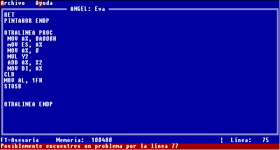

# Pruebas

## Panorama del capítulo

Para evaluar los resultados obtenidos por el uso de ANGEL, se necesita diseñar experimentos que permitan analizar las diferencias que ocurren en el proceso de enseñanza - aprendizaje; descubrir los beneficios que puedan ocurrir como consecuencia de la aplicación de ANGEL; y encontrar las limitaciones en su aplicación.

En esta primera etapa, se presenta un plan general de pruebas, las cuales están en curso; y se describe la primera prueba, cuyos resultados permiten ver las fortalezas de ANGEL, así como analizar las características que requieren ajustes.

En este capítulo, se describen las pruebas realizadas con la implementación prototipo de ANGEL. En primer lugar, se explica el proceso que se siguió para el diseño experimental, y la selección del experimento principal realizado. Posteriormente, se describe la situación en la que se realizaron las pruebas preliminares, y los resultados obtenidos. Con estos resultados, en el siguiente capítulo se presentan conclusiones.

## Diseño de experimentos

Para propósitos de prueba, se plantea la necesidad de definir una forma eficiente de medir los efectos del uso del asesor, específicamente se espera un cambio en el desempeño del alumno (véase la definición de aprendizaje dada por la Pedagogía).

Algunos de los métodos experimentales que se pueden seguir para ello incluyen:

>- Comparar dos grupos que tienen acceso a los mismos recursos, con excepción del asesor inteligente, para determinar los efectos que este tuvo en el aprendizaje. Si bien hay que considerar que dicho experimento puede ser sesgado, dados los factores fuera del control del experimentador, como la amplia diversidad de los sujetos, se puede obtener información más o menos confiable. Este método fue usado por COACH [7].
>
>- Otro método recomendado para medir los efectos de una interfase, aplicable a un asesor inteligente, es el uso de encuestas, donde se puede medir el éxito del sistema de acuerdo a la satisfacción subjetiva del cliente. También puede ser un método sesgado, sin embargo se puede hacer un análisis de significancia estadística sobre él.
>
>- Finalmente, se tiene la opción de experimentar mediante el tiempo requerido para completar una tarea, usando a los mismos sujetos, una vez con apoyo del asesor y otra sin él.

En la propuesta de Tesis [E2], se propuso utilizar un experimento similar al seguido por COACH, para determinar la funcionalidad de ANGEL. Este experimento consistiría en comparar el desempeño del grupo virtual y al presencial, en la resolución de la misma tarea. Sin embargo, existen diversas razones por las cuales se determinó no realizar dicho experimento:

>- Requería demasiado tiempo (1 semestre completo) para realizarse con todo su alcance y realizar una repetición apropiada del experimento, que permitiera asegurar que los resultados fueran estadísticamente significativos.
>
>- Implicaba limitar el acceso a ANGEL, el cual es una herramienta potencialmente benéfica para el estudiante, solamente para un subconjunto de estudiantes; lo cual va en contra de la responsabilidad del profesor, de poner los mejores recursos de que disponga para conseguir el aprendizaje de los estudiantes.
>
>- La prueba, tal como fue diseñada, sería sesgada, ya que compararía a un grupo virtual con uno presencial; y el uso de ANGEL no hubiera sido la única diferencia entre ambos grupos. Si bien ese sesgo se puede medir en la actualidad, ya que se han realizado pruebas que comparan a un grupo virtual y uno presencial, an sin usar el ANGEL, sigue siendo una consideración válida para preferir otro diseño experimental.

Por ello, y dadas las restricciones de tiempo, se decidió seguir el modelo experimental descrito a continuación:

>- Se propone la misma tarea a dos grupos, uno de control que no cuenta con acceso a ANGEL, y otro que sé cuenta con su apoyo. Se mide el tiempo requerido para completarla, para cada uno de los individuos.
>
>- Además del tiempo, dado que este puede ser limitado, se mide el número de errores que tiene el programa que entregan los alumnos.

Con la repetición apropiada de este experimento, se podrá medir el cambio en el desempeño atribuible a ANGEL, y medir el sesgo debido a aspectos como la curva de aprendizaje y las diferencias individuales.

La base de conocimiento irá evolucionando de acuerdo al avance en el curso; a partir del segundo parcial, en que los alumnos inician su práctica de programación, se deberían realizar pruebas semanales para constatar la evolución tanto en los alumnos como en ANGEL. Por otro lado, cuando los alumnos practiquen durante un curso completo, asesorados por ANGEL, el análisis del modelo del estudiante permitirá que el profesor conozca más el cómo ocurre el proceso de aprendizaje del lenguaje, lo que a su vez permitirá mejorar la base de conocimientos.

En resumen, los resultados preliminares producto del experimento planteado permitirán respaldar la tesis objetivo de este trabajo; sin embargo, se requerirá de mayor experimentación futura para definir el impacto que ANGEL puede tener sobre el proceso de enseñanza - aprendizaje en asignaturas de programación.

## 6.3 Pruebas preliminares realizadas con el asesor inteligente

Para probar el asesor, se realizó un ejercicio con 45 minutos de duración, en el que se dividió al grupo de alumnos en dos secciones: una de ellas usó ANGEL como el editor para resolver el ejercicio; mientras que la otra sección resolvió el ejercicio con las herramientas tradicionales.

No se informó a los alumnos el objetivo del experimento; y a todos se les proporcionó una motivación basada en "puntos extras" para quien resolviera completamente el problema.

El planteamiento del ejercicio, correspondiente a resolver un problema utilizando el conocimiento de los temas adquiridos, ya al final del curso de Ensamblador, se muestra en la figura 20.

;

; problema 1, para probar el uso del asesor inteligente ANGEL

;

; Deberás crear una rutina general para pintar.

; La rutina deberá dibujar un rectángulo relleno, en el Color indicado, entre

; las coordenadas X1, Y1, X2, Y2, activando el modo gráfico 13h.

; Usarás el manejo de video por acceso directo a memoria e

; instrucciones de strings

.model small

.stack 100h

.data

X1 DW 100 ; puede cambiarse...

Y1 DW 100 ; puede cambiarse...

X2 DW 200 ; puede cambiarse...

Y2 DW 150 ; puede cambiarse...

Color DB 1

.code

; Aquí empieza el trabajo del alumno...

#### Figura 20: Planteamiento del problema para probar ANGEL

Realizaron el ejercicio 17 alumnos: 9 de ellos contaron con el apoyo de ANGEL; y 8 no contaron con él. Adicionalmente, intentaron resolverlo otros 11 alumnos más, 5 con el apoyo de ANGEL y 6 sin él, pero de estos 11 alumnos no se recabó ninguna información, pues no entregaron el ejercicio ni dejaron historia de uso de ANGEL.

De los 9 alumnos que utilizaron ANGEL, uno no generó código fuente; dos consiguieron dejar funcionando el programa; tres dejaron un programa sin errores importantes, sólo con uno o dos errores de lógica por el cual no se cumplía el objetivo ejercicio, los cuales cuando el profesor los corrigió funcionaron correctamente; y tres entregaron programas con una gran cantidad de errores.

</td>
#### Figura 21: Asesoría no irruptiva al alumno.

  

#### Figura 22: Nivel superior de asesoría solicitada por el alumno.

Un ejemplo de la asesoría recibida por los alumnos, se presenta en la figura 21; algunos de los alumnos, utilizando F1, invocaron un mayor nivel de ayuda, tal como el presentado en la figura 22.

Los programas que mostraron gran cantidad de errores se analizaron usando ANGEL, llegando a tres tipos de resultados:

>- Algunos errores, fueron señalados correctamente por ANGEL.
>
>- Algunos errores fueron desconocidos para ANGEL.
>
>- ANGEL señaló incorrectamente como errores, casos en los que no había error.

Los resultados generales se muestran en la tabla 8.

<table class="MsoNormalTable" border="1" cellspacing="0" cellpadding="0" style="border-collapse:collapse;border:none;mso-border-alt:solid windowtext .5pt;
 mso-padding-alt:0in 1.5pt 0in 1.5pt">

<tbody>

<tr style="height:12.5pt">

<td width="59" valign="top" style="width:44.05pt;border:solid windowtext 1.0pt;
  border-right:none;mso-border-top-alt:solid windowtext .5pt;mso-border-left-alt:
  solid windowtext .5pt;mso-border-bottom-alt:solid windowtext .5pt;padding:
  0in 1.5pt 0in 1.5pt;height:12.5pt">

Alumno

</td>

<td width="57" valign="top" style="width:42.5pt;border-top:solid windowtext 1.0pt;
  border-left:none;border-bottom:solid windowtext 1.0pt;border-right:none;
  mso-border-top-alt:solid windowtext .5pt;mso-border-bottom-alt:solid windowtext .5pt;
  padding:0in 1.5pt 0in 1.5pt;height:12.5pt">

Usa asesor

</td>

<td width="47" valign="top" style="width:35.45pt;border-top:solid windowtext 1.0pt;
  border-left:none;border-bottom:solid windowtext 1.0pt;border-right:none;
  mso-border-top-alt:solid windowtext .5pt;mso-border-bottom-alt:solid windowtext .5pt;
  padding:0in 1.5pt 0in 1.5pt;height:12.5pt">

T

</td>

<td width="76" valign="top" style="width:56.7pt;border-top:solid windowtext 1.0pt;
  border-left:none;border-bottom:solid windowtext 1.0pt;border-right:none;
  mso-border-top-alt:solid windowtext .5pt;mso-border-bottom-alt:solid windowtext .5pt;
  padding:0in 1.5pt 0in 1.5pt;height:12.5pt">

Funciona el programa

</td>

<td width="66" valign="top" style="width:49.6pt;border-top:solid windowtext 1.0pt;
  border-left:none;border-bottom:solid windowtext 1.0pt;border-right:none;
  mso-border-top-alt:solid windowtext .5pt;mso-border-bottom-alt:solid windowtext .5pt;
  padding:0in 1.5pt 0in 1.5pt;height:12.5pt">

EL

</td>

<td width="47" valign="top" style="width:35.45pt;border-top:solid windowtext 1.0pt;
  border-left:none;border-bottom:solid windowtext 1.0pt;border-right:none;
  mso-border-top-alt:solid windowtext .5pt;mso-border-bottom-alt:solid windowtext .5pt;
  padding:0in 1.5pt 0in 1.5pt;height:12.5pt">

TE

</td>

<td width="38" valign="top" style="width:28.35pt;border-top:solid windowtext 1.0pt;
  border-left:none;border-bottom:solid windowtext 1.0pt;border-right:none;
  mso-border-top-alt:solid windowtext .5pt;mso-border-bottom-alt:solid windowtext .5pt;
  padding:0in 1.5pt 0in 1.5pt;height:12.5pt">

ED

</td>

<td width="47" valign="top" style="width:35.45pt;border-top:solid windowtext 1.0pt;
  border-left:none;border-bottom:solid windowtext 1.0pt;border-right:none;
  mso-border-top-alt:solid windowtext .5pt;mso-border-bottom-alt:solid windowtext .5pt;
  padding:0in 1.5pt 0in 1.5pt;height:12.5pt">

END

</td>

<td width="47" valign="top" style="width:35.45pt;border-top:solid windowtext 1.0pt;
  border-left:none;border-bottom:solid windowtext 1.0pt;border-right:none;
  mso-border-top-alt:solid windowtext .5pt;mso-border-bottom-alt:solid windowtext .5pt;
  padding:0in 1.5pt 0in 1.5pt;height:12.5pt">

FA

</td>

<td width="47" valign="top" style="width:35.45pt;border:solid windowtext 1.0pt;
  border-left:none;mso-border-top-alt:solid windowtext .5pt;mso-border-bottom-alt:
  solid windowtext .5pt;mso-border-right-alt:solid windowtext .5pt;padding:
  0in 1.5pt 0in 1.5pt;height:12.5pt">

EC

</td>

</tr>

<tr style="height:12.5pt">

<td width="59" valign="top" style="width:44.05pt;border:none;border-left:solid windowtext 1.0pt;
  mso-border-left-alt:solid windowtext .5pt;padding:0in 1.5pt 0in 1.5pt;
  height:12.5pt">

1

</td>

<td width="57" valign="top" style="width:42.5pt;border:none;padding:0in 1.5pt 0in 1.5pt;
  height:12.5pt">

SI  12

</td>

<td width="47" valign="top" style="width:35.45pt;border:none;padding:0in 1.5pt 0in 1.5pt;
  height:12.5pt">

45

</td>

<td width="76" valign="top" style="width:56.7pt;border:none;padding:0in 1.5pt 0in 1.5pt;
  height:12.5pt">

SI

</td>

<td width="66" valign="top" style="width:49.6pt;border:none;padding:0in 1.5pt 0in 1.5pt;
  height:12.5pt">

</td>

<td width="47" valign="top" style="width:35.45pt;border:none;padding:0in 1.5pt 0in 1.5pt;
  height:12.5pt">

0

</td>

<td width="38" valign="top" style="width:28.35pt;border:none;padding:0in 1.5pt 0in 1.5pt;
  height:12.5pt">

0

</td>

<td width="47" valign="top" style="width:35.45pt;border:none;padding:0in 1.5pt 0in 1.5pt;
  height:12.5pt">

0

</td>

<td width="47" valign="top" style="width:35.45pt;border:none;padding:0in 1.5pt 0in 1.5pt;
  height:12.5pt">

1

</td>

<td width="47" valign="top" style="width:35.45pt;border:none;border-right:solid windowtext 1.0pt;
  mso-border-right-alt:solid windowtext .5pt;padding:0in 1.5pt 0in 1.5pt;
  height:12.5pt">

5

</td>

</tr>

<tr style="height:12.5pt">

2

</td>

<td width="57" valign="top" style="width:42.5pt;border:none;padding:0in 1.5pt 0in 1.5pt;
  height:12.5pt">

SÍ - 12

</td>

<td width="47" valign="top" style="width:35.45pt;border:none;padding:0in 1.5pt 0in 1.5pt;
  height:12.5pt">

40

</td>

<td width="76" valign="top" style="width:56.7pt;border:none;padding:0in 1.5pt 0in 1.5pt;
  height:12.5pt">

NO

</td>

<td width="66" valign="top" style="width:49.6pt;border:none;padding:0in 1.5pt 0in 1.5pt;
  height:12.5pt">

</td>

<td width="47" valign="top" style="width:35.45pt;border:none;padding:0in 1.5pt 0in 1.5pt;
  height:12.5pt">

19

</td>

<td width="38" valign="top" style="width:28.35pt;border:none;padding:0in 1.5pt 0in 1.5pt;
  height:12.5pt">

15

</td>

<td width="47" valign="top" style="width:35.45pt;border:none;padding:0in 1.5pt 0in 1.5pt;
  height:12.5pt">

4

</td>

<td width="47" valign="top" style="width:35.45pt;border:none;padding:0in 1.5pt 0in 1.5pt;
  height:12.5pt">

0

</td>

<td width="47" valign="top" style="width:35.45pt;border:none;border-right:solid windowtext 1.0pt;
  mso-border-right-alt:solid windowtext .5pt;padding:0in 1.5pt 0in 1.5pt;
  height:12.5pt">

4

</td>

</tr>

<tr style="height:12.5pt">

<td width="59" valign="top" style="width:44.05pt;border:none;border-left:solid windowtext 1.0pt;
  mso-border-left-alt:solid windowtext .5pt;padding:0in 1.5pt 0in 1.5pt;
  height:12.5pt">

3

</td>

<td width="57" valign="top" style="width:42.5pt;border:none;padding:0in 1.5pt 0in 1.5pt;
  height:12.5pt">

SÍ  3

</td>

<td width="47" valign="top" style="width:35.45pt;border:none;padding:0in 1.5pt 0in 1.5pt;
  height:12.5pt">

45

</td>

<td width="76" valign="top" style="width:56.7pt;border:none;padding:0in 1.5pt 0in 1.5pt;
  height:12.5pt">

NO

</td>

<td width="66" valign="top" style="width:49.6pt;border:none;padding:0in 1.5pt 0in 1.5pt;
  height:12.5pt">

1

</td>

<td width="47" valign="top" style="width:35.45pt;border:none;padding:0in 1.5pt 0in 1.5pt;
  height:12.5pt">

0

</td>

<td width="38" valign="top" style="width:28.35pt;border:none;padding:0in 1.5pt 0in 1.5pt;
  height:12.5pt">

0

</td>

<td width="47" valign="top" style="width:35.45pt;border:none;padding:0in 1.5pt 0in 1.5pt;
  height:12.5pt">

0

</td>

<td width="47" valign="top" style="width:35.45pt;border:none;padding:0in 1.5pt 0in 1.5pt;
  height:12.5pt">

2

</td>

<td width="47" valign="top" style="width:35.45pt;border:none;border-right:solid windowtext 1.0pt;
  mso-border-right-alt:solid windowtext .5pt;padding:0in 1.5pt 0in 1.5pt;
  height:12.5pt">

0

</td>

</tr>

<tr style="height:12.5pt">

<td width="59" valign="top" style="width:44.05pt;border:none;border-left:solid windowtext 1.0pt;
  mso-border-left-alt:solid windowtext .5pt;padding:0in 1.5pt 0in 1.5pt;
  height:12.5pt">

4

</td>

<td width="57" valign="top" style="width:42.5pt;border:none;padding:0in 1.5pt 0in 1.5pt;
  height:12.5pt">

SÍ - 8

</td>

<td width="47" valign="top" style="width:35.45pt;border:none;padding:0in 1.5pt 0in 1.5pt;
  height:12.5pt">

45

</td>

<td width="76" valign="top" style="width:56.7pt;border:none;padding:0in 1.5pt 0in 1.5pt;
  height:12.5pt">

NO

</td>

<td width="66" valign="top" style="width:49.6pt;border:none;padding:0in 1.5pt 0in 1.5pt;
  height:12.5pt">

1

</td>

<td width="47" valign="top" style="width:35.45pt;border:none;padding:0in 1.5pt 0in 1.5pt;
  height:12.5pt">

0

</td>

<td width="38" valign="top" style="width:28.35pt;border:none;padding:0in 1.5pt 0in 1.5pt;
  height:12.5pt">

0

</td>

<td width="47" valign="top" style="width:35.45pt;border:none;padding:0in 1.5pt 0in 1.5pt;
  height:12.5pt">

0

</td>

<td width="47" valign="top" style="width:35.45pt;border:none;padding:0in 1.5pt 0in 1.5pt;
  height:12.5pt">

2

</td>

<td width="47" valign="top" style="width:35.45pt;border:none;border-right:solid windowtext 1.0pt;
  mso-border-right-alt:solid windowtext .5pt;padding:0in 1.5pt 0in 1.5pt;
  height:12.5pt">

0

</td>

</tr>

<tr style="mso-yfti-irow:5;height:12.5pt">

<td width="59" valign="top" style="width:44.05pt;border:none;border-left:solid windowtext 1.0pt;
  mso-border-left-alt:solid windowtext .5pt;padding:0in 1.5pt 0in 1.5pt;
  height:12.5pt">

5

</td>

<td width="57" valign="top" style="width:42.5pt;border:none;padding:0in 1.5pt 0in 1.5pt;
  height:12.5pt">

SÍ - 6

</td>

<td width="47" valign="top" style="width:35.45pt;border:none;padding:0in 1.5pt 0in 1.5pt;
  height:12.5pt">

45

</td>

<td width="76" valign="top" style="width:56.7pt;border:none;padding:0in 1.5pt 0in 1.5pt;
  height:12.5pt">

NO

</td>

<td width="66" valign="top" style="width:49.6pt;border:none;padding:0in 1.5pt 0in 1.5pt;
  height:12.5pt">

</td>

<td width="227" colspan="5" valign="top" style="width:170.15pt;border:none;
  border-right:solid windowtext 1.0pt;mso-border-right-alt:solid windowtext .5pt;
  padding:0in 1.5pt 0in 1.5pt;height:12.5pt">

NO ENTREGÓ ARCHIVO FUENTE

</td>

</tr>

<tr style="height:12.5pt">

<td width="59" valign="top" style="width:44.05pt;border:none;border-left:solid windowtext 1.0pt;
  mso-border-left-alt:solid windowtext .5pt;padding:0in 1.5pt 0in 1.5pt;
  height:12.5pt">

6

</td>

<td width="57" valign="top" style="width:42.5pt;border:none;padding:0in 1.5pt 0in 1.5pt;
  height:12.5pt">

SÍ - 6

</td>

<td width="47" valign="top" style="width:35.45pt;border:none;padding:0in 1.5pt 0in 1.5pt;
  height:12.5pt">

45

</td>

<td width="76" valign="top" style="width:56.7pt;border:none;padding:0in 1.5pt 0in 1.5pt;
  height:12.5pt">

NO

</td>

<td width="66" valign="top" style="width:49.6pt;border:none;padding:0in 1.5pt 0in 1.5pt;
  height:12.5pt">

2

</td>

<td width="47" valign="top" style="width:35.45pt;border:none;padding:0in 1.5pt 0in 1.5pt;
  height:12.5pt">

0

</td>

<td width="38" valign="top" style="width:28.35pt;border:none;padding:0in 1.5pt 0in 1.5pt;
  height:12.5pt">

0

</td>

<td width="47" valign="top" style="width:35.45pt;border:none;padding:0in 1.5pt 0in 1.5pt;
  height:12.5pt">

0

</td>

<td width="47" valign="top" style="width:35.45pt;border:none;padding:0in 1.5pt 0in 1.5pt;
  height:12.5pt">

0

</td>

<td width="47" valign="top" style="width:35.45pt;border:none;border-right:solid windowtext 1.0pt;
  mso-border-right-alt:solid windowtext .5pt;padding:0in 1.5pt 0in 1.5pt;
  height:12.5pt">

3

</td>

</tr>

<tr style="height:12.5pt">

<td width="59" valign="top" style="width:44.05pt;border:none;border-left:solid windowtext 1.0pt;
  mso-border-left-alt:solid windowtext .5pt;padding:0in 1.5pt 0in 1.5pt;
  height:12.5pt">

7

</td>

<td width="57" valign="top" style="width:42.5pt;border:none;padding:0in 1.5pt 0in 1.5pt;
  height:12.5pt">

SÍ - 4

</td>

<td width="47" valign="top" style="width:35.45pt;border:none;padding:0in 1.5pt 0in 1.5pt;
  height:12.5pt">

45

</td>

<td width="76" valign="top" style="width:56.7pt;border:none;padding:0in 1.5pt 0in 1.5pt;
  height:12.5pt">

NO

</td>

<td width="66" valign="top" style="width:49.6pt;border:none;padding:0in 1.5pt 0in 1.5pt;
  height:12.5pt">

</td>

<td width="47" valign="top" style="width:35.45pt;border:none;padding:0in 1.5pt 0in 1.5pt;
  height:12.5pt">

8

</td>

<td width="38" valign="top" style="width:28.35pt;border:none;padding:0in 1.5pt 0in 1.5pt;
  height:12.5pt">

1

</td>

<td width="47" valign="top" style="width:35.45pt;border:none;padding:0in 1.5pt 0in 1.5pt;
  height:12.5pt">

7

</td>

<td width="47" valign="top" style="width:35.45pt;border:none;padding:0in 1.5pt 0in 1.5pt;
  height:12.5pt">

0

</td>

<td width="47" valign="top" style="width:35.45pt;border:none;border-right:solid windowtext 1.0pt;
  mso-border-right-alt:solid windowtext .5pt;padding:0in 1.5pt 0in 1.5pt;
  height:12.5pt">

0

</td>

</tr>

<tr style="height:12.5pt">

<td width="59" valign="top" style="width:44.05pt;border:none;border-left:solid windowtext 1.0pt;
  mso-border-left-alt:solid windowtext .5pt;padding:0in 1.5pt 0in 1.5pt;
  height:12.5pt">

8

</td>

<td width="57" valign="top" style="width:42.5pt;border:none;padding:0in 1.5pt 0in 1.5pt;
  height:12.5pt">

SÍ - 3

</td>

<td width="47" valign="top" style="width:35.45pt;border:none;padding:0in 1.5pt 0in 1.5pt;
  height:12.5pt">

30

</td>

<td width="76" valign="top" style="width:56.7pt;border:none;padding:0in 1.5pt 0in 1.5pt;
  height:12.5pt">

NO

</td>

<td width="66" valign="top" style="width:49.6pt;border:none;padding:0in 1.5pt 0in 1.5pt;
  height:12.5pt">

</td>

<td width="47" valign="top" style="width:35.45pt;border:none;padding:0in 1.5pt 0in 1.5pt;
  height:12.5pt">

5

</td>

<td width="38" valign="top" style="width:28.35pt;border:none;padding:0in 1.5pt 0in 1.5pt;
  height:12.5pt">

3

</td>

<td width="47" valign="top" style="width:35.45pt;border:none;padding:0in 1.5pt 0in 1.5pt;
  height:12.5pt">

2

</td>

<td width="47" valign="top" style="width:35.45pt;border:none;padding:0in 1.5pt 0in 1.5pt;
  height:12.5pt">

0

</td>

<td width="47" valign="top" style="width:35.45pt;border:none;border-right:solid windowtext 1.0pt;
  mso-border-right-alt:solid windowtext .5pt;padding:0in 1.5pt 0in 1.5pt;
  height:12.5pt">

2

</td>

</tr>

<tr style="height:12.5pt">

<td width="59" valign="top" style="width:44.05pt;border:none;border-left:solid windowtext 1.0pt;
  mso-border-left-alt:solid windowtext .5pt;padding:0in 1.5pt 0in 1.5pt;
  height:12.5pt">

9

</td>

<td width="57" valign="top" style="width:42.5pt;border:none;padding:0in 1.5pt 0in 1.5pt;
  height:12.5pt">

SÍ - 3

</td>

<td width="47" valign="top" style="width:35.45pt;border:none;padding:0in 1.5pt 0in 1.5pt;
  height:12.5pt">

45

</td>

<td width="76" valign="top" style="width:56.7pt;border:none;padding:0in 1.5pt 0in 1.5pt;
  height:12.5pt">

SÍ

</td>

<td width="66" valign="top" style="width:49.6pt;border:none;padding:0in 1.5pt 0in 1.5pt;
  height:12.5pt">

</td>

<td width="47" valign="top" style="width:35.45pt;border:none;padding:0in 1.5pt 0in 1.5pt;
  height:12.5pt">

1

</td>

<td width="38" valign="top" style="width:28.35pt;border:none;padding:0in 1.5pt 0in 1.5pt;
  height:12.5pt">

1

</td>

<td width="47" valign="top" style="width:35.45pt;border:none;padding:0in 1.5pt 0in 1.5pt;
  height:12.5pt">

0

</td>

<td width="47" valign="top" style="width:35.45pt;border:none;padding:0in 1.5pt 0in 1.5pt;
  height:12.5pt">

1

</td>

<td width="47" valign="top" style="width:35.45pt;border:none;border-right:solid windowtext 1.0pt;
  mso-border-right-alt:solid windowtext .5pt;padding:0in 1.5pt 0in 1.5pt;
  height:12.5pt">

3

</td>

</tr>

<tr style="height:12.5pt">

<td width="59" valign="top" style="width:44.05pt;border:none;border-left:solid windowtext 1.0pt;
  mso-border-left-alt:solid windowtext .5pt;padding:0in 1.5pt 0in 1.5pt;
  height:12.5pt">

10

</td>

<td width="57" valign="top" style="width:42.5pt;border:none;padding:0in 1.5pt 0in 1.5pt;
  height:12.5pt">

NO

</td>

<td width="47" valign="top" style="width:35.45pt;border:none;padding:0in 1.5pt 0in 1.5pt;
  height:12.5pt">

40

</td>

<td width="76" valign="top" style="width:56.7pt;border:none;padding:0in 1.5pt 0in 1.5pt;
  height:12.5pt">

SÍ

</td>

<td width="66" valign="top" style="width:49.6pt;border:none;padding:0in 1.5pt 0in 1.5pt;
  height:12.5pt">

</td>

<td width="47" valign="top" style="width:35.45pt;border:none;padding:0in 1.5pt 0in 1.5pt;
  height:12.5pt">

1

</td>

<td width="38" valign="top" style="width:28.35pt;border:none;padding:0in 1.5pt 0in 1.5pt;
  height:12.5pt">

1

</td>

<td width="47" valign="top" style="width:35.45pt;border:none;padding:0in 1.5pt 0in 1.5pt;
  height:12.5pt">

0

</td>

<td width="47" valign="top" style="width:35.45pt;border:none;padding:0in 1.5pt 0in 1.5pt;
  height:12.5pt">

0

</td>

<td width="47" valign="top" style="width:35.45pt;border:none;border-right:solid windowtext 1.0pt;
  mso-border-right-alt:solid windowtext .5pt;padding:0in 1.5pt 0in 1.5pt;
  height:12.5pt">

NA

</td>

</tr>

<tr style="height:12.5pt">

<td width="59" valign="top" style="width:44.05pt;border:none;border-left:solid windowtext 1.0pt;
  mso-border-left-alt:solid windowtext .5pt;padding:0in 1.5pt 0in 1.5pt;
  height:12.5pt">

11

</td>

<td width="57" valign="top" style="width:42.5pt;border:none;padding:0in 1.5pt 0in 1.5pt;
  height:12.5pt">

NO

</td>

<td width="47" valign="top" style="width:35.45pt;border:none;padding:0in 1.5pt 0in 1.5pt;
  height:12.5pt">

35

</td>

<td width="76" valign="top" style="width:56.7pt;border:none;padding:0in 1.5pt 0in 1.5pt;
  height:12.5pt">

SÍ

</td>

<td width="66" valign="top" style="width:49.6pt;border:none;padding:0in 1.5pt 0in 1.5pt;
  height:12.5pt">

</td>

<td width="47" valign="top" style="width:35.45pt;border:none;padding:0in 1.5pt 0in 1.5pt;
  height:12.5pt">

0

</td>

<td width="38" valign="top" style="width:28.35pt;border:none;padding:0in 1.5pt 0in 1.5pt;
  height:12.5pt">

0

</td>

<td width="47" valign="top" style="width:35.45pt;border:none;padding:0in 1.5pt 0in 1.5pt;
  height:12.5pt">

0

</td>

<td width="47" valign="top" style="width:35.45pt;border:none;padding:0in 1.5pt 0in 1.5pt;
  height:12.5pt">

0

</td>

<td width="47" valign="top" style="width:35.45pt;border:none;border-right:solid windowtext 1.0pt;
  mso-border-right-alt:solid windowtext .5pt;padding:0in 1.5pt 0in 1.5pt;
  height:12.5pt">

NA

</td>

</tr>

<tr style="height:12.5pt">

<td width="59" valign="top" style="width:44.05pt;border:none;border-left:solid windowtext 1.0pt;
  mso-border-left-alt:solid windowtext .5pt;padding:0in 1.5pt 0in 1.5pt;
  height:12.5pt">

12

</td>

<td width="57" valign="top" style="width:42.5pt;border:none;padding:0in 1.5pt 0in 1.5pt;
  height:12.5pt">

NO

</td>

<td width="47" valign="top" style="width:35.45pt;border:none;padding:0in 1.5pt 0in 1.5pt;
  height:12.5pt">

45

</td>

<td width="76" valign="top" style="width:56.7pt;border:none;padding:0in 1.5pt 0in 1.5pt;
  height:12.5pt">

NO

</td>

<td width="66" valign="top" style="width:49.6pt;border:none;padding:0in 1.5pt 0in 1.5pt;
  height:12.5pt">

1

</td>

<td width="47" valign="top" style="width:35.45pt;border:none;padding:0in 1.5pt 0in 1.5pt;
  height:12.5pt">

0

</td>

<td width="38" valign="top" style="width:28.35pt;border:none;padding:0in 1.5pt 0in 1.5pt;
  height:12.5pt">

0

</td>

<td width="47" valign="top" style="width:35.45pt;border:none;padding:0in 1.5pt 0in 1.5pt;
  height:12.5pt">

0

</td>

<td width="47" valign="top" style="width:35.45pt;border:none;padding:0in 1.5pt 0in 1.5pt;
  height:12.5pt">

0

</td>

<td width="47" valign="top" style="width:35.45pt;border:none;border-right:solid windowtext 1.0pt;
  mso-border-right-alt:solid windowtext .5pt;padding:0in 1.5pt 0in 1.5pt;
  height:12.5pt">

NA

</td>

</tr>

<tr style="height:12.5pt">

<td width="59" valign="top" style="width:44.05pt;border:none;border-left:solid windowtext 1.0pt;
  mso-border-left-alt:solid windowtext .5pt;padding:0in 1.5pt 0in 1.5pt;
  height:12.5pt">

13

</td>

<td width="57" valign="top" style="width:42.5pt;border:none;padding:0in 1.5pt 0in 1.5pt;
  height:12.5pt">

NO

</td>

<td width="47" valign="top" style="width:35.45pt;border:none;padding:0in 1.5pt 0in 1.5pt;
  height:12.5pt">

45

</td>

<td width="76" valign="top" style="width:56.7pt;border:none;padding:0in 1.5pt 0in 1.5pt;
  height:12.5pt">

NO

</td>

<td width="66" valign="top" style="width:49.6pt;border:none;padding:0in 1.5pt 0in 1.5pt;
  height:12.5pt">

2

</td>

<td width="47" valign="top" style="width:35.45pt;border:none;padding:0in 1.5pt 0in 1.5pt;
  height:12.5pt">

0

</td>

<td width="38" valign="top" style="width:28.35pt;border:none;padding:0in 1.5pt 0in 1.5pt;
  height:12.5pt">

0

</td>

<td width="47" valign="top" style="width:35.45pt;border:none;padding:0in 1.5pt 0in 1.5pt;
  height:12.5pt">

0

</td>

<td width="47" valign="top" style="width:35.45pt;border:none;padding:0in 1.5pt 0in 1.5pt;
  height:12.5pt">

0

</td>

<td width="47" valign="top" style="width:35.45pt;border:none;border-right:solid windowtext 1.0pt;
  mso-border-right-alt:solid windowtext .5pt;padding:0in 1.5pt 0in 1.5pt;
  height:12.5pt">

NA

</td>

</tr>

<tr style="height:12.5pt">

<td width="59" valign="top" style="width:44.05pt;border:none;border-left:solid windowtext 1.0pt;
  mso-border-left-alt:solid windowtext .5pt;padding:0in 1.5pt 0in 1.5pt;
  height:12.5pt">

14

</td>

<td width="57" valign="top" style="width:42.5pt;border:none;padding:0in 1.5pt 0in 1.5pt;
  height:12.5pt">

NO

</td>

<td width="47" valign="top" style="width:35.45pt;border:none;padding:0in 1.5pt 0in 1.5pt;
  height:12.5pt">

45

</td>

<td width="76" valign="top" style="width:56.7pt;border:none;padding:0in 1.5pt 0in 1.5pt;
  height:12.5pt">

SÍ

</td>

<td width="66" valign="top" style="width:49.6pt;border:none;padding:0in 1.5pt 0in 1.5pt;
  height:12.5pt">

</td>

<td width="47" valign="top" style="width:35.45pt;border:none;padding:0in 1.5pt 0in 1.5pt;
  height:12.5pt">

0

</td>

<td width="38" valign="top" style="width:28.35pt;border:none;padding:0in 1.5pt 0in 1.5pt;
  height:12.5pt">

0

</td>

<td width="47" valign="top" style="width:35.45pt;border:none;padding:0in 1.5pt 0in 1.5pt;
  height:12.5pt">

0

</td>

<td width="47" valign="top" style="width:35.45pt;border:none;padding:0in 1.5pt 0in 1.5pt;
  height:12.5pt">

0

</td>

<td width="47" valign="top" style="width:35.45pt;border:none;border-right:solid windowtext 1.0pt;
  mso-border-right-alt:solid windowtext .5pt;padding:0in 1.5pt 0in 1.5pt;
  height:12.5pt">

NA

</td>

</tr>

<tr style="height:12.5pt">

<td width="59" valign="top" style="width:44.05pt;border:none;border-left:solid windowtext 1.0pt;
  mso-border-left-alt:solid windowtext .5pt;padding:0in 1.5pt 0in 1.5pt;
  height:12.5pt">

15

</td>

<td width="57" valign="top" style="width:42.5pt;border:none;padding:0in 1.5pt 0in 1.5pt;
  height:12.5pt">

NO

</td>

<td width="47" valign="top" style="width:35.45pt;border:none;padding:0in 1.5pt 0in 1.5pt;
  height:12.5pt">

45

</td>

<td width="76" valign="top" style="width:56.7pt;border:none;padding:0in 1.5pt 0in 1.5pt;
  height:12.5pt">

NO

</td>

<td width="66" valign="top" style="width:49.6pt;border:none;padding:0in 1.5pt 0in 1.5pt;
  height:12.5pt">

</td>

<td width="47" valign="top" style="width:35.45pt;border:none;padding:0in 1.5pt 0in 1.5pt;
  height:12.5pt">

2

</td>

<td width="38" valign="top" style="width:28.35pt;border:none;padding:0in 1.5pt 0in 1.5pt;
  height:12.5pt">

2

</td>

<td width="47" valign="top" style="width:35.45pt;border:none;padding:0in 1.5pt 0in 1.5pt;
  height:12.5pt">

0

</td>

<td width="47" valign="top" style="width:35.45pt;border:none;padding:0in 1.5pt 0in 1.5pt;
  height:12.5pt">

0

</td>

<td width="47" valign="top" style="width:35.45pt;border:none;border-right:solid windowtext 1.0pt;
  mso-border-right-alt:solid windowtext .5pt;padding:0in 1.5pt 0in 1.5pt;
  height:12.5pt">

NA

</td>

</tr>

<tr style="height:12.5pt">

<td width="59" valign="top" style="width:44.05pt;border:none;border-left:solid windowtext 1.0pt;
  mso-border-left-alt:solid windowtext .5pt;padding:0in 1.5pt 0in 1.5pt;
  height:12.5pt">

16

</td>

<td width="57" valign="top" style="width:42.5pt;border:none;padding:0in 1.5pt 0in 1.5pt;
  height:12.5pt">

NO

</td>

<td width="47" valign="top" style="width:35.45pt;border:none;padding:0in 1.5pt 0in 1.5pt;
  height:12.5pt">

45

</td>

<td width="76" valign="top" style="width:56.7pt;border:none;padding:0in 1.5pt 0in 1.5pt;
  height:12.5pt">

SÍ

</td>

<td width="66" valign="top" style="width:49.6pt;border:none;padding:0in 1.5pt 0in 1.5pt;
  height:12.5pt">

</td>

<td width="47" valign="top" style="width:35.45pt;border:none;padding:0in 1.5pt 0in 1.5pt;
  height:12.5pt">

0

</td>

<td width="38" valign="top" style="width:28.35pt;border:none;padding:0in 1.5pt 0in 1.5pt;
  height:12.5pt">

0

</td>

<td width="47" valign="top" style="width:35.45pt;border:none;padding:0in 1.5pt 0in 1.5pt;
  height:12.5pt">

0

</td>

<td width="47" valign="top" style="width:35.45pt;border:none;padding:0in 1.5pt 0in 1.5pt;
  height:12.5pt">

0

</td>

<td width="47" valign="top" style="width:35.45pt;border:none;border-right:solid windowtext 1.0pt;
  mso-border-right-alt:solid windowtext .5pt;padding:0in 1.5pt 0in 1.5pt;
  height:12.5pt">

NA

</td>

</tr>

<tr style="mso-yfti-lastrow:yes;height:12.5pt">

<td width="59" valign="top" style="width:44.05pt;border-top:none;border-left:
  solid windowtext 1.0pt;border-bottom:solid windowtext 1.0pt;border-right:
  none;mso-border-left-alt:solid windowtext .5pt;mso-border-bottom-alt:solid windowtext .5pt;
  padding:0in 1.5pt 0in 1.5pt;height:12.5pt">

17

</td>

<td width="57" valign="top" style="width:42.5pt;border:none;border-bottom:solid windowtext 1.0pt;
  mso-border-bottom-alt:solid windowtext .5pt;padding:0in 1.5pt 0in 1.5pt;
  height:12.5pt">

NO

</td>

<td width="47" valign="top" style="width:35.45pt;border:none;border-bottom:solid windowtext 1.0pt;
  mso-border-bottom-alt:solid windowtext .5pt;padding:0in 1.5pt 0in 1.5pt;
  height:12.5pt">

45

</td>

<td width="76" valign="top" style="width:56.7pt;border:none;border-bottom:solid windowtext 1.0pt;
  mso-border-bottom-alt:solid windowtext .5pt;padding:0in 1.5pt 0in 1.5pt;
  height:12.5pt">

NO

</td>

<td width="66" valign="top" style="width:49.6pt;border:none;border-bottom:solid windowtext 1.0pt;
  mso-border-bottom-alt:solid windowtext .5pt;padding:0in 1.5pt 0in 1.5pt;
  height:12.5pt">

1

</td>

<td width="47" valign="top" style="width:35.45pt;border:none;border-bottom:solid windowtext 1.0pt;
  mso-border-bottom-alt:solid windowtext .5pt;padding:0in 1.5pt 0in 1.5pt;
  height:12.5pt">

0

</td>

<td width="38" valign="top" style="width:28.35pt;border:none;border-bottom:solid windowtext 1.0pt;
  mso-border-bottom-alt:solid windowtext .5pt;padding:0in 1.5pt 0in 1.5pt;
  height:12.5pt">

0

</td>

<td width="47" valign="top" style="width:35.45pt;border:none;border-bottom:solid windowtext 1.0pt;
  mso-border-bottom-alt:solid windowtext .5pt;padding:0in 1.5pt 0in 1.5pt;
  height:12.5pt">

0

</td>

<td width="47" valign="top" style="width:35.45pt;border:none;border-bottom:solid windowtext 1.0pt;
  mso-border-bottom-alt:solid windowtext .5pt;padding:0in 1.5pt 0in 1.5pt;
  height:12.5pt">

1

</td>

<td width="47" valign="top" style="width:35.45pt;border-top:none;border-left:
  none;border-bottom:solid windowtext 1.0pt;border-right:solid windowtext 1.0pt;
  mso-border-bottom-alt:solid windowtext .5pt;mso-border-right-alt:solid windowtext .5pt;
  padding:0in 1.5pt 0in 1.5pt;height:12.5pt">

NA

</td>

</tr>

</tbody>

</table>

_ 

#### Tabla 8: resumen de resultados del experimento.

Las columnas de la tabla se explican a continuación:

>- Alumno es un número consecutivo usado para identificar al sujeto.
>
>- En la columna 'Usa asesor', se indica si utilizó ANGEL o no; y en caso de haberlo utilizado, cuántas veces recibió asesoría, sea solicitada o no solicitada.
>
>- En la columna T se indica el tiempo, en minutos, que requirió para resolver el problema. A los 45 minutos, se hizo un corte, por lo que la mayoría de los alumnos tienen indicado ese tiempo.
>
>- La columna Funciona el Programa indica si se alcanzó el objetivo del ejercicio.
>
>- La columna EL ("Errores sólo de lógica") indica los errores que el profesor detectó, que no son propios del lenguaje, y que al ser corregidos permitieron que el programa funcionara. Esta columna es excluyente con la de errores en el lenguaje: no se intentó corregir errores de lógica para los programas que también tenían errores en el lenguaje.
>
>- Total de errores en el lenguaje (TE) indica cuántos errores localizó el profesor en el programa que entregó el alumno, que pueden considerarse deficiencias en el aprendizaje del lenguaje de programación.
>
>- Errores detectados (ED) indica cuántos, de entre los errores en el lenguaje, detectó correctamente ANGEL, al procesar el archivo fuente.
>
>- Errores no detectados (END) indica cuántos, de entre los errores en el lenguaje, no observó ANGEL, al procesar el archivo fuente.
> 
>- Falsas alarmas (FA) indica en cuántas ocasiones ANGEL señaló un error que en realidad no existía.
>
>- Errores corregidos (EC) señala cuántos errores corrigió el alumno directamente en respuesta a la asesoría de ANGEL.

De la tabla podemos ver que ANGEL, si bien tiene implementada una parte muy pequeña de la base de conocimientos requerida, detectó un 64% de los errores del lenguaje, y dejó de detectar un 36%. Un 19% del total de errores existentes, se señaló "de más", es decir, fueron falsas alarmas indicadas por ANGEL.

Hay que notar que en los dos casos que utilizaron ANGEL y lograron el objetivo, hubo varios errores señalados por ANGEL que el alumno corrigió posteriormente; se observó que la retroalimentación en estos casos, fue efectiva.

ANGEL no asesoró en todos los momentos oportunos; por ello, en algunos de los casos en los que el código reportó más errores, el alumno recibió menos retroalimentación de la que le hubiera convenido.

Se observó que para algunos de los alumnos, ANGEL marcaba todos los errores de lenguaje que debían corregir; sin embargo, no utilizaban F1 para pedirle más información, ni se dirigían a buscar en sus apuntes o en la página WWW la información sobre el tema correspondiente.

Ninguno de los alumnos pidió ayuda para utilizar ANGEL; la interfase demostró ser suficientemente intuitiva para editar apropiadamente.

Se continuarán las pruebas, invirtiendo a los sujetos, de modo que se aíslen las diferencias individuales y se pueda juzgar mejor el papel que tuvo ANGEL en el desempeño obtenido.

Los resultados preliminares son alentadores, si bien enfatizan la necesidad de ampliar la base de conocimientos y probar extensamente para detectar las capacidades que pueden faltarle a ANGEL; especialmente, es notorio que se debe indicar a la generalidad de los alumnos que ANGEL los podrá asesorar, para que soliciten ayuda; y se debe perfeccionar el modelo instruccional, de modo que ANGEL ofrezca más oportunamente su asesoría.

En el capítulo siguiente se presentan las conclusiones generales del trabajo y las particulares a esta fase preliminar de pruebas; así como las pruebas y trabajo futuro.

  

